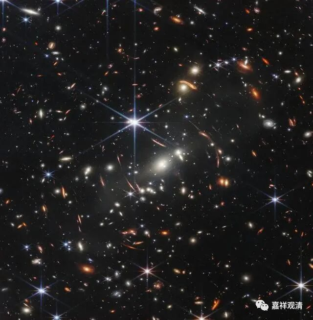

**《微课佛教史》327·2**

雪窦山的雪窦寺的“弥勒菩萨”实际上是契此和尚，他是奉化人，大肚子和尚的形象。现在汉地一提到弥勒菩萨，大家脑子里的第一反应就是那个大肚子弥勒的形象，实际上这是一位僧人，只是后来传说在他圆寂之前，有过这样一首偈子叫：“弥勒真弥勒，分身千百亿，时时示世人，世人皆不识。”自从这个偈子流行以后，大家就说这个和尚就是弥勒菩萨化身，以后大家就直接把他当作弥勒菩萨来供。

实际上大家可以去看看几个早期的石窟，那些石窟里面主要都是天冠弥勒的形象。但是这个故事发生以后，直到今天我们汉地在脑子里面的印象，弥勒菩萨就是这个大肚子的样子，就变成一种固化的思维，或者心理学里面的固有印象，差不多就是这样。我们平时去山里面朝拜的时候，有些人一看：“哎呦！你看这块石头像不像弥勒菩萨？”冤枉啊！这个像弥勒菩萨吗？恐怕只有中国的汉人才能看懂了，为什么呢？因为这块石头有点像那个大肚子弥勒。

我出家在黄山的翠微寺，翠微峰又叫弥勒峰，为什么呢？因为从某个角度望过去，它比较像大肚子弥勒，所以又叫弥勒峰。但是如果一个藏人或者一个南传的（南传也有弥勒，对吧？）或者一个尼泊尔的，你让他们看，他们是肯定看不出这是一个弥勒菩萨的样子，为什么呢？因为他们对弥勒菩萨的概念是与此全然不同的。

普陀山也有这个情况，是哪个洞我就不说了。那个洞，只有在某个时间点、在某种光线下、从某个角度看过去——哎！像观音菩萨，其实是像汉地的白衣观音。你让其他人去看，比如说我有两位师父去看过，他们怎么都看不出来的，因为他们没有这种刻板印象或者固有概念——认为观音菩萨是白衣观音的形象，在他们心目中观音菩萨的形象是四臂观音的形象。反过来，他们在法雨寺附近看到一块石头：“哇！这个，是观音。”但是汉人却看不出来，为什么？因为他们觉得这个石头比较像四臂观音，而汉人脑子里的观音菩萨不是这个样子。类似的情况还有，比如什么地方有一个脚印，大家都觉得：“哎！这是观音菩萨的脚印。”然后又觉得那边是哪个菩萨的脚印。说实话，以科学唯物的观点来看，很多明显都不是的。

我认识一位信奉阿弥陀佛的教徒，以前曾经是同济大学的老师，他到过四川的很多地方帮忙建寺院。因为他学过地质学，所以他就直接说：“这哪里是什么脚印嘛，这就是一个很简单的地质现象（或者什么其它的地质名词）……另外那边那个，一看就是人工刻的嘛！”当然，我们是外行，对这个不是很知道。反正对我来说，这些东西对我的信心没有什么影响，既不会给我增加信心，也不会给我减少信心。

好，今天就先讲到这里，谢谢大家！废话多了一点，大家见谅！

