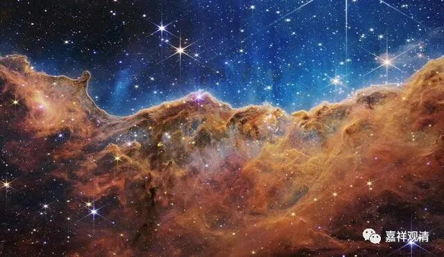

**《百论》游义·“破神品”来也**

三解脱门与四谛十六行相的话题牵扯时间太长了，另外专门写文章发挥吧，我们继续《百论》第二品——《破神品》。强调+提醒一下——是“破除”实有的“神我”，不是有个神叫“破神”！！！

《破神品》第二

《中论》、《百论》、《十二门论》都有“破神”的内容，而内容都不同。

《中论》“破神”的内容在《观本住品》第九（叶少勇译作《取与取者之考察》），能取根、尘者即“神”（我、主宰）。

《十二门论》“破神”的内容在《观作者门》“破他生”部分的破大自在天生，彼处的神即大自在天（神）。

《百论》“破神”的内容则在第二品《破神品》，实际是破的具体的数论派和胜论派的“神”，在数论派是神我（部分涉及觉），在胜论派则是“实谛”当中的“我”（神）。

三论之间对比，《中论》、《百论》“破神”相对抽象，《十二门论》则比较具体；而《中论》、《百论》之间对比来看，《中论》破神更形而上，《百论》则相对具体。

原文：

** “外曰：不应言一切法空无相，神等诸法有故（修妬路）。**

** 迦毘罗、优楼迦等言，神及诸法有。**

** 迦毘罗言：从冥初生觉，从觉生我心，从我心生五微尘，从五微尘生五大，从五大生十一根。神为主，常、觉相、处中、常住、不坏不败、摄受诸法。能知此二十五谛，即得解脱；不知此者，不离生死。**

** 优楼迦言：实有神常，以出入息、视眴、寿命等相故，则知有神。复次以欲恚、苦乐、智慧等所依处故，则知有神。**

** 是故神是实有，云何言无？若有而言无，则为恶邪人，恶邪人无解脱。**

** 是故不应言一切法空无相。”**

今释：

对方（外道）说：不应该说“一切法空无相”，因为神等诸法确实存在！（修多罗）

比如金发仙（数论派祖师）、鸺鹠仙（胜论派祖师）等都说，“神”和某些法是实有的。

金发仙（数论派）说：从自性生觉，觉生我慢，我慢生五唯，五唯生五大，五大生十一根。（此二十四加“神我”为“二十五谛”，即二十五种究竟真实。）神我为核心，常、有觉、处中、常住、不变坏、不伤害、摄受诸法。若人能知此二十五谛（生起、还灭道理），就能（依此修行达到）解脱；不知此二十五谛道理，则不能离生死。

鸺鹠仙（胜论派）说：实谛中有神（我），它有出入息、能看、有寿量等等作用，通过这些作用则知有神（我）的主体。再者，因为贪嗔苦乐智慧等必有其所依之处，所以知有神（我）。

故此，神（终极本体的我）是实有存在的，怎么可以说没有呢？若真实存在的东西却说没有，就是恶劣奸邪之人，恶劣奸邪之人不能得解脱！

所以你不应该说“一切法空无相”。

