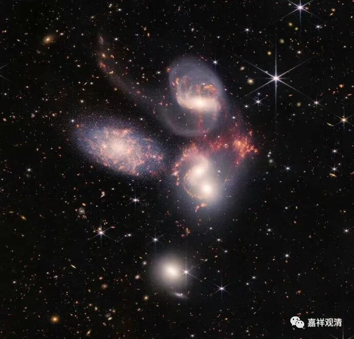

**《百论》游义·成实师“俱往矣”**

义释：

《百论》这里所破的“神”，相对属于宗教哲学范畴的，而非具体的某某天神。

吉藏《百论疏》说：

“** 但解神有内外二道。**

** 外道有四师：一者僧佉，计神与觉一；二者卫世，明神与觉异；三者勒沙婆，计神觉亦一亦异；第四若提子，计神觉非一非异。**

** 内道计神亦有四师：一、庄严云：假神有体、有用、有名；二、光宅云：神有名、无体、无用；三、开善云：神有名、有用而无有体；第四、犊子计，有神体用，而非即离所摄，故神在第五不可说藏中。**”

吉藏在这里提到了印度四派：数论派（** 僧佉）**、胜论派** （卫世）**、裸形派（** 勒沙婆）**、苦行派** （若提子）**。关于后两者，印度佛教典籍中，早期并不分派，而作为耆那教的别名，而大致到了公元2～4世纪的印度佛教文献里，就把它们分为两支来谈。前者见于《阿含经》即诸部律，后者见于坚意造《入大乘论》及提波《破楞伽经中外道小乘四宗论》，有说此提波即提婆，即使是提婆，也未必就是中观派的圣提婆。

内道四师，即：庄严僧旻、光宅法云、开善智藏，和印度部派佛教里著名的犊子部。前三者年代大约与吉藏同时而略早，是汉地著名的“成实大乘师”，也有称为“成实宗”、“成实师”的，这三人是南北朝后期著名的“成实三大师”，也是吉藏论辩的主要假想敌。（可惜的是，成实师的全部著作整体性丢失，目前好像仅有敦煌有一点残本存世，其它，也就活在吉藏、智顗的著作里了。）犊子部则是著名的佛教部派，最主要的观点就是持——有“非即蕴非离蕴”的“不可说我”。

本论此处破“神”，是比较笼统的概念，它涉及到了数论派的“二十五谛”中最初的“神我”、胜论派的实谛（地、水、火、风、空、时、方、我、意）中的“我”，若如吉藏所说还涉及到内道四家的话，就还旁及佛教所说的“补特迦罗”（数取趣）的建立。

