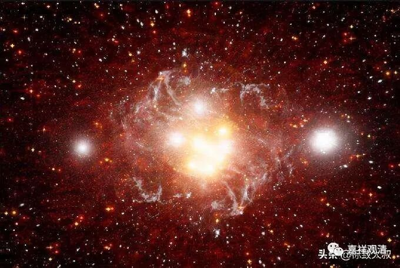

**《百论》游义·主宰的神我不存在**

义释：

婆薮《百论释》列举的“数论二十五谛说”是一个特殊的存在，它既不同于今天的《数论颂》，也不同于《金七十论》。

我们看下表——

1、《数论颂》

2、《金七十论》异说

3、《百论释》

1

自性

自性

自性

2

觉

觉

觉

3

我慢

我慢

我慢

4

五唯、十一根

五唯

五唯

5

五大

五大、十一根

五大

6

十一根

据自在黑《数论颂》和乔荼波陀的注释介绍（《古印度六派哲学经典·数论颂》·姚卫群，P155），数论派的二十四谛生起关系是：自性生觉，觉生我慢，我慢生五唯和十一根，五唯生五大。《金七十论》第二十一节颂及释与此说相同。

而《金七十论》第五颂及释又有一说：自性生觉，觉生我慢，我慢生五唯，五唯生五大和十一根。

婆薮《百论释》为第三说：自性生觉、觉生我慢，我慢生五唯，五唯生五大，五大生十一根。基大师《大乘法苑义林章》的二十五谛说同此。（吉藏《百论疏》同。）

这个问题我有单篇的文章可以参考。

这里想说的是，以目前综合判断来看，可能第一说更符合数论派的原意，其他两说则很有可能是出自翻译（或者传抄）过程中造成的误解。

依胜论派，六谛说（六句义：实、德、业、同、异、和合）里的“实谛”（“实句义”）有九法谛实：地、水、火、风、空、时、方、我、意。《百论·破神品》相关联性的就是胜论“实句义”的第八个——“我”，就是有寿命、能看、具贪嗔痴的“主宰”。胜论派认为这属于“实谛”——是终极存在、真实存在，无可辩驳的存在。

前文中观派（提婆）提出一切法无自性（一切法空无相），外道不承许，而举出自许的理由——神是真实有的！

