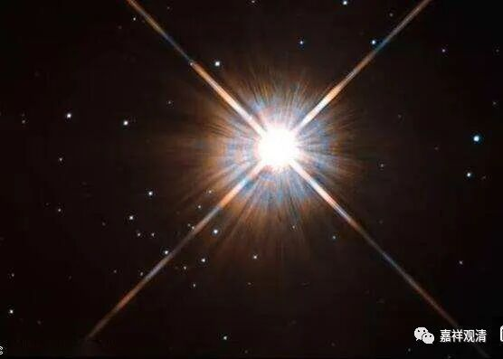

**《百论》游义·第二还是第一**

原文：

** “内曰：若有神而言无，是为恶邪。若无而言无，此有何过？谛观察之，实无有神。**

** 外曰：实有神。如僧佉经中说，觉相是神。**

** 内曰：神觉为一耶？为异耶？**

** 外曰：神觉一也。”**

今释：

自宗回复：如果如你（们）所言的神我确定是有，而说神我为无，那可以说“** 恶邪**”；如果本来就不存在而说神我无，这哪里有问题呢？究竟的推究观察，神我不可建立！

对方说：神我究竟存在！比如数论派的经典里说，觉相是神！

自宗提问：你的神我和觉，是一相？是异相？

对方回复：神觉一相。

义释：

此品，现在都做《<破神品>第二》，《卍续藏经》收录的《<涅槃经>疏私记》《<涅槃经>疏三德指归》都引作“《<百论>第一》”，如《<涅槃经>疏私记》：

“《<百论>第一》云：

外曰：实有神。如僧佉经中说：觉相是神。

内曰：神觉为一耶？为异耶？

外曰：神觉一也。”

这样看来，或者历史上有可能有过把《百论·舍罪福品》当作《序章》，而以《破神品》为第一章的本子。也有这个可能，因为《百论》的其他品都是“破某某品”，这样，《舍罪福品》一看起来就比较特殊，从《百论》的整体结构来看，《舍罪福品》的篇幅也明显大于其余各品，所以很有可能有过把《破神品》当作第一章的本子。

当然也有可能只是《<涅槃经>疏私记》和《<涅槃经>疏三德指归》抄错了而已，不过接连抄错、校对错，也是值得怀疑的。（有机会找一下有没有敦煌的本子可以看看。）

