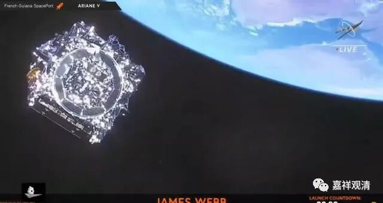

**《百论》游义·瞎子和瘸子**

义释：

这里，数论外道说“觉是神相”，这是一招破绽非常大的建立。数论的“神我”非能生所生，是常法，即使说神我是因，也不是“能生”的“生因”，而是“了因”。

数论派的二十五谛是以“自性”和“神我”为核心的，所以有的人把它理解为一种二元论：“神我”近乎精神性，“自性”略近物质性。“神我”不变化、不创造；变化、创造的功能属于“自性”。但“自性”并不单纯凭自我就可以创造，它需要“神我”这个旁观者的“照了”才能“生发”——也就是说，按数论派的宇宙生成论，世界的生起，需要“神我”和“自性”两者共同“合作”才能创造。（而且这种创造世界的过程是染污、堕落的过程。）

数论说“自性”和“神我”，有一个经典的比喻，就是瞎子驮着瘸子，他们需要互相帮助才能创造出世界——从自性生觉，觉生慢，我慢生五唯、十一根、五唯生五大……世界因此展开。

数论外道的《金七十论》说：

** “我、自性，和合义亦如是。我为见故，自性为他独存故，如跛、盲人合者……如是二人以共和合遂至所在，此之和合由义得成就。至所在，各各相离。**

** 如是我者见自性时即得解脱。是自性者，亦令我独存，各相舍离。由义生世间者，由人（神我）为见他，自性为独存故。因此二义，故得和合。是和合者，能生世间。”**

数论派“解脱”的过程则与世界生成的过程相反——通过禅定，“神我”注视“自性”，自性如“新妇般羞涩”，收起变化，五大、十一根摄入五唯，五唯摄入我慢，我慢摄入觉，觉摄入自性，最后“神我”与“自性”独存，即获得解脱。

