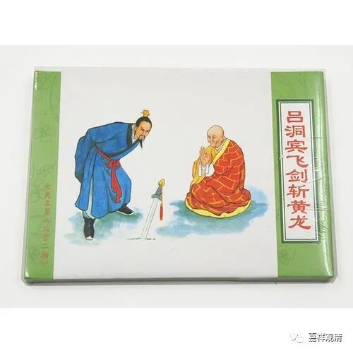

**《微课堂佛教史》331·1**

黄龙慧南禅师还有一个比较有名的故事，就是“吕洞宾飞剑斩黄龙”，这应该是“三言两拍”里面讲的故事（《醒世恒言》第二十二卷）。

有这样一个故事，就是吕洞宾去见黄龙禅师，然后看他不爽，晚上就飞了一把宝剑过去……最后被黄龙禅师给收伏了。

也见于《嘉泰普灯录》：

吕岩真人，字洞宾……未几，道经黄龙山，睹紫云成盖，疑有异人。

乃入谒，值龙（黄龙慧南禅师）升堂。

龙（黄龙慧南禅师）见，意必吕公也，欲诱而进。厉声曰：“座傍有窃法者。”（有偷听的！）

吕毅然出，问：“一粒粟中藏世界，半升铛内煮山川。且道此意如何？”（内丹之术如何修炼，老和尚能谈谈吗？）

龙指曰：“这守尸鬼。”（守着身体，只会玩色壳子，追求长生不老。）

吕曰：“争奈囊有长生不死药。”（修内丹能长生不老，这不香吗？）

龙曰：“饶经八万劫，终是落空亡。”（尽管长生，终归不出轮回。）

吕薄讶，飞剑胁之，剑不能入。遂再拜，求指归。

龙诘曰：“半升铛内煮山川即不问，如何是一粒粟中藏世界？”（你的内丹修炼法我们不讨论，这“一粒粟中藏世界”的境界你来聊聊看？——这里，吕本来说的“一粒粟中藏世界”说的是内丹奥妙，黄龙慧南说的“一粒粟中藏世界”说的是华严法界重重无尽的事事无碍境界。一个玩的是形而下的玄妙物质，一个论的是形而上的境界，由此高下立判。）

吕于言下顿契。作偈曰：

“弃却瓢囊摵碎琴，如今不恋水中金。

自从一见黄龙后，嘱付凡流着意寻。”

当然了，此段文字小说的味道更浓了……

我记得有一次我们出去玩的时候，看到有一个好像是吕洞宾的庙，我还跟大家开玩笑讲这个故事，后来在临济宗里面就有一个说法，说吕洞宾后来成为了临济宗的护法，因为他拜了黄龙慧南禅师为师。至少在传说当中有这样的说法，我们到后面再讲。

那么，在“五家七宗”当中，沩仰宗和临济宗都是属于马祖道一禅师门下的，而另外三个——曹洞宗、云门宗和法眼宗都是属于（至少都是挂在）石头希迁禅师门下的（但它们实际上和马祖道一禅师门下都有关联）。

这个很有趣，我们可以这么说，就是全部的“五家七宗”都和江西禅、和马祖道一禅师有关，也就是石头希迁禅师门下的三家基本上和马祖道一禅师门下的两家的祖师都有关。但是马祖道一禅师门下的临济义玄禅师、沩山灵祐禅师、仰山慧寂禅师，就主要待在江西禅门下，特别是临济义玄禅师尤其明显，所以说马祖禅或者江西禅对于后世禅宗的影响是非常大的。

反观石头系的禅宗，好像大家平时不怎么听说，或者说大家对于石头希迁禅师不太了解。其实“五家七宗”当中有三家是石头系的，前面我们已经讲过一个曹洞宗，是吧？而后面这两家都是出自雪峰义存禅师门下。雪峰义存禅师的老师是谁呢？他继承的是谁呢？继承的是德山宣鉴禅师，就是“德山棒”那个的宣鉴禅师。

