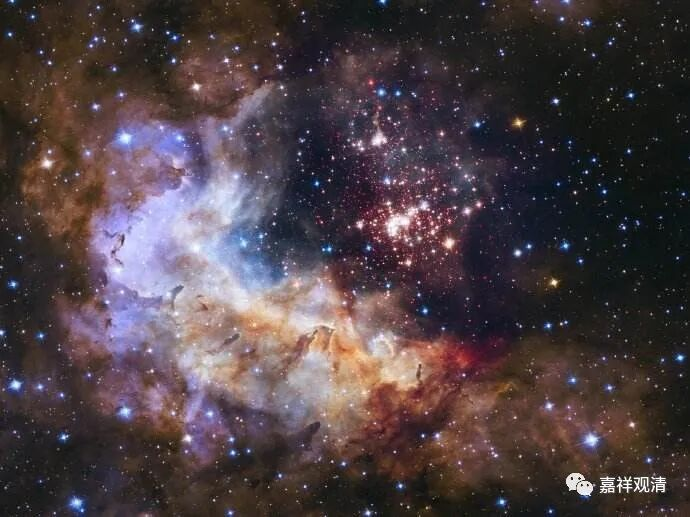

**《百论》游义·随应破与自共许**

义释（补充）：

前举胜论派说：“** 优楼迦言：实有神常，以出入息、视眴、寿命等相故，则知有神”，**吉藏《百论疏》对此展开说：

** “又，诸异外道还自相破。若以‘出入息’为神相者，第四禅已上应当无我，以无出入息故。**

** 若以‘视眴’为神相者，诸天目及鱼眼不眴，应当无有我。又无色界众生及无眼人悉应无我。**

** 若以‘寿命’为我相者，外道以暖触为寿命，若尔，大日等有暖触，亦应有我。”**

胜论以有出入息、能视眴（眴xuàn，动眼睛。视眴，眼睛能动），有命，推知有神我。吉藏对此辩驳说：1、若因出入息而证有神我，那么，我们知道色界四禅以上（包括无色界众生都）没有出入息，则四禅以上应当没有神我，没有补特迦罗？

若因能动眼而证明有神我，那么没有眼睛（无眼人、无色界众生）、眼睛不动的众生都没有神我咯？

若因寿命而知有神我，而你们又以有温度（暖触、体温）来推知命存，那么，太阳、火堆因为有暖触、有温度，也应该有我咯？

你们胜论派的这些说法都有不可摆脱的矛盾，所以你们证明“神我实存”的这些理由都不成立！

这里“** 诸异外道**”值得就是“** 优楼迦**”的随行者——胜论外道；“** 还自相破**”意思是胜论派成立“我”（神我）的观点仍旧和先前数论派的观点一样要被破除。（这里要提出的问题是，吉藏所举的“四禅息住”、“无色界无色”等事例，胜论派是不是共许呢？）

