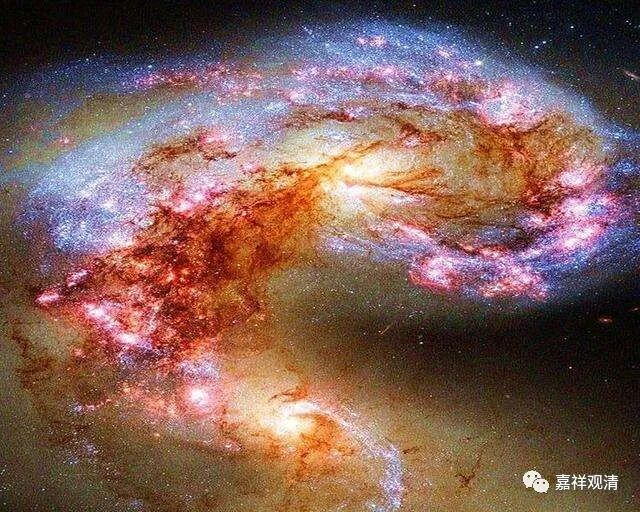

**《百论》游义·能生所生**

原文：

“** 外曰：不生故常（修妬路）。**

** 生相法无常，神非生相故常。**

** 内曰：若尔，觉非神相（修妬路）。**

** 觉是无常，汝说神常，神应与觉异。若神觉不异者，觉无常故，神亦应无常。**”

今释：

对方（数论派）说：（神我）不生，故是常。（修多罗）

带有生的性质的事物那都是无常。“神我”不具有能生所生的性质，是常法。

自宗说：照这么说，“觉”（认识）就不是“神我”的本性。（修多罗）

按你们数论派的说法，“觉”是无常，“神我”是常，那么，“神我”与“觉”应该是异。（而你前边的“宗”是“觉”与“神我”是一——你要么失去自己的观点，要么放弃你数论派的观点。）

若你坚持自己的观点，认为“神我”和“觉”不异，那么，“觉”是无常，“神我”也应是无常——而你说“神我”是常。

义释：

数论派对二十五谛分为四类：“1、本而非变易：2、变易而非本；3、亦本亦变易：4、非本非变易”。这里的“本”就是能生，“变异”就是所生。上文我们说过，数论的二十五谛生起说现存有三种解读，而依能生（本）所生（变异）来总结，则可归纳为两种：

一、1、自性，是根本，是能生，不是所生；

2、十一根、五大，是所生，不是能生；

3、觉（大）、慢、五唯，既是能生，又是所生；

4、神我，不是能生也不是所生；

二、1、自性，是根本，是能生，不是所生；

2、十一根，是所生，不是能生；

3、觉（大）、慢、五唯、五大，既是能生，又是所生；

4、神我，不是能生也不是所生；

不管上述那一种说法，都认定，“神我”非能生、非所生，“觉”则既是能生，又是所生。拿《百论》的话来说，就是，“神我”是常，“觉”无常。

若以数论派经典的教义，很明显是不能许“神觉一相”的；若许“神觉一相”，就必然会违背《金七十论》、《数论颂》这些权威经典的核心理论。婆薮《释》仅展开了两个问难，吉藏《疏》展开了五个（可以合并为四个）问难。

吉藏《疏》说，数论派和胜论派虽分别许“觉是神相”，但含义不同：数论派说的是体相，如火以热为相；胜论派说的是标相，如火以烟为相。吉藏的这种分别很有道理，数论派说的是合一的相，胜论派说的是分别的相。

现在的问题是：既然数论派的根本教义里明显之初了“神我”与“觉”不同的性质特征，那数论派为什么要说“神觉一”呢？这就是下文引出的“神我”之“遍入”性。

