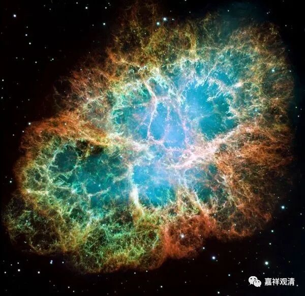

**《百论》游义·遍不遍门说一异**

原文：

“** 复次，若觉是神相，无有是处。所以者何？觉行一处故（修妬路）。**

** 若觉是神相者，汝法中神遍一切处，觉亦应一时遍行五道；而觉行一处不能周遍，是故觉非神相。**”

今释：

（自宗说：）再者，若坚持说“觉是神我的本性”，这完全没有正确的道理。为什么呢？因为（你们说）觉“行一处”，不具有普遍性（而你们又说“神我”有普遍性，这是矛盾的）。

若说“觉”是“神我”的体性、“觉”与“神我”为一，而你们数论派又说“神我”能遍入一切处，则觉应如神我一样瞬间周遍行于所有五道。而实际你们又说觉是有限的在一处而不能周遍，所以，（你们的说法矛盾，因此）“觉”不能是“神我”的体性。

义释：

数论宗说“觉是神相”、“神觉一”，自宗说：在常、无常问题上你必然会出现自相矛盾。数论说：因为“神我”能遍入（浸入）“觉”，所以。“神我”与“觉”能为一，“觉”能是“神我”的体性！

自宗就问他：你的“神我”（能遍）和“觉”（不能遍），是“遍”还是“不遍”呢？

一，用你的“神我”去迁就“觉”，那么，“神我”应该和“觉知”一样是“不遍”——而你许“神我”是“遍”，矛盾！

二，若以“觉”去迁就“神我”，那么，“觉”应该和“神我”一样是“遍”—而你根本说“觉”不遍，矛盾！

三，若你按照二十五谛的性质，说“神我”能遍而“觉”不遍，则“神我”与“觉”是异——而你坚持“神觉一”，矛盾！

四，若如前说“神我”与“觉”体性是一、性质各别，那么“神我”与“觉”自身都同时具备“遍”和“不遍”这两种属性，而“遍”和“不遍”是一对相违的性质，无法在一个事物上同时成立——矛盾！

吉藏在《百论疏》分为五解，这里合并第三、第四项，作四解。婆薮《释》着重讲的是第二解。

