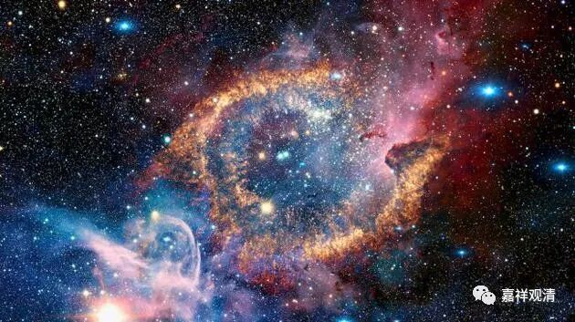

**《百论》游义·一义立错，千疮百孔
**

原文：

“** 复次，若尔，神与觉等（修妬路）。**

** 汝以觉为神相者，神应与觉等，神则不遍。**

** 譬如火无热不热相；神亦如是，不应有遍不遍相。**”

今释：

（自宗破曰：）再者，若是你所许的那样（觉为神相），则“神我”与“觉”应等同。（修多罗）

你们数论师现在许“觉为神相”，则“神我”与“觉”应相同，（因为你们数论派说“觉”不遍一切处），所以“神我”也应不遍一切处。（而数论派又说“神我”能遍一切处。）

譬如火不是热不热相，“神我”也一样，不应是遍不遍相。

义释：

婆薮《释》的这一段实际可以分为渐次的两破：

一、若“觉”为“神我”的“自性”，“觉”与“神我”为一，则，因为“觉”是不遍相，则“神我”亦应是不遍相！而你数论派实许“神我”是能遍相——同一个“神我”，你既许遍相，又许不遍相——矛盾了！

二、若对方说“我不矛盾！我就是这么认为的——‘神我’既有遍相，又有不遍相！”如“神我”本身是遍相，而当他遍入“觉”的那部分就具备“觉”的体性，是不遍相。

这个时候自宗就以火为例子，说“** 譬如火无热不热相**”（这里的“** 无热不热相**”，就是“** 非热不热相**”）。“火是热相”，这是大家共许的，所以火不是“热不热”相！热与不热是相违的！同样，“神我”也不可能是“遍不遍相”，因为遍与不遍是相违的！

（对这一段《百论》原文的解释，与吉藏《百论疏》和刘常净《百论释义》不同，大家可以自行抉择。《百论释义》这一段可以理解为《百论疏》的白话解释。）

