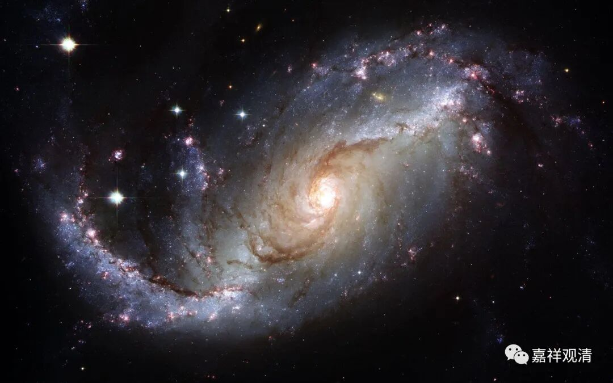

**《百论》游义·溃势已成，堵不胜堵**

原文：

“** 复次，若以为遍，则有觉、不觉相（修妬路）。**

** 汝欲令神遍，神则二相：觉、不觉相。何以故？觉不遍故。神若堕觉处是则觉，若堕不觉处是则不觉。**”

今释：

（提婆自宗继续破对方：）再者，若如数论派所说“神我”有遍的特征，那么，“神我”应该有觉、不觉二相！（而你说“觉”是“神我”的相——“神我”即是“二相”，又是“一相”，矛盾！）

你们数论派若是最终许“神我”有遍的特性，那么，“神我”有二相——“觉”“非觉”相。为什么呢？数论派说（神遍而）觉不遍——遍入“觉”的“神我”部分有“觉”相，遍入“非觉”的“神我”则有“非觉”之相。

义释：

《百论颂》和婆薮《释》此处都点到为止，并没有展开，他的意思是这样的：

由于“神我”有遍的特性，则遍入“觉”的“神我”部分有“觉”相，遍入“非觉”（或者说“非遍入觉”）的“神我”则有“非觉”之相，那么。“神我”是“觉、不觉”相。而前文说“觉为神相”，这样要么“觉是神相”错了（因为“神我”是“觉不觉相”），要么“神我是遍”这个说法错了！

简单说就是：

1、若“觉”是“神我”相，则神我不遍；

2、若“神我”遍，则“觉”非“神我”相。

这一节和上一段的差别是，上一段是从“觉为神相”之下的遍不遍相摘出过失，这一节是从“神是遍”之下的觉不觉相寻出过失。

吉藏则继续推理：若你数论派仍旧同时接受“觉是神相”和“神有觉不觉相”（这一点在上面已提出是矛盾了），那么，我们也可以说“火有热不热相”——这明显违背世俗共通的认知。

同时，若认可“神有觉不觉相”，则“神我”与“觉”，亦一亦异——觉相是一，不觉是异。而你前面说“神觉一”——矛盾！

