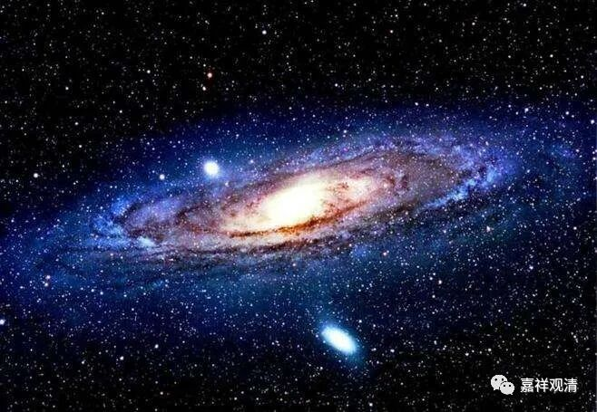

**《百论》游义·灯喻，生因和了因**

原文：

** “外曰：如灯（修妬路）。**

** 譬如灯能照物、不能作物。因缘亦如是，能令觉有用，不能生觉。**

** 内曰：不然。灯虽不照瓶等，而瓶等可得，亦可持用。若因缘不合时，觉不可得，神亦不能觉苦乐，是故汝喻非也。”**

今释：

数论师说：如灯。（修多罗）

譬如灯能照物品，但不能造物品。（前面说因缘和合而有觉用，此）因缘也像灯一样，能令“觉”起用，不能生起“觉”。

自宗回复：不可以（这样把因缘比作灯）！灯不照瓶的时候，有瓶可得，也可以拿来用（即：有瓶的作用）。（但按照你前面的说法，）因缘没能会遇时，“觉”（用）不可得，“神我”也不能感知苦乐。所以你的比喻不成立。

义释：

这一段数论师的意思是：依缘而起的是“觉用”，而非“觉体”（觉力）。上下文连起来就是——“** 因缘合故，觉力有用，如灯。**”譬如灯能照物，非能生物。这可能是数论派常用的解释：了因和生因——能照了，非能出生。

自宗说：你的灯喻不成立！因为即使灯不照瓶，也已有瓶之体、有瓶之用；而你前述的立意是：因缘未遇时，有“觉”之体（觉力）、无“觉”之用——二者并不能成同类的比喻。（若依数论经典的说法，“自性生觉”，则因缘不具时，“觉”的体用俱无——灯喻仍旧不成！）

