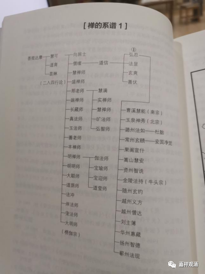
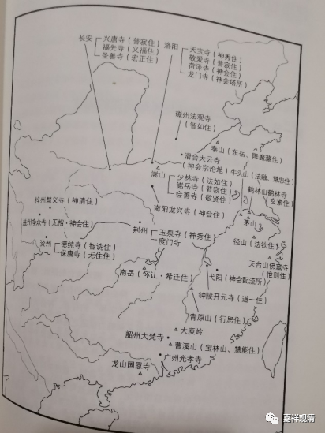

**《微课佛教史》337·1**

好，我们今天继续佛教史。

这两天和大家聊到一个问题，都说这些禅师的名字太多了，没搞清楚谁是谁，而且很多文字我在微信群里也没写出来。大家都觉得：“哎呦！怎么这么多禅师啊！这么多名字。”我现在就把类似于传承图当中比较重要的一些内容发出来给大家看一下，今明两天我们就专门看看到目前为止的这几张图。

有些名字大家都已经熟悉了，比如这第一张图中最左边的菩提达摩祖师，还有慧可禅师，这两位大家都是知道的。道育禅师，我们没有讲，但是昙琳禅师我们讲过，就是他的手被贼砍断了，然后让慧可禅师给他绑起来的那一位。他曾经整理过达摩禅师的《二入四行论》。

你们再看边上的向居士和僧璨禅师，看见没有？在这里他们两位是分别独立的，我在前面提过，关于这两位到底是不是一个人，是有争议的。其实是后世推说他们是一个人的，如果往前看早期禅宗的传记的话，没有说过这两位是同一个人的。后面的一些人我们不算太清楚，比如那老师、慧满等等，不过也没有那么大的关系，我们另外再说。

然后是道信禅师，他下面有弘忍禅师、法显禅师、玄爽禅师和善伏禅师。他这里没有写，但善伏禅师可能主要还是牛头系的，就是三论师系统的禅师。

我们再看五祖弘忍禅师门下， 比较重要的是曹溪惠能禅师、玉泉神秀禅师、潞州法如禅师（我上次给大家看过关于他的一篇碑文）、常州玄赜禅师、安国净觉禅师。后面的果阆宣什禅师就是宣什宗，我们讲过，在四川。嵩山慧安禅师就是老安禅师，是在嵩山的。资州智诜禅师，这个“诜”字念“shēn”，他实际上也是后来四川这一系的，包括保唐宗等等都和他有关。越州义方禅师、越州僧达禅师、刘主簿（佛教寺院里的主簿，相当于秘书）。

我们再看边上的第二张图。首先可以看到嵩山，达摩禅师主要在嵩山，是吧？然后左边的终南山道宣禅师和智岩禅师和禅宗的关系不大，道宣禅师是《续高僧传》的作者，智岩禅师是华严系统的。双峰山大家看到了吧？又名西山、四祖山，还有东山——冯茂山（也叫冯墓山）。西山、东山等等，这些都在湖北黄冈，都是四祖、五祖待过的地方。

南边的东林寺其实和禅宗没什么大的关系。大林寺，可以说道信禅师在那里住过。我们再往南面广东这里看这个罗浮山，道信禅师曾经跟两位禅师学习过，这两位禅师后来就去了这个罗浮山。建业就是南京，这是牛头系很重要的地方。

我们看起来在禅宗的早期，相对来说人也比较少，也比较简单一点。上次我们也讲过，聚众讲习的出现差不多要到四祖的后期和五祖时期，后来就基本上定在一个地方。你们看五祖，基本上就在西山和东山这里不动了，所以才会有很多弟子上门而来。如果是到处游走地讲学，弟子可能并不多。“只有你在某个地方停下来，大家才比较容易聚集起来”——这是寂如师跟我讲的，我觉得挺有道理，推己及人，想亦如是。

