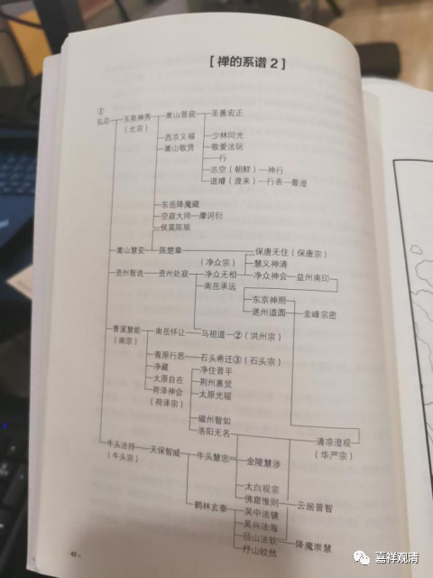

**《微课佛教史》337·2**

接下来我们看“禅的系谱”第二张。

弘忍禅师、老安禅师等等这些都有了。玉泉神秀禅师（北宗的神秀），下面是嵩山普寂禅师。在早期的时候，唐代的盛唐时期，是立玉泉神秀禅师为六祖，嵩山普寂禅师为七祖的。下面的曹溪慧能禅师（南宗）之后，到菏泽神会禅师“南宗定是非”的时候，得到了皇家的支持，最后定下来是曹溪慧能禅师为六祖，菏泽神会禅师为七祖。

牛头法持禅师和弘忍禅师的关系应该算是互相接触过，师承关系则并不能够真算得上。他后面是天保智威禅师、牛头慧忠禅师和鹤林玄素禅师，这里的“泰”字写错了，应该是“素”，鹤林玄素禅师。然后传到径山法钦禅师，这位法钦禅师就是径山国一禅师，或者叫径山道钦禅师，他是径山寺的开山祖师。

今年我们可能有机会去一下径山，在天目山附近，是一个大寺院，而且是非常重要的寺院。在中国佛教历史上，从南宋一直到明代的初年和中期 ，径山寺基本上就是禅宗里面第一重要的寺院了，从元代后期到明代的时候，是第二重要的寺院，不管第一还是第二，在禅宗里面（甚至整个中国佛教里面）一直排位很高（那时候四大名山信仰还没有成爆款）。

我们再看中间的资州智诜禅师、资州处寂禅师，再以后就是净众无相禅师，这就是净众宗，发展到了四川，这就是禅宗的四川这一支。在净众无相禅师上面还有一支，看到没有？保唐无住禅师（保唐宗），那么保唐系也是在四川的。

再看圭峰宗密禅师这一支，他从遂州道圆禅师这里也学习过，另外他也从清凉澄观禅师这里学习过，这也是为什么圭峰宗密禅师可以把四川的保唐宗和净众宗的禅讲给大家听。因为他和这几支都有一些师承关系，所以在禅源师资图当中还是讲了一些保唐宗、净众宗的历史和禅法。

再往下看，华严宗的清凉澄观禅师，他活了一百二十一岁，师承关系非常多，学习的范围也非常广，曾经到苏州学习过三论，天台、华严等等都学过。《华严》应该说是他私淑的法藏，按照我们今天的讲法，是他自己去接法藏大师的传承，实际上他和法藏大师没有直接的师承关系。

从清凉澄观禅师往下，他和牛头慧忠禅师好像也有点关系，所以他受到了一些中观的影响，在他的《华严经》注解当中既有中观的也有唯识的经论的来源。

