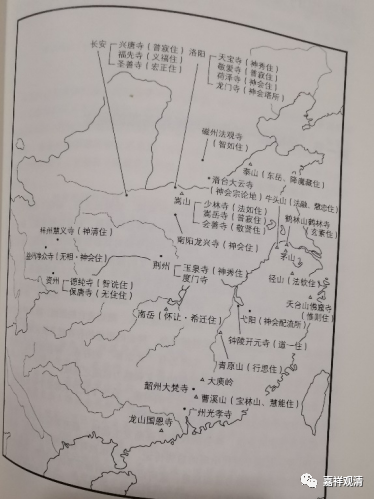

**《微课堂佛教史》338·1**

牛头慧忠禅师和鹤林玄素禅师，这两位都是牛头系的。佛窟惟则禅师，佛窟是一个地方，牛头也是一个地方——牛头山，是吧？佛窟在哪里呢？在天台山。如果我没记错的话，鹤林应该在常州或者是镇江附近。所以，我们再看最下面的牛头系，牛头系特别明显，基本上就是在江南这一带，从南京往宁波这里，甚至连温州也没到，它的地域性非常明确。

我们来看禅宗关系图中的地理方面。

首先看长安。长安是经济、政治的重镇，也是佛教的重镇。

嵩山，主要是有少林寺等等。在历史上禅宗和嵩山少林寺是长期有关系的，一直到后来的曹洞宗也在少林寺。

洛阳，禅宗的北宗在洛阳的活动比较多，对吧？因为当时他们有过正统的地位，而洛阳当时曾经是唐代的东都，所以北宗的很多人就在长安和洛阳活动。

滑台大云寺，其实是今天才会把它当回事，主要是因为在敦煌的相关文献中说菏泽神会禅师在滑台大云寺“南宗定是非”。

我们再看一下南京附近——牛头山。牛头慧忠禅师、牛头法融禅师都在牛头山，它是在南京的西南面一点。鹤林玄素禅师的鹤林是在镇江，还有茅山也是在镇江的南面，就是现在的句容，这个地方以前叫延陵。

然后往东南是径山（法钦住），这个是比较晚了，径山就是天目山。

你们看，从茅山到天目山，再往右下，到天台山佛窟寺——佛窟惟则禅师的佛窟，是很局限的一块区域。所以，三论宗包括后来的牛头系出不来，也与此有关，它太局限了！

我们再往中间走，南阳龙兴寺——菏泽神会禅师住。荆州玉泉寺，在中国历史上其实蛮重要的，包括智者大师也是在玉泉寺。《三国演义》里面的故事也提到，关公死了以后是在玉泉寺显圣的，显圣以后被普静和尚收服了。实际上，这个故事的原型是后来的智者大师。当然，智者大师也不是三国时期的，但这个故事的原型应该是在南北朝时期。大家看，荆州这里也是在长江的沿岸，也是经济比较发达的地方。

四川这里有几个。净众寺，无相禅师，是吧？这里的神会，是指净众神会禅师，净众寺的神会禅师。再往南面一点，资州，智诜禅师，是吧？然后，保唐寺的无住禅师。

再往南面看一点。南岳（怀让住），是在湖南。青原山（行思住），这个是在江西。弋阳，我们就不讲了。

再往南，大庾岭，在传记里面说当年六祖大师翻越大庾岭，后来被惠明找到的那个地方。曹溪山（宝林山），慧能大师出家以后主要住在这里。光孝寺，是慧能大师剃度的寺院。

以上算是禅宗初期比较主要的一些人物和地域。

