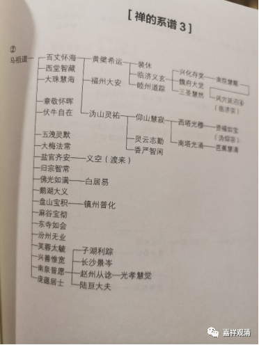
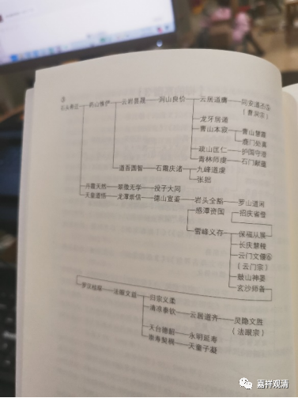

**《微课佛教史》338·2**

我们再往后看一下，就到了禅宗的发展期。

来看第三张表格。

据说马祖道一禅师门下有一百多位大善知识，这里列了一些。其中第一重要的、对后世影响最大的就是百丈怀海禅师。大珠慧海禅师，我们没讲。西堂智藏禅师，讲过没有？好像是稍微提到过。章敬怀晖禅师，他也是做过国师的，所以对禅宗和朝廷的关系蛮重要的。大梅法常禅师，我们讲过吗？好像没怎么讲。后面这些人当中，南泉普愿禅师我们讲过，赵州从谂禅师，我们也谈到过。五洩灵默禅师，五洩就是绍兴这里，西施的故里。你们看这里，也都是浙江一带的居多。赵州从谂禅师应该是在北边了，赵州在河北。

我们主要看百丈怀海禅师这一系。他最重要的弟子，一个是黄檗希运禅师，在他门下开出临济宗，就是临济义玄禅师，还有一个弟子是睦州道踪禅师。临济义玄禅师门下的弟子从兴化存奖禅师，一直到风穴延沼禅师，我们都没有讲。风穴延沼禅师在后期也是比较重要的，我们现在还没谈到。

百丈怀海禅师门下的另外一支就是沩仰宗，沩山灵祐禅师禅师和仰山慧寂禅师。沩山灵祐禅师还有一个弟子叫做香严智闲禅师，我们讲过关于点茶的那个故事。仰山慧寂禅师下面的几个弟子，我们都还没讲呢。

这里面还提到了白居易，其实白居易很难算得上是正统的弟子，把他放在这里主要是因为他的名气大。实际上他在佛教的造诣谈不上的，主要是名气大。反正他也看不出什么伪经不伪经的，对他来说，最主要的是信佛，这一点就够了。关于白居易还有一个比较重要的，就是他和鸟窠禅师的故事。鸟窠禅师在杭州，是吧？那个著名的“三岁小孩知道，八十岁老汉做不到”的故事。

我们再翻到下一页看，前面是马祖道一禅师这一系，后面就是石头希迁禅师一系的。

石头希迁禅师在历史上最重要的弟子就是药山惟俨禅师，他的门下一个是云岩昙晟禅师，我们提到过，云岩昙晟禅师最重要的弟子是洞山良价禅师。洞山禅师的下面，云居道膺禅师和曹山本寂禅师都是曹洞宗的。你们看，他这里把曹洞宗主要是放在云居道膺禅师下面的，曹洞宗这一支流传下来，主要的并不是曹山本寂禅师这一支，而是云居道膺禅师这一支，这个现象也比较有趣。

