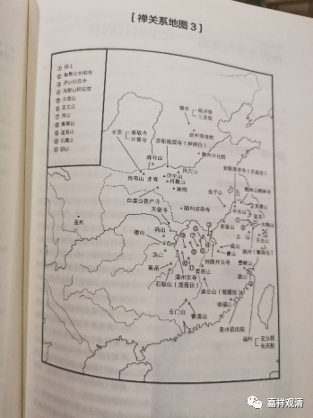

**《微课佛教史》339·2**

好，我们再看“禅关系地图3”。

我们从上往下看。首先是镇州，这个地方也叫真州，也叫正定，也叫真定，就是在石家庄北面一点。历史上也叫常山，常山赵子龙就是在这个地方。这里有什么呢？临济院，就是临济义玄禅师的寺院，现在这个寺院还在。这个寺院在历史上比较重要，但它不是那种大型的寺院，属于自己建造的小寺院，不是皇家寺院，也不是那种府县层级的大寺院。

然后往下是赵州观音院，就是赵州从谂禅师在的那个地方，在石家庄的南面一点。往下是魏州兴化院，就是兴化存奖禅师。往左下，风穴山，就是风穴延沼禅师，是吧？丹霞山，丹霞天然禅师。伏牛山，伏牛自在禅师。南阳，南阳慧忠禅师。钟南山旁边，圭峰宗密禅师，这个圭峰是在西安的西南面不远的地方。北边一点就是麻谷山，麻谷宝彻禅师。长安这里有章敬寺，就是我们前面讲的章敬怀晖禅师，对吧？他当时被朝廷封为国师的，所以禅宗百丈淮海禅师这一系能够支撑起来 和他在中央也有关系。

然后圭峰往西南一点，白崖山香严寺，这个是香严禅师，是吧？就是那个著名的香严上树的公案。香严禅师就是学了半天师父都不同意他，最后就跑了，觉得算了，没希望了……结果有一天干农活，往后边扔了一个石头，甩到竹子上，“铛”的一声……就开悟了。香严禅师是沩山灵祐禅师的弟子。

再往南面一点,天皇寺，这个地方在哪里呢？可能在湖北吧。再南边就是药山，这个是在哪里呢？在湖南常德的北边一点，而德山在常德的东边一点，沩山在常德的南边一点。南岳也是在湖南，石鼓山也是在湖南。

然后我们看江西,非常多。从③ 到⑪，都在江西，对吧？庐山、云居山、百丈山、洞山、黄檗山，都在江西，所以六祖以下四五六代的时期，禅宗在江西是非常兴盛的。青原山也是。

再往南就是广东了，云门山，还有曹溪，这个就不讲了，绝对南禅祖庭。

我们再看江浙这一带看。金陵清凉寺，清凉文益禅师，现在还没谈到。鹤林山有鹤林玄素禅师，我没有谈，他是三论宗牛头系的。牛头山，也是牛头系的。大梅法常禅师，大梅山在宁波附近。天台山，应该在宁波的东南面一点。南屏山永明寺，（今浙江杭州），可能就是净慈寺。径山，就是今天的天目山，在杭州的西边一点，属于临安。禅宗定焦寺院“五山十刹”基本上大多数都集中在江浙一带，但也有个别不是的。

越州，除了大珠慧海禅师还有其他几位禅师，我们好像也提到过法敏禅师，是吧？越州就是今天的绍兴。然后是疏山、曹山，就是曹山本寂禅师，这可能在江西（今江西抚州）。雪峰山和鼓山都在福建，福建福州附近，鼓山最重要的是涌泉寺，前面我们讲过了，就是和雪峰义存禅师关系非常好的闽王王审知出钱建造的。泉州招庆院，忘了（招庆省僜禅师）。然后这里有一条线拉出来，福州，看见没有？玄沙院、长庆院，是吧？玄沙师备禅师，也是雪峰义存禅师门下的。

我们大致上可以看出来了，禅宗这几个系统，和我们现在讲到的也差不多，个别的没有提到，大部分有名的都提到了。

最后呢，我们可以从这张图看到，到了唐代禅宗的兴盛期，主要确实是在湖南和江西，所以当时有一种说法叫“走江湖”，就是指的湖南和江西，再加上湖北，因为后来五祖山——就是东山（也变得比较重要）西山——双峰山，也比较重要。双峰法门，或者东山法门，从这时候就开始讲法门了，是吧？所以经常会讲禅宗要“走江湖”。

那么浙江的这一系主要是牛头系为主，天台宗也是在这里。福建这一系我们也看到了，主要是因为雪峰义存禅师开出来的这一脉。

好，今天就到这里，谢谢大家！

