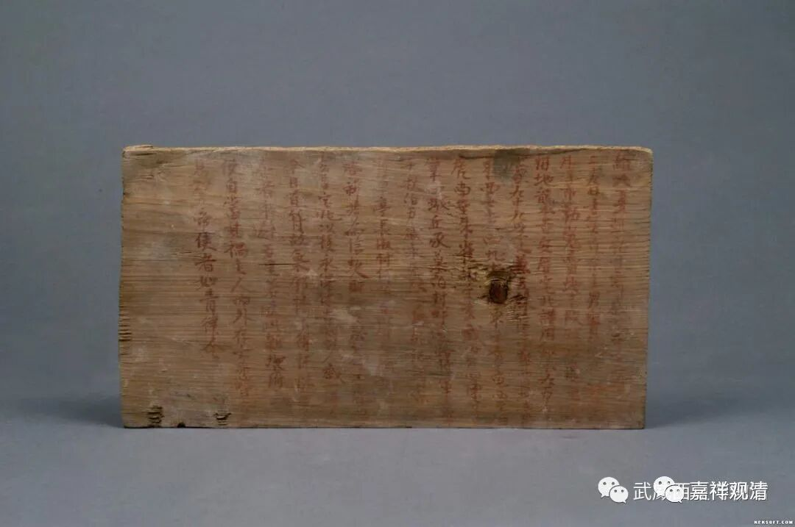
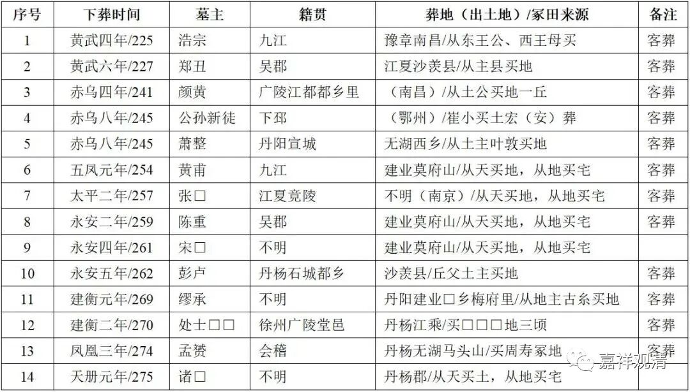

**客葬、人口迁徙与汉藏文化传播**

** ——藏地的“买地券”**

之前写过一篇关于藏地保有的类似“买地券”风俗的文章——

“** 老师父说，藏人过世，一般是用天葬的，有火葬、水葬，也有土葬……土葬当中，有一种属于比较特别一点的：此人远离家乡，而且当地不方便天葬等等，于是就用土葬。在土葬落葬之前，就会找一块大点的石头，在石头上写一些字，说这个地方现在买下来做土葬用，意思是告诉当地的土地山神之类的神灵，“这个地方我们用了，我用钱买了，不玷污你的地方”……大致就是这意思，然后才能落葬。总的意思是：山林土地本来所有权属于地神、山神，去世的人直接落葬会引起他们不快，所以先‘买地’，把‘所有权’变更一下，然后再用作土葬，这样比较不会触怒神灵。**”

前几天读了韩吉绍教授的《中古人口迁徙与买地券信仰》，觉得可以接着说几句。

韩文说，“买地券信仰”（我觉得“买地券信仰”这个词在这里并不是最佳的表述，暂时借用）有几个明显的符号、特征，落葬之处“非祖茔”、属于“客葬”，实践中的“买地券”带着明显的移民和人口迁徙的信号……

韩文中的一个表格

上述的这些特征在前文介绍藏地“买地券”的实际运用中也可以找到——远离家乡（移民、人口迁徙），无法实行天葬（不能用通常的葬法），在客地乞地土葬（“买地券”的实际运用）。目前不知道藏地此类“买地券”有没有实物出土，或者有没有藏传文献的相关记载，我估计可以找到相关的介绍。有机会可以请老师父给一个实践版的“买地券文疏”范本，也算是某种活着的“实物”了。

接下来就是猜测：藏地保存的这种“买地券信仰”是怎么出现的？可以肯定是从汉文化“引进”的，但何时与如何引进的呢？

我想大概有四种可能：1，“买地券信仰”主要在唐代和文成公主入藏时传入的大量汉地文化一起同时传入；2，在汉藏长期的人口双向流动中渐渐传入；3、前两者的结合；4、汉唐之间随古羌族西进而在更早期传入青藏高原。

启发了一个新的猜测：汉藏周围民族会不会也保有“买地券”的“信仰”呢。我觉得肯定会有，比如可以采访一下羌族、嘉戎人。更进一步，如果有，那他们的“买地券信仰”是从汉文化直接流过去的呢？还是从藏文化转手过去的？抑或是他们才是二传手？“云”游的时候这类小东西值得继续八卦……

清案：

最上面配图是西夏买地券，朱书，松木。说明汉文化符号的买地券确实已经渗入周围民族的民俗、丧俗中了。

