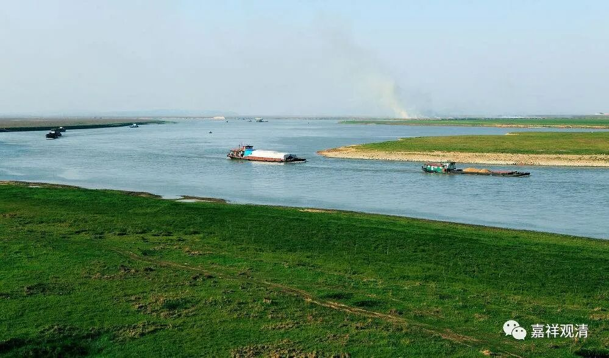

**《微课堂佛教史》342·1**

好，我们继续今天的禅宗史。

禅宗史我们已经讲了很多了，希望到现在这个时候大家能够稍微记住一点内容，不过记不住也无所谓，其实大家听得多了以后，慢慢地就会把很多内容互相联系起来。至少很多禅师的名字大家已经开始一点一点地熟悉了，对吧？我们可以把最近讲的这些差不多同时代的禅师名字再复习一下。

“会昌法难”前后，北边最重要的是临济义玄禅师，南边最重要的是德山宣鉴禅师。上次那个图大家还记得吧？临济义玄禅师是在常山，又叫真定，也叫镇州，德山宣鉴禅师是在常德的德山，他之前是在澧阳或者澧县或者澧州，这个地方现在还有临澧县。

那么，临济义玄禅师和德山宣鉴禅师分别是洪州系（马祖道一）和石头系（石头希迁）的。临济义玄禅师的老师是黄檗希运禅师，黄檗希运禅师的老师是百丈怀海禅师，百丈怀海禅师的师父是马祖道一禅师。德山宣鉴禅师的老师是龙潭崇信禅师，龙潭崇信禅师的师父是天皇道悟禅师，天皇道悟禅师的师父是石头希迁禅师。

所以在当时差不多同时代的禅师有德山宣鉴禅师、北边的临济义玄禅师、南边的沩山灵祐禅师、仰山慧寂禅师，还有洞山良价禅师的时间也差不多。洞山禅师的师父是云岩昙晟禅师，云岩昙晟禅师的师父是药山惟俨禅师。洞山禅师的弟子当中包括曹山本寂禅师。

我们前面讲到禅宗在福建传法比较重要的一位人物雪峰义存禅师，还有他的一些师兄弟包括钦山文邃禅师、岩头全奯禅师等等。前天我们又讲到了夹山善会禅师，他的老师是船子德诚禅师，船子德诚禅师的师父还是药山惟俨禅师。

这些人都是差不多同时代的，所以夹山善会禅师和玄沙师备禅师（我们还没讲）、雪峰义存禅师他们的弟子们都有互相之间的来往。雪峰义存禅师曾经到处参访的，岩头全奯禅师也是一样到处“云游”。这个时候呢，各个地方的禅宗都比较兴盛，因此一些大师们都经常走来走去，互通往来。

这也属于禅宗比较“兴盛”的时期——这个“兴盛”需要打引号，为什么呢？我之前也讲过很多次了，应该说是禅宗的记载当中比较兴盛的时期。但是这里面还是有一些问题，比如我之前提到的很多年代方面的问题。如果认真去考证的话，我觉得有些新的问题是可以考证出来的，但是现在我也没那么认真。如果一定要认真考证的话也是可以的，但是会被人骂的。前两天我在提到这方面问题的时候，发表的一些内容就已经被人骂了。（不过，我好像也不是很怕被人骂。）不过我不是专门的佛教史、禅宗史的研究者，仅凭机缘作一下考订证伪而已，并不准备每个人、每个事件都去深究……

