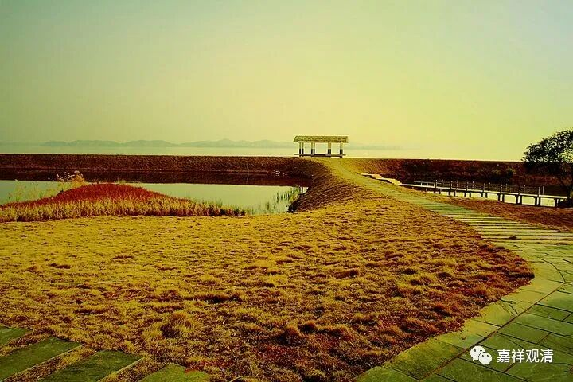
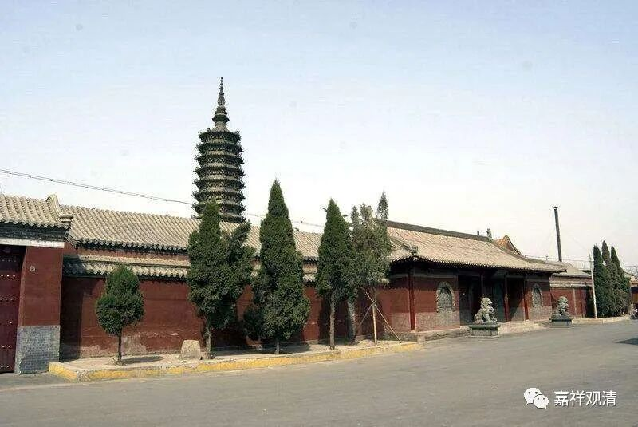
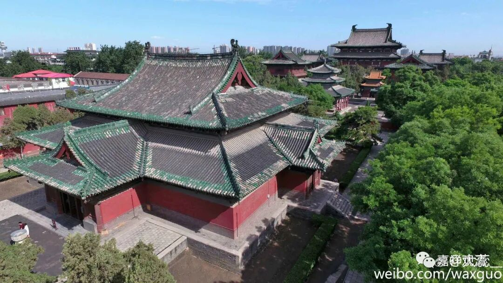

**《微课佛教史》342·2**

北边是临济义玄禅师，南边是德山宣鉴禅师，这两位大师在当时是齐名的，被称为“德山棒、临济喝”。禅宗里面经常讲的“棒喝”，就是这么来的。我们小时候看日本的动画片《聪明的一休》，那个师父就老是要打一休，“啪”的一声。再小的时候看日本的电视剧《姿三四郎》也是这样，姿三四郎要被榔头和尚打的。其他的故事我已经记不得了，就是他要被榔头和尚打我还记得，每次都要打几板子。还有一次，姿三四郎翻跟头飞出去，这个我还记得，其他的情节就不记得了。不知道现在网上还有没有《姿三四郎》。

那么，“德山棒、临济喝”就是 “棒喝”这个词的典故来源。

我们最近都在讲德山宣鉴禅师这一系，现在再讲临济义玄禅师这一系的一位重要人物三圣慧然禅师。“三圣”指的是三圣院，三圣院也是在正定（镇州）的，现在是不是还叫三圣院我就不知道了。反正我还是推荐大家如果去五台山朝拜的话，就多安排两天时间到石家庄去玩一下，赵州柏林寺和正定都可以去看一下。这个地方叫三圣院，所以称他为三圣慧然禅师。

正定临济寺

三圣慧然禅师在临济义玄禅师门下也是属于比较重要的弟子。我们可以看到，三圣慧然禅师在临济义玄禅师之后就独立开法了，他没有继续待在临济院。看起来就是，临济院好像没有那么大，其实今天也可以看到在镇定比他大的禅宗寺院有很多。然后三圣慧然禅师就去了正定或者真定，你们可以看到，其实正定另外一个寺院更加重要、更大，是官方府一级的寺院，叫隆兴寺，大家有空去看一下这个寺院。前两天我还看到这个寺院出了邮票，里面有一些很重要的文物。

正定隆兴寺

三圣慧然禅师有一点和雪峰义存禅师很相像，包括和当时差不多同时代的岩头全奯禅师、夹山善会禅师一样，他们都有一个共同特征，就是他们跑的地方非常多，到处跑。三圣慧然禅师跟临济义玄禅师学过，是吧？然后他参访过接触过的老师包括道悟圆智禅师、仰山慧寂禅师、香严智闲禅师（他是仰山慧寂禅师的一个同学）、洞山良价禅师、德山宣鉴禅师、雪峰义存禅师等等，都去参访、接触过，这些人都是差不多同时的。

