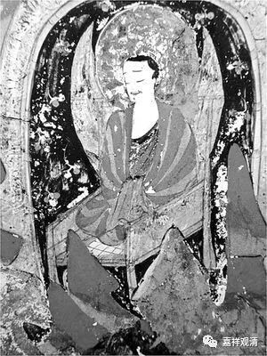
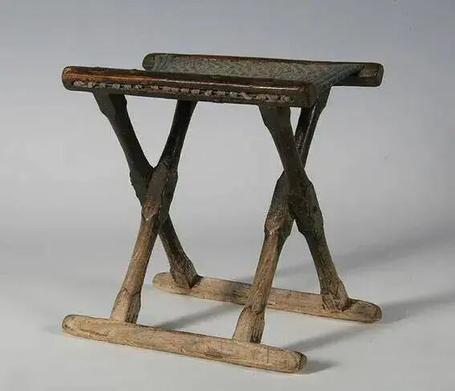

**《微课佛教史》345·2**

接下去我们要讲的这个公案就可能是后出的，而且大家可以看到一点“公案”的演变线索……

我找了几段，我们先来看第一段。

** 普请往寺庄，**“普请”就是集众。“寺庄”是什么呢？就是寺院里面的农庄，这个时候已经有百丈怀海禅师设立的丛林制度了，寺院里面就有一些农庄。

我的庙里面以前也有这个情况（庙里有地），现在没了，那块为寺院买卖土地的碑还在。就是大家觉得来这个庙进香的效果不错，比如说该生孩子的生了，所以大家就愿意捐一点香火钱。但是这些钱施主怕被庙里面用完了，他们担心和尚会不会把钱花到其他地方去，所以他们就会买点地送给寺院。

所以寺院就会有农庄，也会请人来种地，或者大家看历史的话，也会有一些佃户什么的。地里的收成一部分给寺院，一部分卖掉，还有一部分给佃户。还有一些人，因为他自己种地的话是要交税的，于是他就把头剃了，说自己是给庙里干活的，每年交一定的租子给庙里面。一开始的时候是把头剃了，到后来头也不剃了，这个就相当于逃税，是古时候常见的一种“逃税”“免丁”的行为。

这个就是寺院里面有农庄的，所以叫“普请往寺庄”。

** 路逢猕猴。**路上看到了猴子。

雪峰义存禅师就说了。** 师曰：“这畜生，一人背一面古镜，摘山僧稻禾。**什么意思呢？看到猴子可能是在农庄里面糟蹋粮食。“一人背一面古镜”是什么意思呢？“古镜”，一般来说可以把它比喻为如来藏——明明白白的明镜，就是心里面来什么照什么。本来的佛性是在那里的，但是它被蒙尘了，所以现在跑到我们庄子里面来糟蹋庄稼。差不多是这个意思。

** 僧曰：**有个和尚就说了。** “旷劫无名，为什么彰为古镜？”**这个“彰”在有些版本写的是“立”，就是“立为古镜”。你们看“彰”有一小部分就是“立”，是吧？所以这个字到底应该怎么理解，其实也搞不清楚。“旷劫无名”，那么久以来都没有立过名字，为什么要把它叫做古镜呢？这个是最容易解释的。

另外一方面，“彰”这个字其实也好的，可能比“立”那个字更好。但是我不知道这个字应该怎么去很好地翻译，一下子找不到合适的解释。“旷劫”——在那么长的时间里，我们没有办法给它安立“古镜”的名字，现在为什么要把它说成是“古镜”呢？

** 师曰：“瑕生也。”**这个“瑕生”可以有两种解释，第一种解释就是古镜“瑕生”，这句话其实是针对上面来说的。古镜“瑕生”，在古镜上面有了尘埃以后，所以它是畜生，所以它来犯苗稼，所以在轮回当中……这就是“瑕生”。第二种解释就是，你的“瑕生”了，你的问题出现了。

** 僧曰：**那个和尚说。** “有什么死急，话端也不识？”**急什么呢？“话端也不识”，没听懂我的话吗？

** 师曰：**“师”就是雪峰义存禅师。** “老僧罪过，闽帅施银交床。” **“闽帅”就是王审知，是吧？就是当时的福建节度使，所以称他为闽帅。“施银”，布施了银子建造寺庙。“交床”，我觉得它可能有两种意思。第一，“交床”它本身是个名词，它实际上就是我们今天的折叠椅，也就是绳床。大家看敦煌有一幅画，很明显地就画出了这个绳床的样子。现在北京的国家博物馆也有一个复制品，我还写过一篇微信文章。

这个就是绳床，绳床并不是一根绳子，就像我们小时候用的棕绷。我们小时候还有那种折叠的小椅子，就是用绳子编起来的椅子，这个绳床稍微大一点，也是这种形式。实际上以前的和尚都坐在“床”上面，敦煌的壁画里面就是这样的。

如果把“交床”当作是一个名词的话，那就是和尚坐的，有点像我们今天打坐用的禅凳，现在全都是木头做的，以前它下面是用绳子绷的，而且是折叠的。“交床”在这里有另外一种意思，可以把“交”理解为动词，就是把这个寺院住持的位子交给我了，所以我挺忙的。

** 僧问：**又问了。** “和尚受大王如此供养，将何报答？”**你怎么报答呢？

** 师**（雪峰义存禅师）** 以手托地曰：“少打我。”**差不多可以理解为“好了，好了，不要说了”。徒弟太厉害了！我的想法就是：这个徒弟也太烦了，我只是随便说两句话，看到猴子就说两句，居然还要这样追问。我也觉得烦。

我们再看下面的那个公案，就是有进步了。前面那个公案是《景德传灯录》当中的，可能是这个故事最早的来源，到后来这个故事就演变得不一样了。

** 雪峰一日见猕猴，**前面的内容都去掉了。** 乃云：**就说了。** “这猕猴各各背一面古镜……”**等等。后面少了一半内容。

** 三圣便问：**刚才的那个“僧问”就去掉了，直接变成“三圣”。“三圣”就是三圣慧然禅师，名字都出来了。然后又多了一句话：** “一千五百人善知识，话头也不识。”**然后，** “老僧住持事繁。”

大家看见没有？这里面的“一千五百人善知识，话头也不识……老僧住持事繁”，其实是最下面那个公案的故事。两个故事折叠了、嫁接了，是吧？把两个公案直接变成一个了。

这是什么情况呢？因为这个是后期的公案，这两个故事传出去以后，实际上很多人并不会“背”这些公案，记忆就会出现问题，就知道三圣慧然禅师和雪峰义存禅师有这样一段故事，然后就把两个故事拼到一起去了。

