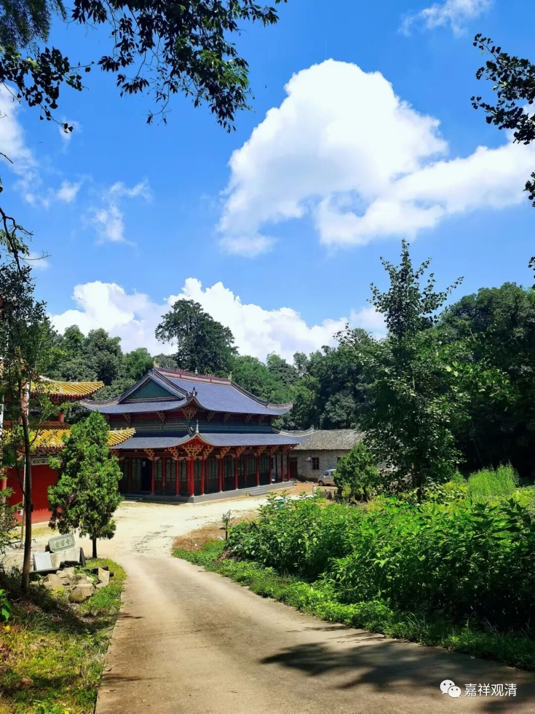

《**微课堂佛教史》347**

** 白云寺一桩“公案”：济善上人与虚云老和尚往返书信**

禅宗史讲到现在，我忽然想到，不妨来聊一聊我们的寺院和禅宗的关系。我们的寺院叫莲花山白云寺，是吧？有些地方叫莲花寺也有，叫莲荷山的也有。寺院的名字确实是叫白云寺，在它的边上以前有过一座七星庵，也有叫七星寺的，离寺院不远，看起来有点像是以前的下院的样子。

寺院坐落在鄱阳、浮梁和东至三县的交界地，寺志里面写最初是贞观九年建造的，但是并没有给出其他的说明。我现在发的这篇文章呢，是在虚云老和尚的文集当中出现的一段说法——《复莲花山济善上人书》。有人就认为济善上人是一个开悟的人，因为虚云老和尚证明他开悟。我个人认为这个不能算是他开悟的证明，如果一定要这么说的话，也就这么说吧，反正虚云老和尚证明过的人也不少了。但我个人仍然坚持认为这个不一定算开悟。

我们来看一下。** 附《赣北鄱阳莲花山来书》。**这个人就是我们寺院里的，他的名字叫什么呢？叫济善上人。这个时候他的年纪应该还不大。他写了一封信给虚云老和尚——

** 久慕慈云，无缘礼见。**一直听说您的名字，但是没有机会见到。** 思与时积，毋任神驰。晚出家一十四年，行年三十零一。**文字还可以。“出家一十四年”，现在三十一岁。那就是十七岁出家，估计十八岁受戒。

** 宗教钻寻，**“宗”指的是禅宗，“教”指的是教下，“钻寻”就是钻研追寻。** 终是隔靴搔痒，**这个实际上是在讲他自己的一些见地，就是觉得外面所学的没有意义。** 殆有时节因缘，**“时节因缘”指的是什么呢？指的是开悟。** 今冬漆桶始破，**他的意思就是说自己已经开悟了。** 原来恁么一段光景，豁尔虚空撞破。**撞到了开悟的状态，然后就来呈现自己的见地。** 视之了无纤尘，呼之却也有声。**这个就是，一个是无，一个是有。** 觅之无毫发相状，广则横遍十方。**也是一个是无，一个是有。** 天下本无事，庸人自扰之。**这个指的是开悟以后去看开悟以前，就是“天下本无事，庸人自扰之”，类似于凡夫在轮回当中的情况。

** 善哉斯言，**他觉得可以印证之前的这些文字——“天下本无事，庸人自扰之”了，他就是呈上了自己的一些见解。** 附呈乙偈，**这个“乙”就是“一”，接下去我有一个偈子写上来，您帮我看看行不行。** 还乞老人为我决择，**“为我决择”的意思就是说：您帮我看看，我这算开悟吗？实际上就是求印证。就我个人来说，其实这一段啥都不算。** 曰：“这个物，太亲切，”**这里的句读错了。** “了了无形状，不得开口说。”**

这个也太平凡了，实在算不了什么。有人说，这个就是虚云老和尚证明他开悟了，反正我是不会证明他开悟的。如果寺院需要去宣传的话，可以把这一段拿出来——其实我真的不愿意去宣传。但是，我可以把它当作一个记载文献留下来。

我们再看上面的一段，是虚云老和尚给他的复信——《复莲花山济善上人》。对了，他老了以后也是“济公”，哈哈。

** 昨阅来书，**昨天看了你的来信。** 庆慰无量，**很高兴。** 欣颂饱餐法喜，充满禅悦。**“欣颂”，这个字是“颂”吗？我再看看，这个“颂”字有点奇怪，还真是“颂”。听说你“饱餐法喜，充满禅悦”。** 诚为难得。**很难得。也没说什么，我个人觉得就是很正常的回信。

** 若论此事，天然本具，**这个就算是一种指导。** 有何差别？无言可说。**没啥可说的。** 理虽如是，然积习有厚薄之分，故喻化城宝所。**“化城宝所”，用的是《妙法莲华经》当中的典故，以“化城宝所”来做比方。但问题是，“化城宝所”的意思是什么呢？是指并没有达到最终的结果。“化城宝所”等于是到达彼岸的中间有一个休息的地方。如果从这个角度来看，我觉得虚云老和尚真的不见得是证明他开悟了。

当然，你也可以换一种理解。因为“化城宝所”在《妙法莲华经》当中比喻的是罗汉们的境界，所以你一定要说由此可以证明他有些开悟，那也未尝不可。但我个人看来，这段不是证明他已经开悟了，实际上我的理解是这样：他获得的只是一些禅定的境界，和智慧没什么大的关系。所以这里虚云老和尚的回应可以这么理解：你这是禅悦的境界，是化城，并不是彼岸。

我们继续看下去，下面这一段其实可以重新再起一段的，是教育济善上人的。** 仰山重法，不嫌香严之遥，**他的意思好像是仰山慧寂禅师要去香严智闲禅师那里，但这两位好像是师兄弟，具体的公案我不是很清楚。意思就是再远的路他也去了。下面也是一样。** 云门尊贤，不辞雪峰之远。**云门文偃禅师去雪峰义存禅师那里，也是很远的路去参法，差不多的意思。** 古范昭昭，百城烟水，**“古范”可以理解为范本，就是以前的这种情况放在那里，大家都看得到。

** 究为何事？**这就是说，那么远的路，跑过去干什么呢？** 由其根本智易得，差别智难明，**说什么呢？就是根本容易得，差别难明。或者简单点解释就是，即便你开悟容易，但是到底应该怎么做事，或者怎么度众生，怎么待人接物，这些你都要去学习的，有很多很多，所以就称为“根本智易得，差别智难明”。如果从这句话上来看，你一定要说印证了济善上人已经开悟，那我也没办法说，是吧？

但实际上我们可以再看最后一句。** 故尔免不得许多麻烦也。**这句话实际上就有一点在批评的意思。当然，也可以说是暗示。“免不得许多麻烦也”，是什么意思呢？你不能写封信就算了呀，你该来学，还是应该来学啊。你才三十一岁，你不能就躲在山里面，然后说突然碰见一个境界，然后写封信给我就算了——这不行啊！所以，“故尔免不得许多麻烦也”这句话其实是有点批评的意思。

当然，前人写文章的时候会留几分薄面，水平不够的可能就看不懂了，还以为是“印证”，哈哈。

我的解释就是这样。

但是，有人认为这位济善上人是开悟的，那再说吧，反正我不认为他是开悟的。因为我正好在整理庙里的一些文件等等，就觉得有这样一件事情，也可以算得上是一个小公案，顺便就拿出来说说。但是，我认为这个“济善上人”的禅定功夫可能有，其他方面都不够……后来也没有消息了。

如果要撰写莲花山白云寺志的话，我们的文献资料并不多，这篇东西我可能会放进去的。但是我仍然这么说，我并不认为这位济善上人是多么了不得的开悟的人。

我们的寺院到底叫什么名字？莲花寺、莲花山寺、莲荷寺、白云寺，都有。

今天我们就先到这里吧，因为正好整理到这篇文章，就先把这个讲一下。谢谢大家！

