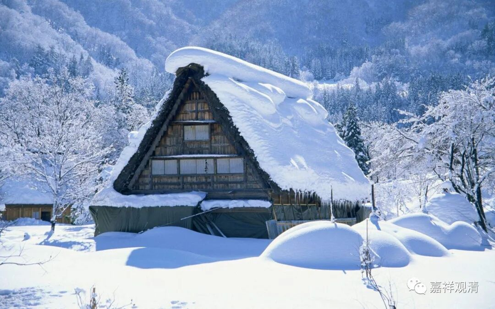

**《微课堂佛教史》353·1**

好，我们继续佛教禅宗史，现在讲到云门宗的开宗祖师----云门文偃禅师。

昨天我讲到慧洪觉范禅师，他的名字有好几个说法，后世也叫他洪觉范禅师。

有时候禅师的名字有很多，实际上也就是两三个名字的不同拼法，地名也可以叫的。比如以我自己的例子来说，我的寺院名称叫白云寺，所以我可以叫白云观清禅师，或者用一个字的话就是白云清禅师。再比如我们昨天讲的洪觉范禅师，他是慧洪觉范禅师或者觉范慧洪禅师，对吧？可以把“洪”字放到前面去，就变成三个字——洪觉范禅师。还有个别的情况会把姓氏冠上来，比如说马祖道一禅师、金和尚，是吧？

有时候我看到一些论文的作者似乎对禅宗不是很熟悉，就在禅师的名字上出现一些错误。比如说刚才讲的临济义玄禅师，你称他为义玄禅师是可以的，释义玄禅师也是可以的。但是如果你叫他释临济禅师，这个就不对了。我看到现在有些文集当中就会出现类似这样的错误。

比如说刚才举的我的例子，如果叫我释白云禅师，这就不对了，释观清禅师是可以的，但是释白云禅师就不对了。同样地，你如果说释临济禅师，那就不对了。再比如说云门文偃禅师，释云门禅师就不可以，但释文偃禅师是可以的。因为出家人后来都以“释”为氏，是吧？都是释氏的，就是释迦他们家的，于是大家后来就习惯叫释某某。释白云不可以，但释观清可以，类似于这样。

有些作者不是佛教专业的，就会出现一些问题，也给佛教界带来很多麻烦。比如说他写某某人的传记，但这个传记中的名字在佛教史上没有出现过，所以大家阅读的时候要注意。

好，我们继续讲云门文偃禅师，前面讲到云门文偃禅师是苏州嘉兴人。但今天就不是苏州嘉兴了，今天来说的话，应该是浙江省嘉兴市人，不过嘉兴也是在苏州附近，离杭州、苏州这两个地方都挺近的。

云门文偃禅师出家以后学习了不少的经论，然后又在陈尊宿那里学习了很多年。陈尊宿就推荐他去雪峰义存禅师那里，于是他就去了雪峰义峰禅师那里，并没有冒失地上门——这在以前也算是一种手段吧，而是住在庄子里面。这个庄子，我估计应该是山下的农庄。

我以前讲过，寺院都会得到一些封地，特别是像雪峰义存禅师这样有闽帅——福建节度使王审知助建庙的，也会被安排到一些土地。这些土地，一方面可以供他们一千五百人自给自足，另一方面如果租出去的话，也可以收点租子，那山下就会有庄子，前面不是也提到过雪峰义存禅师从庄子里面出来嘛。

云门文偃禅师就先在庄子里住着。估计当时的情况就是这样：一千五百个人当中，可能一部分是在庙里坐禅，还有一部分就在下面的庄子里干活。我们可以举个少林寺的例子，在历史上实际就是这样：一部分人参禅、打坐、修行、念经，一部分人看家护院。

有些人问：“真的是这样吗？”我告诉你，真的是这样。那些看家护院的其实未必是非常正统的和尚，实际上有点像庄丁，但是他又和一般的庄丁不一样，他是做一些杂役或者干活种地的和尚。这些人这辈子的文化水平也不高，也不准备这辈子解脱——甚至连一点点解脱的想法都没有，虽然有时候他们也会去听经……

