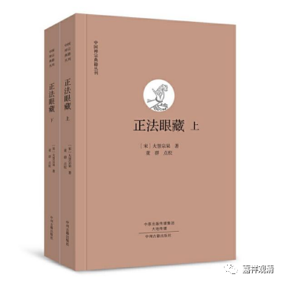
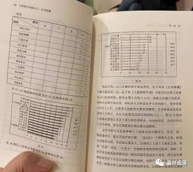
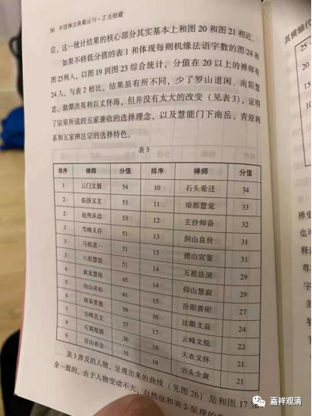
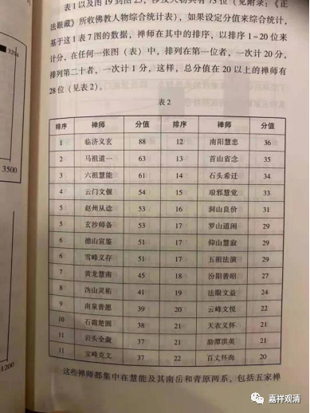
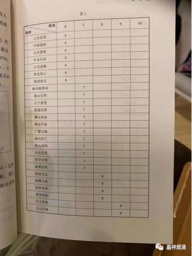
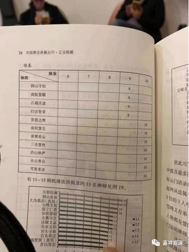
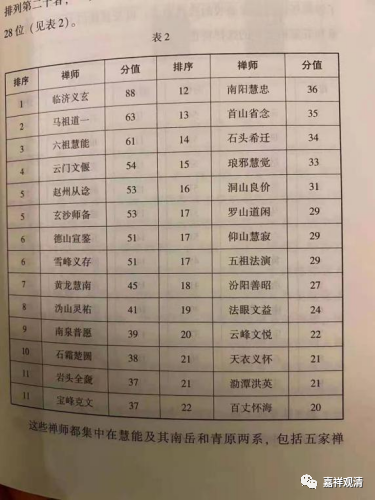
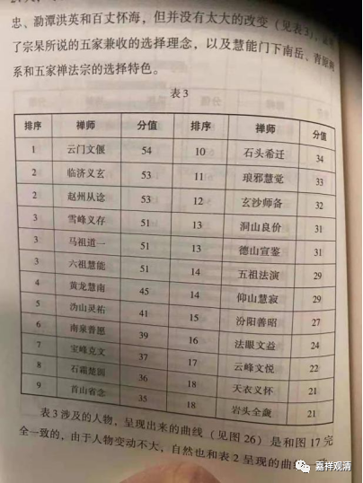

**《微课堂佛教史》358·1**

今天开始晚了。我们现在是讲中国佛教的历史。

讲到禅宗，刚刚讲完云门文偃禅师。雪峰义存禅师的另一位弟子玄沙师备禅师我们就先不讲了，接下去准备讲法眼宗——云门宗接下去就是法眼宗。

法眼宗法眼文益禅师的师父叫罗汉桂琛禅师（罗汉就是指罗汉院，桂就是花的桂，琛就是钱其琛的琛），而罗汉桂琛禅师的师父仍然是雪峰义存禅师。

正好我今天看到了一个说法，好像是南宋大慧宗杲禅师的《正法眼藏》当中，文字出现最多的是哪些禅师呢？临济义玄禅师、云门文偃禅师、玄沙师备禅师。玄沙师备禅师也是雪峰义存禅师的弟子，是王审知护持的。

现在市面上有一本《正法眼藏》的注解，是董群注解或解释的。我也见过董群老师，他是南京大学的。他进行了一些现代的统计，比如说《正法眼藏》当中提到最多的人是呢？就是云门文偃禅师，总共46次，其次是雪峰义存禅师、临济义玄禅师和赵州从谂禅师各30次，再后面是宝峰克文禅师（他是和圆悟克勤禅师同时代的人物）、玄沙师备禅师和沩山灵祐禅师，这三位都是被提到24次。德山宣鉴禅师被提到23次。琅琊慧觉禅师被提到19次，这位我们没有讲过。仰山慧寂禅师我们讲过了，也是被提到19次。马祖道一禅师禅师，也是19次。南泉普愿禅师、六祖慧能禅师被提到17次。黄龙慧南禅师16次。

我们看，提到最多的这些人当中，云门文偃禅师、雪峰义存禅师、玄沙师备禅师都是排在前五位的。这三位都出自同一个系统，都是雪峰义存禅师系统的。如果加上云门文偃禅师和玄沙师备禅师的弟子们，这个数字就更加庞大了。所以前面提到的“云门天子、临济将军”这种说法是有原因的。

我现在把这个图表发给大家，稍微等一下。

好，我待会再发另外几个图表给大家，这几张表我们也趁机都谈一下好了。

我们刚才提到的这几位禅师都是比较重要的，那么，还有石头希迁禅师、玄沙师备禅师、洞山良价禅师、五祖法演禅师。到现在我们还没有提到过五祖法演禅师，他也是后来很重要的一位人物，我们会提到的。

另外还有汾阳善昭禅师、法眼文益禅师、岩头全奯禅师、夹山善会禅师，也被提到很多次，包括我们前两天刚讲过的三圣慧然禅师，这些都是《正法眼藏》当中大量提到的人物，好像这些我们都讲过了。

