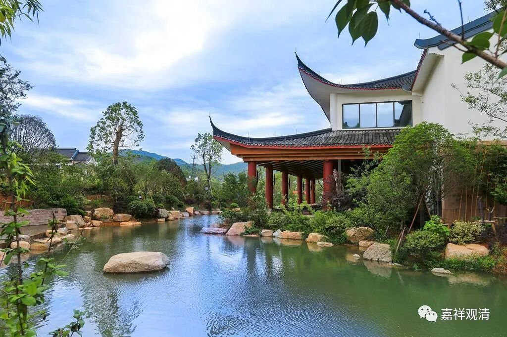

**《微课佛教史》359·2**

前面讲到罗汉桂琛禅师继承的是玄沙师备禅师的法，但是据《宋高僧传》的记载，他的一些师兄弟对此不满，因为大家都在雪峰义存禅师门下学过，就逼着他要继承雪峰义存禅师。后来罗汉桂琛禅师不同意、不接受，被大家联合起来欺负，就离开了。

那个时候罗汉桂琛禅师所在的地方叫地藏院，所以罗汉桂琛禅师也可以称为地藏桂琛禅师，因为他之前是在地藏院的。后来他就去了罗汉院，被称为“罗汉桂琛”禅师。

昨天有人问我：“为什么禅师的名字都是四个字的？”其实也不一定都是四个字的，三个字的也有，比如以前我们讲过的解三通禅师，是吧？解，这里可能应该念“xiè”，是他的姓氏。四个字里面有两个字是他所在的地名或者寺院的名字，另外两个字是他自己的名字，这是有好处的。

像我们中国一直有的习惯，你可以不直呼他的名字而称呼地名，是吧？比如柳河东、刘豫州，还有“宗喀巴”也有个地名——宗水边上的人，这些都是以地名来称呼这个人了。

还有一个情况呢，就是同样一个名字可能会有很多人，比如说神会禅师，大家都知道荷泽神会禅师，对吧？那还有一位净众神会禅师，在四川有一个寺院叫净众寺，也有一位神会禅师。再比如说慧远禅师，有庐山慧远禅师，也有净影慧远禅师，都是很有名的，在嘉祥寺还有一位慧远禅师。通过在前面加上寺院的名字，这两个字一加就可以区分这些同名的人。（当然，业界仍有很多半吊子分不清这些人，连着几篇论文都是一通胡诌……）

罗汉桂琛禅师有过一段小的公案，就是在《宋高僧传》当中记载他曾经为了继承玄沙师备禅师的法而被其他人欺负。后来罗汉桂琛禅师的弟子法眼文益禅师（又叫清凉文益禅师，因为他在清凉院住过，而“法眼”是朝廷给他的一个封号）也有这个情况发生，就是他的师兄弟找上门来说：“你在我们师父面前待的时间比较长，你为什么去继承罗汉桂琛禅师的法呢？”

从这些记录看起来，当时类似的情况还蛮多的。云门文偃禅师好像也是这样，对吧？大家还记得吗？云门文偃禅师在雪峰义存禅师门下学习的时间并不长，而之前他在陈尊宿门下和之后在如敏禅师的寺院当中待的时间都比较长，但是他继承的却是雪峰义存禅师。现在这个罗汉桂琛禅师之前也在雪峰义存禅师那里学习过，但是他继承的却是玄沙师备禅师。他主要是在玄沙师备禅师那里有点好像开窍了。

说实话，禅宗里面的这些故事现在是越来越多了，实际上这些故事并不那么重要。大家可能认为这些故事非常重要，其实故事并不重要，重要的是故事里面没说的部分——就是他在禅堂当中或者在寺院当中坐禅的、做事的那几十年，那是比较重要的。而最后师父引他开窍的这几句话，其实你拿去是没用的，因为你没有在那个场合，你没在那个情境底下，给你那段“机智问答”对你而言是没用的。

禅宗后来到了宋代，大慧宗杲禅师就谈到过这个问题，就是这些语录、这些故事实际上都是糟粕，但是大家非要把这些记录下来，觉得很重要。但实际上，你不是那个人，你不在那个场合，你没有跟过那位师父那样一段时间，那句话放在你身上是没有用的，或者绝大部分来说是不可能有用的。只有相同的这些心境、环境，才有可能有用，而且也真的越是刻意越没用。

但是我们现在都只去学这“最后一招”——当年释迦牟尼佛在树下一坐，那我也到树下坐。说实话，虽然我自己也算是禅宗的，从我个人的角度来看，看见大家在那些圣地装模作样地一坐，其实我的内心是觉得非常可笑的。这个叫“菩提树”，是因为人家在那儿坐的，他成佛了。但你坐到那棵“菩提树”下，和你成佛没有关系，有本事你在梧桐树下坐，你成佛了，那棵梧桐树也叫“菩提树”了。

我们好像都只学人家最后一招，都是吃最后的饼子，真是特别有趣。我们去问别人：“你做的是哪几套黄冈的卷子？”其实人家之前那么多年努力地学习，是哪几套黄冈卷子已经不那么重要了。（不过，不知道现在还是黄冈卷子吗？）

