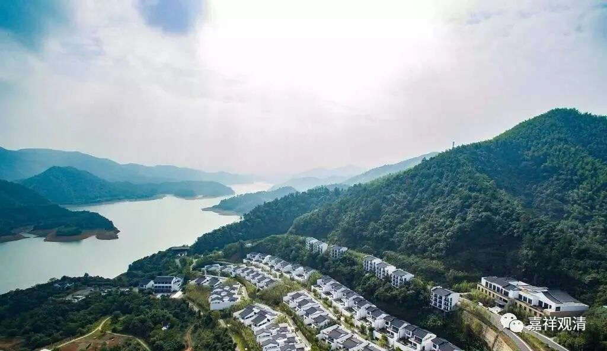

**《微课佛教史》360·2**

总的来讲，罗汉桂琛禅师是继承了玄沙师备禅师，而玄沙师备禅师的师父是雪峰义存禅师。我们前面讲了雪峰义存禅师和玄沙师备禅师都是福建人，是吧？后来罗汉桂琛禅师就到了福建的漳州，留在那里。那个时候他住的地方叫地藏院，带着弟子两百多人。

我也搜索了一下CBETA（就是佛教大藏经的电子版），当时出于对大师们的推崇，弟子们的数字其实未见得是确数，但是从弟子们的数字可以大致看出这个人的地位如何。比如说，径山国一禅师或者说径山寺有1500人，是不是真的1500人暂且不说，但是“1500人善知识”，就说明是大善知识。再往下就是“500人善知识”，再往下就像这样“200人善知识”。

他这个数未见得是确数，也未见得是同时住的人数。当时的寺院可能也就是个小院子。你们如果想要知道当时佛教寺院大致的样子的话，可以到京都去看一下，差不多就是几十米有一个小寺院，几十米又有一个小寺院，寺院的规模并不大，但是数量很多。

前两天我还转发了一篇关于北京城的寺院的文章，也是说差不多三、五十米就有一个寺院，北京城里应该是这样的。我后来看了一下上海的地方志，如果以今天上海的辖区来进行统计的话，很有可能历史上的上海的地方寺院要达到上万座。大家可能很难想像，但是实际上差不多有到达这个程度。

我们刚才讲的北京城里面，差不多距离二、三十米都可以有一个小寺院，这些寺院都是不大的。今天我们一讲寺院，都是那种大型寺院，占地几百亩，但实际上以前的很多寺院就是一个小院子，像这些地藏院、罗汉院，很可能就是很小的一个院子。

我们看民国时期的很多院子，如果今天去上海找一些遗迹（还谈不上古迹），都是规模不大的，就几进院子或者几间房，但在当时都算是大丛林了，实际情况就是这样。所以大家不要脑子里一想到某个寺院，就觉得是非常大的寺院，这样的“200人善知识”未见得就是很大的寺院，可能就是一个很小的寺院，可能曾经来来回回地有过200个弟子。

大家也可以去看看《洛阳伽蓝记》，在洛阳这个地方曾经有过很多很多的寺院。如果大家有兴趣的话，等过两年疫情过去了，我们可以去京都看看，差不多就是这样，若干步就是一个寺院。京都的高楼不多，你在一条小巷里面走，大概就有好几个寺院，而且你一不留神，就会看到一个有名的寺院，就是因为历史太丰富了，这些寺院都是有名的。我去京都时候的住所附近，有一个地方叫西园寺，后来我看了一些资料，发现日本明治维新时期有一位重要人物叫西园寺公望，好像就是和这里有关。

我讲这些是为了稍微纠正一下大家对寺院的概念，不要一听寺院就觉得是大寺院那种概念。其实大寺院是建国以后（主要是文革以后）才多起来的，大家一造寺院就直接把几个亿砸下去。像我们现在这样建造一个普通的寺院，在古代那都算是大型寺院了，大家现在可能看不上，如果在古代真的算是大型寺院了。以前建造寺院的话，一代人能建一两间房、一两个殿就已经很不错了，那今天我这一代已经建了好几个殿了，这在古代那就是了不起的造庙祖师了。

那么，罗汉桂琛禅师在禅宗史上是一位过渡型的人物，因为在他之后主要是开出了他的弟子法眼文益禅师。

好，那今天就先讲到这里，谢谢大家！

