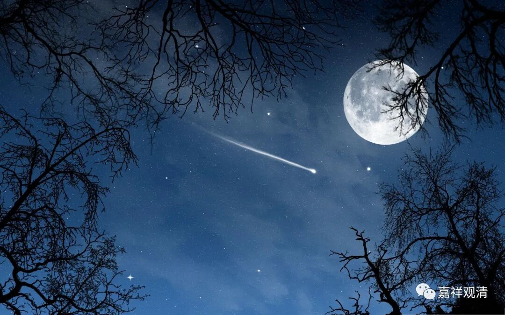

**听师父讲那过去的事情（2）**

** 人物 **

师父（永生人，不知道年纪，永远四十来岁的和尚模样，听说以前说过相声，徒弟看见他很头大。）

小明（师父的徒弟，最喜欢和师父斗嘴，师父看见他很头大。）

** 布景**  中秋的夜晚，一轮大月亮挂在天上。

（开幕时，师父坐在屋顶上认真地看着月亮。小明从他背后蹑手蹑脚地爬上来。）

** 小明**（突然大声说）** :** 啊！月亮！你在夜晚才上班，睁着你那仅有的一只，眼睛！

**师父** （头也不回）：哼，早听见你上来了，装神弄鬼！

**小明** （嬉笑着坐下，左左右右夸张地看了一会儿月亮，一脸好奇）：看得这么深情，想谁呢？

（师父沉默不语。）

**小明 :** 喔！师父，您想嫦娥了吧？原来您曾经是猪八戒？！

**师父** （嫌弃地）** :** 呸呸呸！

**小明 :** 嫦娥好看吗？

**师父 :** 记不清了，其实记忆的并不是模样。

**小明 :** 是感觉？

**师父** （打小明）** :** 你这熊孩子不好好读圣贤书，整天就知道看网络小说！

**小明 :** 她干嘛不要后羿啊，是不是被您忽悠的？奔月的仙药是不是您给她的？

**师父** （忽然感到悲哀）** :** 我再告诉你一个秘密吧。我就是你们说的那个“后羿”。

**小明 :** 啊！我同情您！

**师父 :** 其实，你们都错了，我不叫后羿。

**小明 :** 那叫什么？

**师父 :** 因为射箭是我的强项，他们叫我“羿”——司羿，类似今天的陆军元帅兼粮食部长。秦汉人把“司”看成了“后”。

**小明 :** 这我不关心，我就关心您和嫦娥为什么离婚。为啥她宁愿抱个兔子也不要您？您对她干了什么？

**师父 ** :唉，我一直怀疑，我的长生和这件事情有关。

**小明 :** 快说快说！

**师父 :** 事实是，她吃了过量的长生药，死了。

**小明 :** 吃过量长生药而死？这太讽刺——

**师父 :** 老神仙也吃多了，他也以为长生药应该多吃。所以，按剂量服用的嫦娥，死了。我只吃了瓶里留下的，本来想殉情，结果阴差阳错，被孤独地留在人间万岁万岁万万岁，唉！

**小明 ** （崇拜地）**:** 怪不得您对爱情的理解如此深刻！

**师父 :** 她啊，属兔。其实陈那也问过你刚才的问题：师父你为什么老看月亮？

**师父 :** 我说：怀兔，非月。他没听懂，以为我讲因明的道理，于是对“怀兔”和“月”的关系做了大量发挥。他一根筋，看啥都是因明，我懒得纠正他。

**小明 :** 您可坑死我了，怀兔和月到底是个什么关系我迷糊了三年！

**师父 :** 陈那的意思其实是“传称共许”，他想说：师父传下来的话都是对的，你必须接受。

**小明 :** 您又骗我，梵文里不是您说的意思！

**师父 :** 让他们按这意思改！

**小明 :** 我师父真霸气！对了，我最近在读《入中论》，您见过月称本人吗？

**师父 :** 没有啊，江流儿在印度那会儿，我在大唐呢。

**小明 :** 您那时还在大唐干什么？

**师父 :** 听说张果老他们有长生药，我去看看。

**小明 :** 效果好吗，吃了会死吗？

**师父 :** 长生药，真是一代不如一代！

**小明 :** 您那真药也不知道给我们留点！

**师父 :** 张果老倒骑毛驴，他弟子说，他的毛驴是纸糊的，用完了就能叠起来揣好。其实，是后来他跌死了。

**小明 :** 跟他磕了药有关？

**师父 :** 你怎么知道？！

**小明 :** 他一定没少服用他的长生药嘛！

**师父 :** 他们叫散仙，就是爱服五石散的道士。

**小明：** 师父，我不想看见你又被追杀，我们还是说月称吧。

**师父 :** 月称很聪明地发挥了中观，他比清辨更有慧。

**小明 :** 那清辨怎样？

**师父 :** 他是一个被低估的大师

**小明 :** 低估？

**师父 :** 你们学过哲学，哲学更看重提出问题，是吧？清辨就是提出问题的那个，而月称是在他后面解决问题的那个。

**小明 :** 这您可别问我，您没教过我哲学，您教的是叔本华。

**师父 :** 你怎么知道我教过叔本华？

**小明 :** 您说梦话的时候自己说的。您说小叔啊，你不错，哲学靠你了。

**师父 :** 我给他讲了唯识，他的笔记整理得不错，就是那本《唯意志与表象的世界》

**小明 :** 师父不厚道，您给他们讲的都是秘籍，对我，您就知道教我撸串时候撒多少孜然！

**师父 :** 当初叔本华也这么说，他说你只反复说唯识唯了别，真烦人。可后来他的笔记不是成了名著吗？你试着把我们的对话写下来，也是《对话录》啊，《论语》啊一类，总不亏你！

**小明 :** 那我写本《分别孜然论》。

**师父 :** 好名字！

**小明 :** 那当然是好名字，您一直不了解您徒弟我的才华。您说《对话录》，您认识柏拉图？

**师父 :** 不认识。那会儿我在印度。

**小明 :** 看来就算活得长也不是全能全知。

**师父 :** 全知全能？比如，我会降伏狻猊的咒术，可世间并没有狻猊，那这种能力，该算作有呢，还是没有？同样，知道这个咒语，该算知道呢还是不知道？

**小明 :** 又忽悠我！佛陀就是全知，没错吧？

**师父 :** 当年，竹林精舍里也有人提出这个问题，我们肚子都笑疼了，目犍连把饭都喷老远，后来他的三传弟子说：“师公是在布施虫蚁鸟雀。”

**小明 :** 啊？还有这事

**师父 :** 这些事，书里面是没有的。那时，有人说佛陀是全知全能的奎师那神。还有人说他雪山六年苦行，受雪山女神指导。

**小明：** 雪山，对啦，总有人说他在雪山苦行。

**师父 :** 其实，他的苦行并不在雪山，而是在摩揭陀国，今天称为苦行林的地方。

**小明 :** 那为什么有人说他在雪山？

**师父 :** 因为他的部族来自北方。雪山，是我们对他的尊称。就如称洛桑扎巴为宗喀巴，沩山灵佑，憨山德清……

**小明 :** 好吧，这说得通。那他是不是遍知？据说他连哪片叶子来自哪棵树这么无聊的事都知道。

**师父 :** 当年要是有人这么问，早就被六群比丘揍成二维码了。

**小明 :** 我觉得您才会被揍成二维码，您早就该被揍成二维码！

**师父 :** 六群比丘边揍边说：“必须揍！以后要是有人拿这来问比丘，和尚们回答不出来，岂不是没饭吃了！”再后来就没人敢问了。六群比丘就说，这叫“第十五无记”。

**小明 :** 那到底佛是不是遍知呀，您倒是说句实在的。

**师父：** 我们说的是，他对四谛遍知。对世间——苦、集二谛的遍知。出世间——灭、道二谛的遍知。所以他是“一切知者”。

**小明 :** 四谛涵盖一切存在，您以为我没文化呀！

**师父 :** 所以啊，一切遍知嘛！你真烦！我都没心情看月亮了！

（小明被师父一脚踢下了屋顶。）

**小明：** 打击报复啊——

——闭幕

