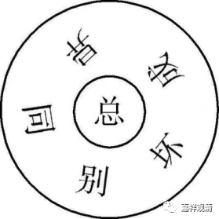

**《微课堂佛教》368·1**

那么，沩仰宗还有一些其他的内容。比如说，我们之前讲过仰山禅师和沩山禅师的对话。就是沩山禅师做了个梦，就说：“哎哟，刚才我做了个梦，你们谁来给我解个梦啊？”然后香严禅师就带着碗茶上来，仰山禅师就给他端个洗脸盆过来，意思是“你清醒了没有”，两个人的意思都是“你清醒了没有”。

而且沩山禅师和仰山禅师这两个人的有些公案拼起来看，就可以看出这里写的“父慈子孝，上令下从”。比如说，大家还记得之前讲的那个公案吗——两位禅师在山里采茶，沩山禅师就说：“老是听见你的声音，不知道你在哪里啊？”然后仰山禅师就摇摇树，显然他摇的是一棵大的乔木树，说明那些茶树很高，互相之间都看不见了。

那么，仰山禅师摇摇树之后，沩山禅师就说：“你这个是只知其用，不知其体。”意思就是说，我听到你的声音了，我知道你在那里。我是怎么知道的呢？是因为你的用——你的作用。

然后仰山禅师就问：“那么，师父，你怎么做呢？”师父不说话。于是，作为弟子的仰山禅师就说：“师父，你这里只有体，没有用。”

这个公案两个人问答一起来看就比较明显了，宾主互换，互相照应。所以这里怎么说沩仰宗的呢？“父慈子孝，上令下从。”这就是沩仰宗。

下面我们讲法眼宗。在《人天眼目》当中，他谈到了法眼宗当中的“华严六相义”，就给出了下面这个图。但是这个图是错的，所以《人天眼目》所讲的有些地方是有问题的。

我们看这个图，“总”和“别”并不是这个图里的关系，不是“总”在中间，别在外面，不是的。“总”和“别”是一对，“同”和“异”是一对，“成”和“坏”是一对，总共这样三对，并不是“总”单独在中间。我要去看看整理这本《人天眼目》的人是谁，他完全搞错了。看起来，他对于“华严六相义”是不通的，是不了解的。

