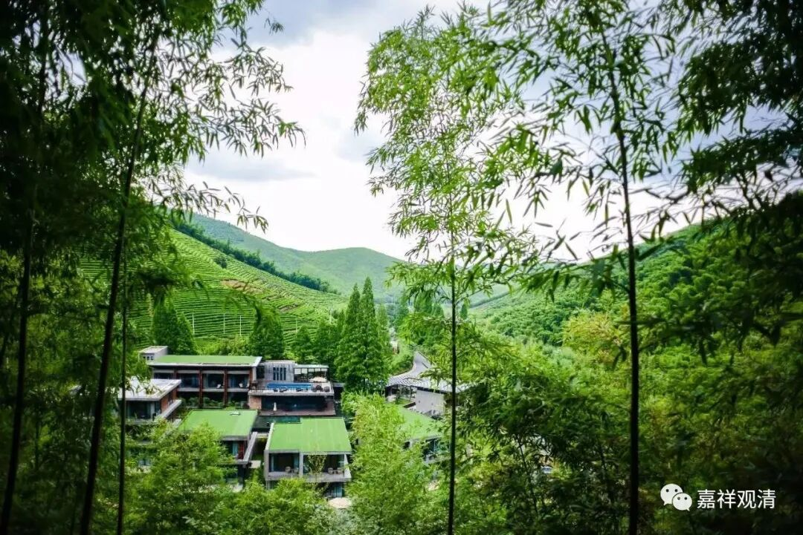

**《微课佛教史》371·2**

宋太祖还有一个和佛教有关的八卦，就是说他和麻衣有关系。这个关系就有点复杂，在正史和野史当中都是有记载的。大致上可以肯定是有这么一件事情的，就是他和麻衣这个人是有关系的。那么，麻衣到底是道人还是和尚？一般会说是个道士，现在据一些史料看起来，可能是一个和尚。后来的《麻衣神相》呢，则多半是后来附会上去的。

麻衣这个人在什么地方呢？历史上说在北方的潞洲（今天的山西省长治市）。说是宋太祖去北边征战的时候，曾经去过到麻衣和尚的庙里面。宋太祖是亲征太原的时候路过潞洲麻衣和尚院的。

如果这样的话，那麻衣应该是出家人，应该是和尚的身份。但如果单纯以《麻衣神相》来看的话，他似乎一个道士的身份。应该说，可能是麻衣的名气太响了，后期就出现了托名的《麻衣神相》，就以他来冠名，把冠名权就给了麻衣和尚。中国历史上也常有类似的情况，比如《黄帝内经》、《华佗中藏经》等等，都是这样的。

我是黄山翠微寺出家的，黄山翠微寺的《寺志》当中也出现了麻衣这个人物，而且这个麻衣出现的时代也是在宋代，或者说也是在五代到宋代的时候。《寺志》的记载说他是一个印度人，是在赤岭禅师门下学的禅宗，后来到了黄山，觉得黄山很像印度，就留下来了。

我个人觉得，《翠微寺志》的记载还得存疑，也存在一种可能性，就是在同时代或者相差不多的时候出现过另外一个人也叫麻衣。这两个麻衣是不是同一个人，不好说。潞洲麻衣和尚庙，和黄山实在是差得太远了，地方不对。在历史记载上，如果说是人的话，名字和内容几乎一致。黄山翠微寺的麻衣和潞洲麻衣和尚庙的麻衣是不是同一个人？我觉得同一个人的可能性不大，很小，还需要继续研究。

《翠微寺志》里面说他是印度人，穿着麻布的衣服，所以大家叫他麻衣。而且提到他是翠微寺的第一任住持，就是翠微寺的开山祖师——麻衣祖师。（我这样说，把自己的开山祖师给推翻了，会不会遭报应啊？哈哈。）——但我觉得这个两个“麻衣”是同一个人的说法可能还是有点问题，因为地方不对，翠微寺在黄山，太南边了。

《寺志》里面还记载说麻衣觉得翠微寺所在的黄山很像印度，就留下来了。我实在想不起来黄山的哪里像印度，结果我在黄山我们那个寺院待了一年多，然后确实发现有一点像印度。呵呵，我记得印度有个地方叫“雨极”，是吧？就是每年下雨的时候特别多。黄山其实也有这个情况，黄山气象志的记载是一年当中有183天下雨，正好超过一年的一半。后来我就开玩笑说，麻衣说这里像印度，很有可能他是印度“雨极”（“乞拉朋齐”，世界上降雨量最多的地方，在印度东北部地区）的人。

