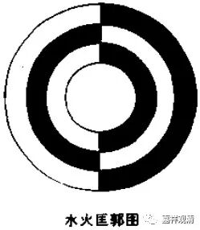

**《微课堂佛教史》372·1**

另外，这位麻衣和尚还有一个问题，就是他跟陈抟的关系。按照现在一般的传说来讲，陈抟是麻衣的弟子，然后呢……这个说起来就有点……如果真的要说麻衣就是禅宗里面的一个人物，而他实际上是三论系牛头禅这一支传承下来的，是属于三论——牛头——径山这一系的禅师，他的师父赤岭禅师就是径山这一系的。（假如要说他可能是印度中观——中国三论系的人，这个可能性也不能说完全没有，但也没有实锤、证据，只是自己的瞎猜。）

那么，我们顺着这个思路来讲。之前我们曾经提到过，禅宗里面曾经出现过什么水火水火匡郭图，还有曹洞宗和沩仰宗等等都出现过圆相，然后又出现了九十六种圆相，是吧？我有段时间曾经整理过，有一种说法是：陈抟的太极图或者说陈抟最后传给周敦颐的太极图，跟麻衣有点关系。假如说麻衣和陈抟、周敦颐的故事是可以串起来的话，那可能是有点关系的。但问题是：“麻衣祖师”到底是一个什么人物？反正目前我是不很确定的。

历史上还有一个关于陈抟的故事，是吧？说陈抟是天天在睡觉，叫作卧功，是吧？陈抟老祖天天在那儿睡觉，人家以为他在山里面冻死了，结果发现他是在睡觉——卧功哦。还有一个传说，说是宋太祖、宋太宗小时候被人挑着的时候看过相，是吧？说是一担挑着两个皇帝，是吧？这个好像是跟陈抟有关的。反正五代之末、宋代之初，麻衣和陈抟这两人都是有名的八卦人物。

我师父曾经在上海图书馆找到了《翠微寺志》，后来就印刷了一批，送了一本给我。我也算是略略地研究过，后来这本《寺志》我留在寺院了，没带出来，现在手上也就没有了。假如关于《翠微寺志》里麻衣祖师的早期的故事是可信的，把他确定为赤岭禅师的弟子，那么就可以续上了，三论——牛头一系最后比较有名的，或者有文献记载的，应该就是翠微寺的开山祖师麻衣了。因为他是赤岭禅师的弟子，而赤岭禅师是径山某某禅师（我现在记不清名字了）的弟子。

今天的这一小段八卦就先讲到这里吧。

我还是这么说，《麻衣神相》或者与此相关的一些东西，应该还是后人附会上去的，应该不太像是禅宗的祖师能够传下来的东西。当然，要说是不是一定这样，那我也不敢说，对吧？这仅仅是我个人推测，因为禅宗历史上的异人也不是完全没有。

那个时候我还去研究过赤岭到底算什么地方（叫这名字的地方有很多），也有多方咨询过，后来正好碰到安徽省旅游局的局长（他后来还担任黄山市的副市长），他说在某个地方确实有赤岭这个地名（好像在黄山和杭州中间），他说他去过，好像有寺院遗址。

