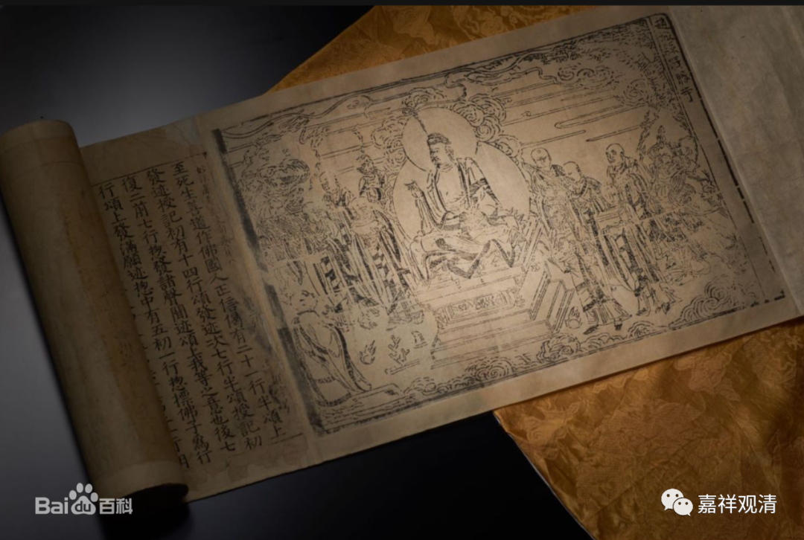

**《微课佛教史》374·2**

再多说两句……假如我的弟子或者我自己，一天做108种功课，我肯定会批评的。这个完全是修行没有主心骨，没有方向，这是不对的，你一定要有主次的。就像我以前跟××师父聊天的时候谈到，如果你只做一门功课，你的佛台上的佛像简单，我反而觉得这个人可能思路很清楚，修什么内容非常清楚。你一个小小的佛台上放了几十尊佛像，我看得眼都晕啊！我不知道你在干吗。同样，一个人如果是每天的功课有108种——禅净密律,顿渐秘密不定……全都来了，这个不行啊！这个肯定是没有主心骨的。

永明延寿的佛教理论、佛教实践其实也有同样的问题，他以他自己的想法来研究理论，我们可以看到是很杂拌的。就像刚才我们讲的，天台和华严是夹杂着来的，顿渐秘密不定，把“顿”又拿出来了，把“圆”又拿出来了，次序看上去非常混乱。既不华严，也不天台，不知道他是怎么整理的。

所以实际上他的经教实力是不强的，我个人认为不强，最多算一个三、四流的法师。哈哈哈，我给他的评价有点低啊。

比如说，他在《宗镜录》当中等于是自己在判教。第一个是小乘教，（这个不说倒也无所谓，）说“唯说六识，不知第八阿赖耶”，这个莫名其妙。然后“初教说有阿赖耶生灭，不言如来藏”，这就是把初教放在唯识，从某种角度上也是天台的通说，这倒也无所谓。“三、终教，有如来藏，生灭和不生灭和合，为阿赖耶识”，这个是受到华严的影响。然后就又来了，“四、顿教”，这是受到禅宗的影响，又受到华严的影响。本来“顿、渐、秘密、不定”是“化仪四教”，这个和“化法四教”是不一样的，他又把天台的“顿教”拿来说话。最后再是“一乘圆教”。

总的来讲，他自拟的判教学说非常混乱。天台的“化法四教”是“藏、通、别、圆”，“圆教”最高，是吧？“顿、渐、秘密、不定”，这是“化仪四教”，就是有顿的，有渐的，顿是和渐相应的，然后有秘密、有不定等等。他把“顿教”又放到“圆教”下面来讲——这是受到禅宗流行的影响。

我一直用的一个词就是，他这种做法是“拼盘”，是“嵌合”，而不是“融合”。虽然大家都说他是融合，这可能是给面子，或者是说他融合的人不懂佛教。这个不是融合，了不起是嵌合——说“嵌合”已经是很给面子的评价。

我再多说两句——呵呵，废话又多了。类似永明延寿禅师这样的国师，在历史上是非常多的，绝大部分是不被历史记住的。永明延寿禅师之所以被历史记住，就是因为他留下的文字比较多。真的是因为他的文字比较多，而且还有这种特别能够被大家记住的假故事，就是用税款放生什么的。实际上这个故事是不太可能的，考证出来应该也不是他的故事，是后期演变出来的故事。但是，传播需要的是故事——连脱口秀都在走讲故事的路子，大众不需要“独立实有空”“常一自在空”……

好，差不多今天就到这里吧，说了不少了，谢谢大家。

