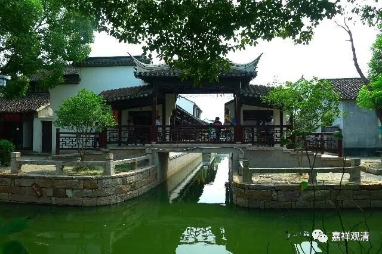

**《微课堂佛教史》377·1**

好，我们继续佛教史。

现在讲到禅宗史，来到宋代，前面讲了首山省念禅师。那么，首山省念禅师是属于临济门下的（我们已经好久没有讲临济宗了）。大致上我们已经看出来了，临济宗的系统现在（宋初）是中兴，或者说在这个时代重新亮出门庭，很明显的，它是以北方地区为主，特别是在中原一带。

之前我们讲的，临济义玄禅师是在北方驻锡弘法，在河北和中原一带，我们前面讲的首山省念禅师在汝州（今天的河南），是吧？而后来的曹洞宗基本上在江西，云门文偃禅师在广东，雪峰义存禅师在福建，法眼文益禅师在江浙一带……到了宋代的时候，政治中心又开始回到中原一带，于是禅宗的中心也开始回到了中原一带。

这个时候呢，临济宗又适时地恢复了，或者说成为了禅宗的中心，重新进入了中国禅宗史。

我们前面讲的风穴延沼禅师和首山省念禅师都是北方人。首山省念禅师本来是山东的，但是在禅宗里面几乎就没提到过山东。之前讲过菏泽神会禅师，但是这个菏泽是指菏泽寺，不是菏泽地区，在洛阳，也不在山东。

现在，我们就接着讲汾阳善昭禅师。汾阳善昭禅师也是临济宗历史上比较重要的一位人物。他又是一个北方人，或者说中原一带偏北方——太原人，俗姓俞。在传记当中说他非常聪明，没有老师，自己通达了文字。

我表示惊讶啊！是不是偷偷学或者怎么样？说他没有老师教，自己就通达了文字。就我而言，是表示非常惊讶的……或者说不清楚什么背景，他表现为初通文墨的，后来的传记就更加表现为有一定文化功底了。

汾阳善昭禅师十四岁的时候父母都圆寂了。在以前的话，十四岁都快要算成年了，对吧？要交税吗？然后，他就出家了。十四岁要交税看，他不交税，就出家了。出家以后呢，到处走，说是** “历参诸方七十一员”**大善知识。

我们想想看，如果真是这样的话，难道当时真的遍地都是这么多的善知识吗？但是好像历史上并没有记录下这么多善知识。可能也就是他去了很多地方参访，实际上他并不是都买账的，通常水平高一点的大师们其实也是有一点自己的想法的。

在参访了这么多善知识之后，汾阳善昭禅师对曹洞宗特别感兴趣，他在曹洞门下也接触了一些名僧或者高僧，比如石门惠彻禅师。由于他见多识广，最后又在石门惠彻禅师这里学习了，体会到了曹洞宗的妙处……可以说这个时候汾阳善昭禅师已经对禅宗有所体验，有所认识，也写了一些颂子来表达自己的认识。但是，应该说他这个时候离开悟还有一段距离。

不过，他对于临济宗里面还没有很明显地得到真实的受用。我估计是什么原因呢，估计是这七十一位善知识当中，可能也有临济宗的人，但是他走访的这些大善知识当中，从曹洞宗门下得到的受用比较多，在临济门下总觉得还差一口气，还没有得到过捶打、训练。当然，这个时候他也没开悟，所以也还在到处“云游”中，想看看临济宗到底还有没有高人，自己能不能更进一步……于是，他就去了汝州的首山省念禅师门下。

到达那里之后，又开始一个新的公案了。

