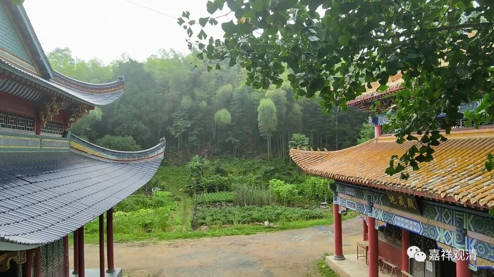
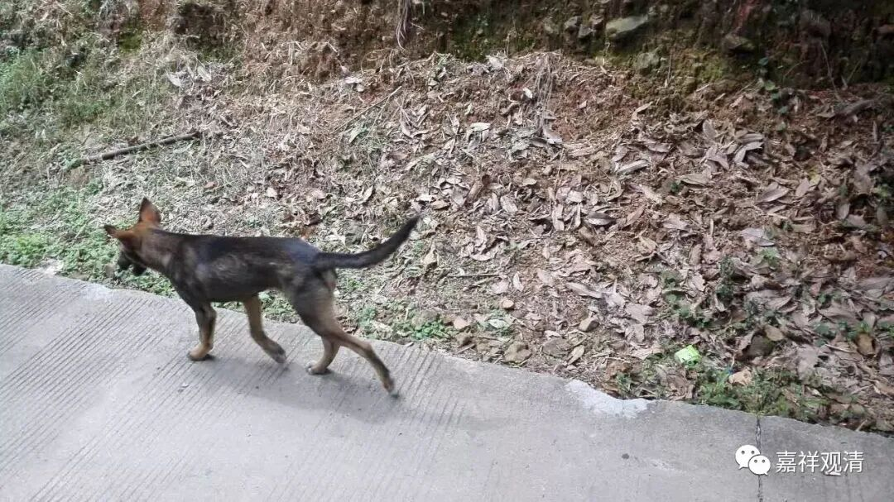
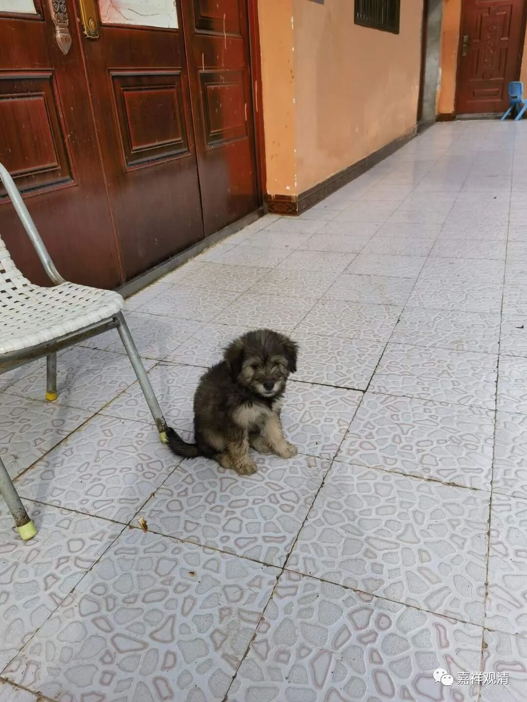
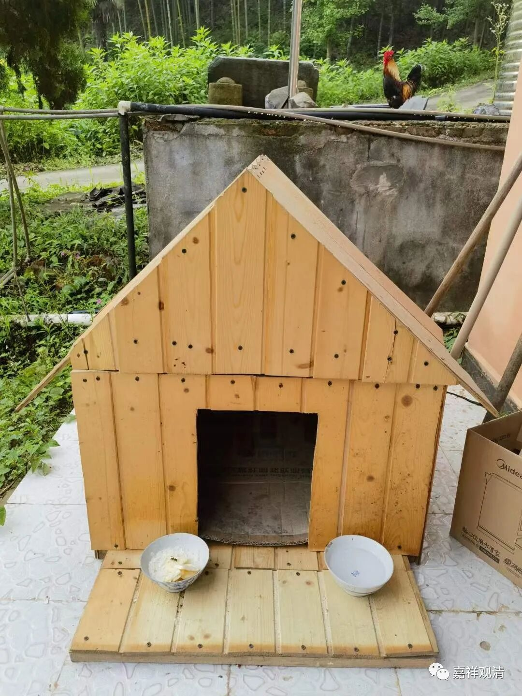
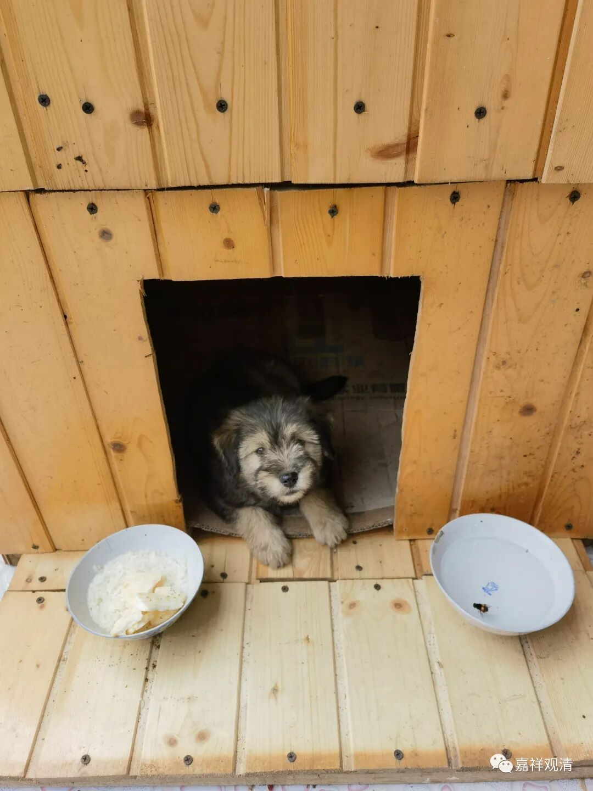
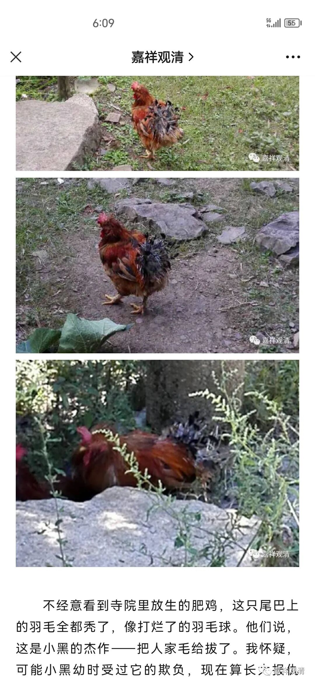

**“小黑”**

寺院以前就有一只小黑，中华田园犬，这里的老人都知道。

前些年，小黑跟着老韩下山溜达的时候，误食老鼠药，当天痛苦地暴毙了……龙瑜居士因此哭了好些天……也导致寺院里有一段时间没养狗，那是伤心了……

寺院里少了条狗，毛贼就更大胆了，接连光顾好几次，所以我一直说有机会还是要养一两条田园犬，田园犬聪明，能看家。

过年前有弟子要送两条小狗来寺院，被俩小和尚给拒了——现在小和尚都比我牛，直接否决我的安排，也不跟我打招呼。唉……我是不是太慈悲了？

最近县里抓了个专偷寺院功德箱的贼，结合我们前段时间的报案，审了，说未发现和莲花山功德箱被盗案有关……我已经把相关截图照片发过去配合人家调查。

前些天村里给送来一只小奶狗，就是——

又黑又萌，顺口还叫“小黑”，算是“小黑二世”。

老胡给它钉了个小别墅，别墅有个霸气的名字，叫“小黑屋”。

庙里有只大公鸡，是别人送来放生的。常年在庙里的它，大概有了领地意识，看小黑不满意，老是追着它啄。小黑现在就跟着木生。魏老师护着小黑，追着“大花”满寺院跑，顺带完成一天的运动量……还好我在，不然这只人人讨厌的公鸡很可能被全体居士驱逐。

第一世的小黑，童年时也有只它的“大花”，也被欺负惨了……成年后，小黑1就把仇报了，追着大花跑，我回山看到那只“大花”屁股是秃的，那是被小黑1拔光的……学历史的人说：这叫——太阳底下没有新鲜事。

小黑二世”这回刚露面，就给自己赚了工分，这不，第一份狗粮要到了……

