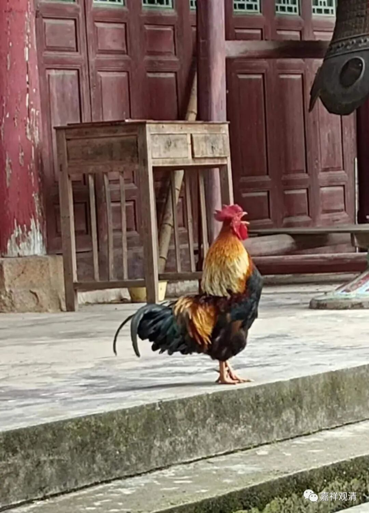
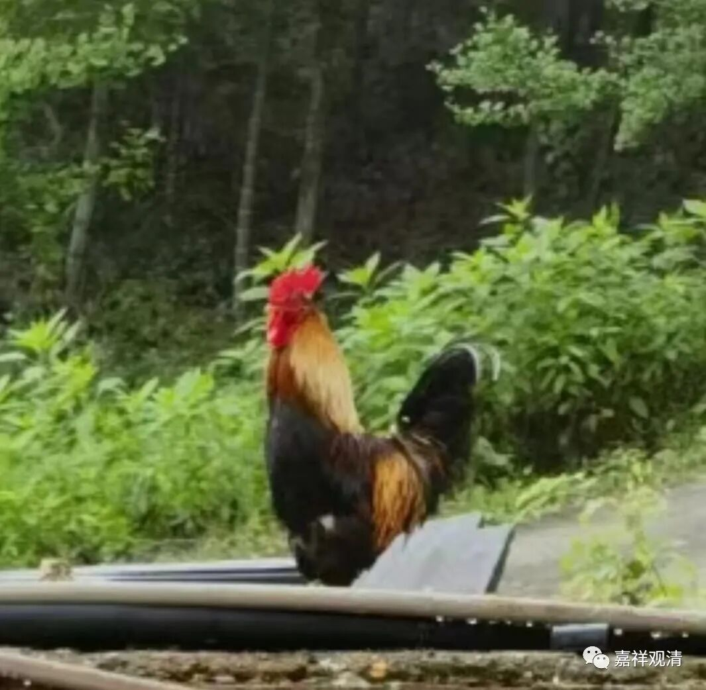
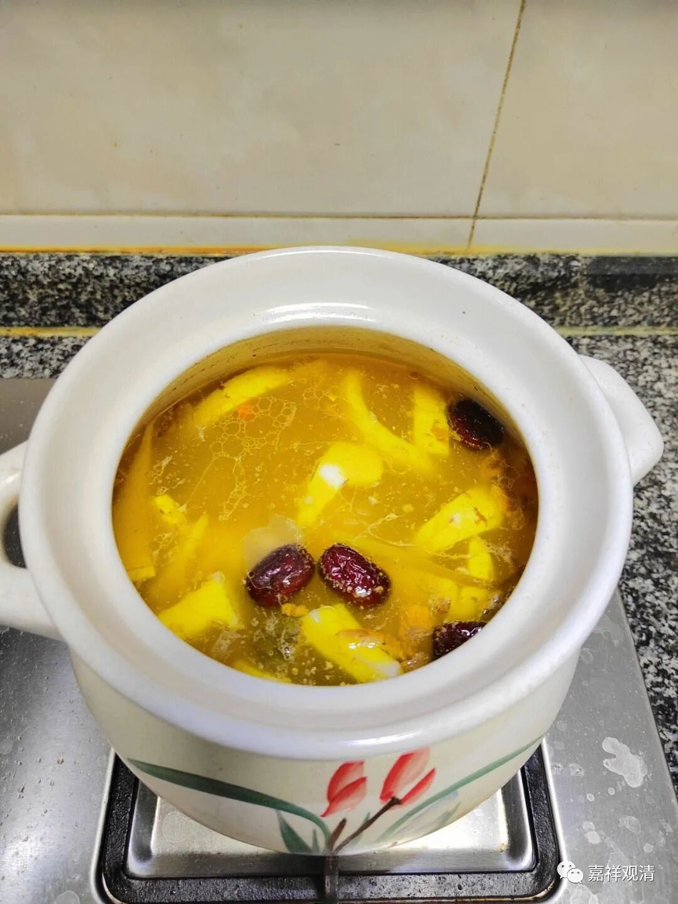

****

** 战斗“鸡”**

继续八卦小庙里的动物吧。这次说鸡。

现在庙里的“小花”大约是我来寺院以后的鸡三代了。

庙里的鸡，都是外人送来放生的，甚至有的就是养鸡场送来的，这算是平衡一点功德的意思吗？寺院也就这样散养着，没有专门伺候。

最多的时候庙里有三只鸡，天天打架，2V1，最后真给啄死一只，居士在它长待的树下挖个坑，埋了。“凶手”终于也“报应不爽”——它照例追着小孩啄，给人家小孩脑袋哚出血来。家长专门上来“报仇”，验明正身……然后……就不知所终了……

我刚来寺院的时候，山下村里养鸡养狗的还很多，早晨，能听到山下三个方向的村里传上来的“鸡犬之声”，顿悟那种“小国寡民”的“国”恐怕也就是“村郭”的“郭”。

老早以前，浮梁方向的那个村子和这边俩村子还有山路来往，后来往鄱阳方向修了路，这边跨县市的路又没修，渐渐这个相隔只一个山头的俩村子就很少走动了。老几辈这几个村子还有嫁娶婚姻，现在基本没了，倒是去鄱阳方向的婚姻多了——可见，交通方便比地理上的远近要重要。（前几年，临县的这条村路终于修通了——其实当年就是一直在争哪个方案自己会多修几百米）

庙里的这些公鸡常常攻击人，搞得我们也头很大，又不能炖了它们，是吧。老×让我把这只鸡扔到更深的山里去，我说“那可不行。庙里少了一只鸡，村里面会传是我们炖了的！！！”

公鸡打鸣有时候也很讨厌，昨天早上它就叫得很早，我一翻腕子——还不到三点！！！有一次冬天，它不到一点就打鸣了，我出来一看——哦，月夜、雪天，映得有点亮了。

话说，这胡乱打鸣怎么整？某尼打开淘宝，给我推荐了个——

