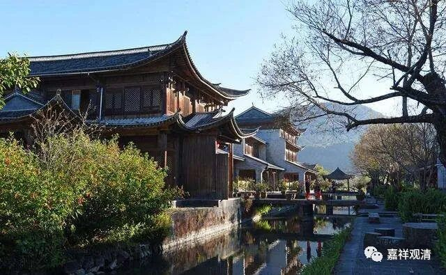

**微课佛教史379·2**

等到他的师父首山省念禅师圆寂的时候，山西汾阳太平寺太子院就专门请善昭禅师回去，让他去继承他师父的法席——也就是大家都知道，他是从首山省念禅师这里继承了禅宗临济宗的这一脉，要他承担起来，传承下去。

汾阳善昭禅师回去以后呢，故态复萌，还是在庙里面睡觉，不起来，不出门，结果就把契聪禅师给惹火了。契聪禅师相当于他的大师兄，直接进门开骂了——

** “让之曰”**，“让”就是责备的意思。契聪就说：** “佛法大事，靖退小节。风穴惧应谶，忧宗旨坠灭，”**这里说“谶（chèn）”，估计有什么谶纬方面的事情，或者有什么预言之类的，因为担心传到自己手上的这一支香火断掉，所以勉为其难地出来传法。后来，** “幸而有先师。”**“先师”就是首山省念禅师，“幸而有先师”把这支法传承下来。** “先师已弃世，”** 现在师父圆寂了，靠你了。** “汝有力荷担如来大法者，今何时而欲安眠哉？”**师父的这些弟子当中，你是有能力弘扬临济宗来“荷担如来大法”的，你怎么现在还在那里睡觉，还是把自己当清众一样来行事呢？

这里说他睡觉，其实就是指他不想管事，把自己当作一般的清众。我们说就一般的修行人而言，当个清众确实挺轻松的，从某种角度上来说确实挺轻松，特别像汾阳善昭禅师这样，也不管事，就到处跑，挺轻松的，是吧？

这一句话就把汾阳善昭禅师给骂“醒”了，马上起来，握住他师兄契聪禅师的手：“哎呀！多亏听了你这句话。谢谢，我明白了，我这就出山了。”实际上就是开法了。之前他虽然回到了太平寺的太子院，但是一直把自己等同于一般人，现在他既然答应了，就相当于他在丛林当中、在江湖当中放出消息——开法了，入院了。用今天的话来说，就是方丈要升座了。当年的升座的意思就是他要开始讲经、住持了，而我们现在的升座的意思是他具备方丈资格了，性质完全不一样。

汾阳善昭禅师就在这里开法了，开始管理寺院，教育徒众，足不出户二十年（百度上说三十年）。由于他的能力很强，江湖上都服他，不敢直呼“善昭”这两个字，都尊敬地称他为“汾阳大师”，或者称汾阳善昭禅师。

