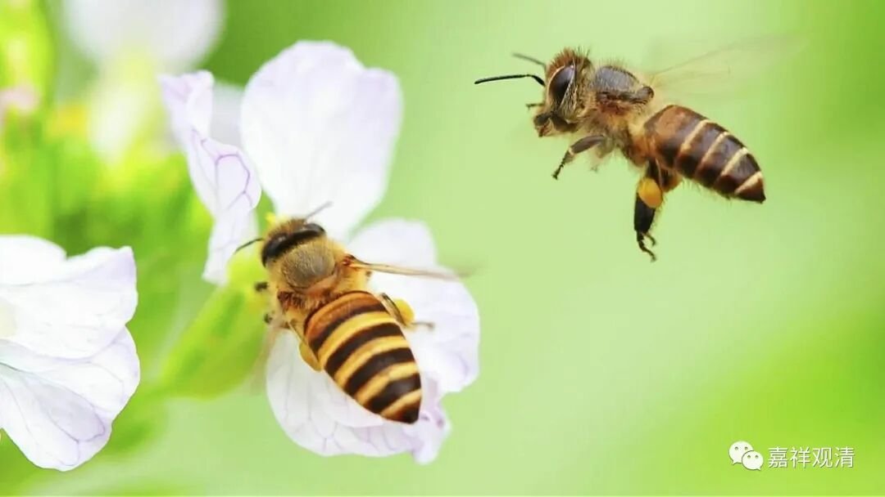
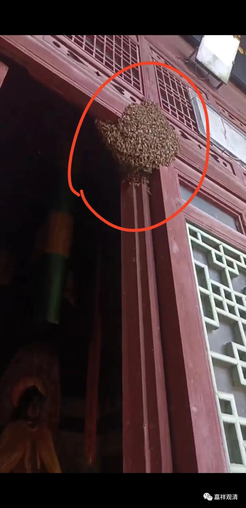

**小蜜蜂**

** 一**

前两个月，庙里汇报：“大王！大事不好！大批蜜蜂来袭！”

原来，庙里来了一个蜂群，分别在我们大雄宝殿和地藏殿落了户。原先还不多，寺院“留守”也就没太当回事。但几天以后它们呼朋唤友地渐渐聚集起来，乌泱乌泱地，搞得香客、居士、义工们都不敢进大殿门……

木生说：“别惹它，就没事。”

而魏老师可能前世欠了点啥债没还干净，“你猜怎么蛰”，他的脖子被蛰了……

这么连着几天，大殿和地藏殿满屋子飞蜜蜂，庙里的人都愁坏了，频频告急。

大殿门口的蜂群

打听到山下潘村有一对夫妻养蜂，急忙找他们上来处理。人家上来，乐呵呵地把蜂子收走了……

可能是当天有些蜜蜂996出工“干活”了，这一次没收干净，于是他们认定是魏老师“先动的手”，“你猜怎么蛰”，又给他胳膊给蛰了……（轮回是苦，啊！）

于是，蜂农又二次上山，收编了这支漏网小队……

** 二**

其实庙里本来就有蜜蜂，算是半野生的——我们有（原始的）蜂箱，还产蜜呢。新来的义工不了解，也不会养蜂。（其实我也不会。）

庙里最早养蜂是在什么时候我不太记得了，好象是张阿姨在这儿做饭的时候，可能是她收了一群蜂，蜂巢就在老厨房靠大门的柜子里，后来基本上每年都会分群的。有一次蜂巢结在老厨房窗口，侧面的样子像极了福尔摩斯的侧影。

前几年分群的时候，老胡在菜地里也养了一群——拿个木桶子，顶上倒扣个木盆，大概其就这样了（具体怎么样我也不清楚）。后来那年老胡收了不少蜂蜜，好像两升的瓶子装了四个，送给我一瓶，到现在还在综合楼的冰箱里，前两天我意外发现他们了……你们懂的。

这次老胡被提醒了，准备再去收点蜂蜜去……

** 三**

今年寺院种了创纪录的庄稼，还种了好多花儿，蜂蜜应该高产……

