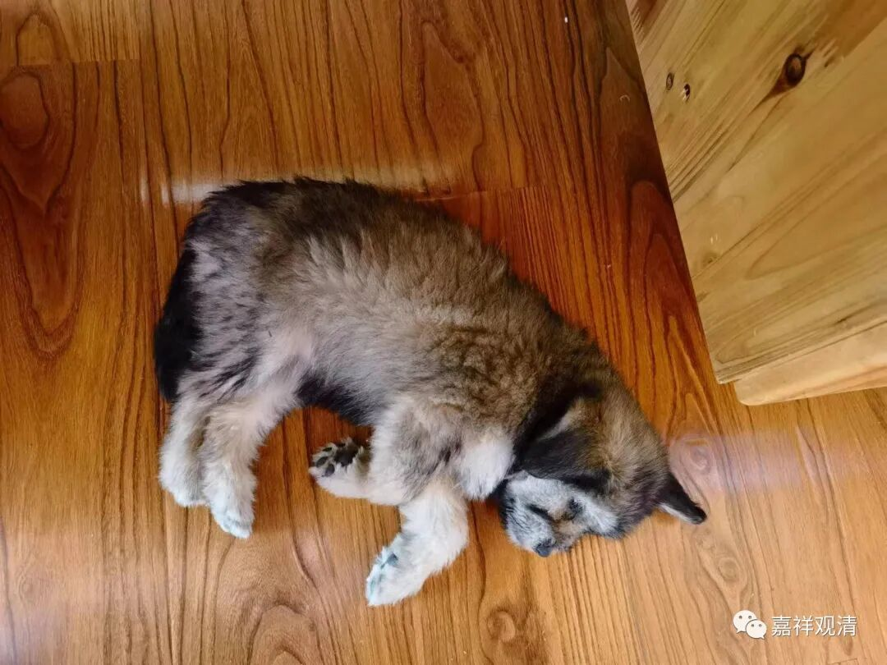
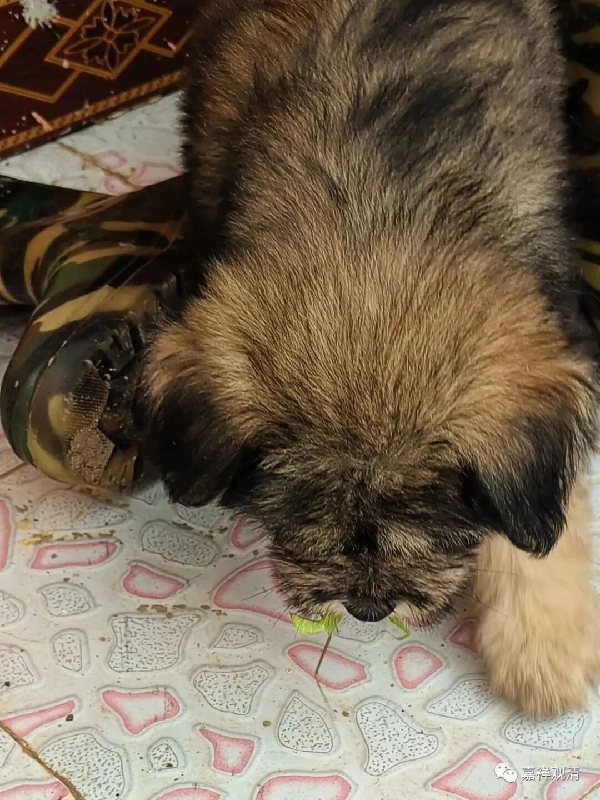

**庙里的狗是素食主义者吗？**

** 一**

有人问：“庙里的狗也吃素吗？”

呵呵，只能说汉地寺院不可能给它们肉吃，至于他们吃不吃素……狗粮里可能……

** 二**

小朋友很早起床追鸡、斗狗。（这两天，鸡都逃到树上睡觉了。）

忽然大声叫到：“狗狗杀生了！”

原来，小狗在观音殿廊前捉弄一只螳螂，最后，只往前一扑，三口两口就把它吃了……凶案现场有小朋友目击了全过程！

** 三**

庙里的狗就是这样开荤的。

** 四**

以前的小黑一世跟着我们下山的时候，经常走着走着就扑到路边的野地里“补充蛋白质”，寺院里的老居士也经常作** 口头**教育，不过** 基本**无效，它** 装**听不懂。小黑有时候还“拿耗子”，不知道后来是不是成为它的蛋白质来源……

所以，在寺院里“被”吃素的狗子，是会自己下山打猎的。

所以，狗子有佛性吗？

** 五**

小黑打猎，结果却自己被“打猎”了。

这里山上有小野兽，所以有人下捕兽夹。小黑中过两次。

第一次，它出门很多天，瘸着回来的——原来中了夹子逃不走……后来村民上来取猎物，认出是寺里的狗子，就给放了。它因此瘸了好一段时间，有一段时间好了还装瘸。

第二次它“打猎”被夹的地方很近，它带着夹子逃回来。那是一个大清早。去夹子的时候小黑疼啊，很不配合，最后想个办法——把它放在门外，门缝里伸进那只被夹的腿，这样才卸了捕兽夹。卸完以后它就嗷地逃走了，找个地方躲起来疗伤，不过中午就回来了。（它好像在山上找了一种草药吃，山民说这草药能治骨折。）

** 六**

下午，老胡又目击了一场命案——

这次被抓现行了！

** 七**

原先我想用《震惊，白云寺今晨发生命案》做标题的，那样一定可以吸引大量围观群众，后来想想，还是不要了吧，我老实。

