**山居说菌

** 一**

小朋友上山找眼镜，采了一帽子蘑菇——

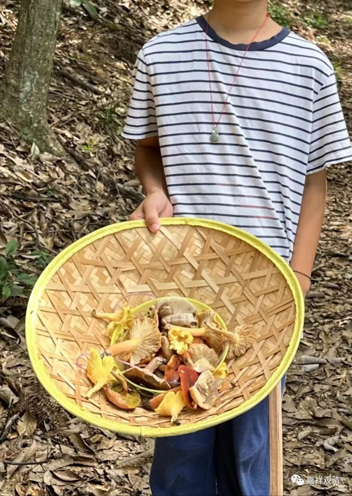

凑过去闻，扑鼻的诱人鲜味儿啊！（好想煮个汤……）

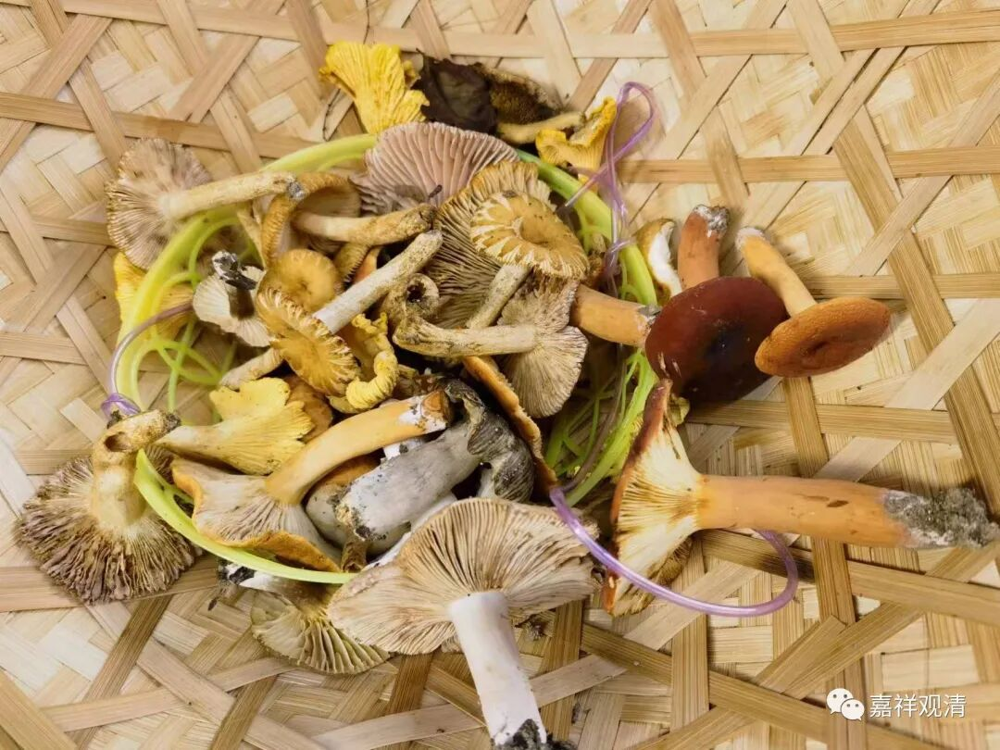

但也是真不敢吃，怕看见小人（其实还有点期待呢，其实更主要的是）怕“躺板板”。

云南前线发回的消息说：”看着像奶浆菌……”，我找了一下，好像这是奶浆菌——

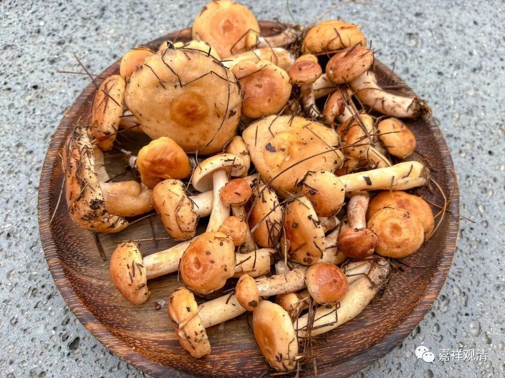

不过大家终究没敢吃。

** 二**

其实庙在山里，蘑菇很常见，却很少有人敢吃。

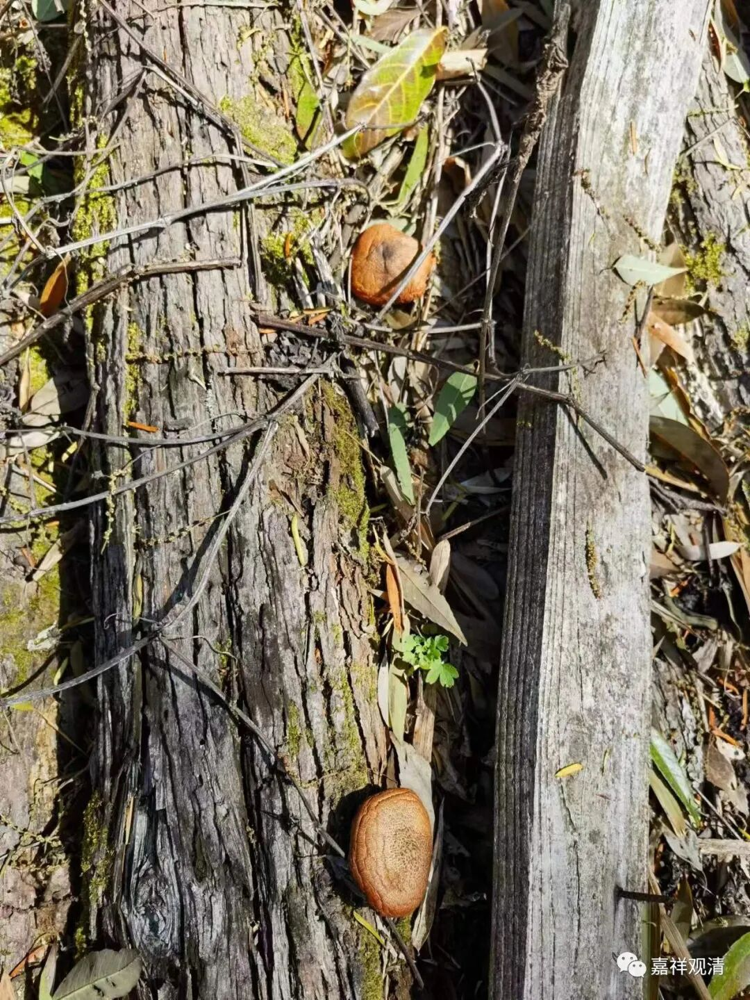

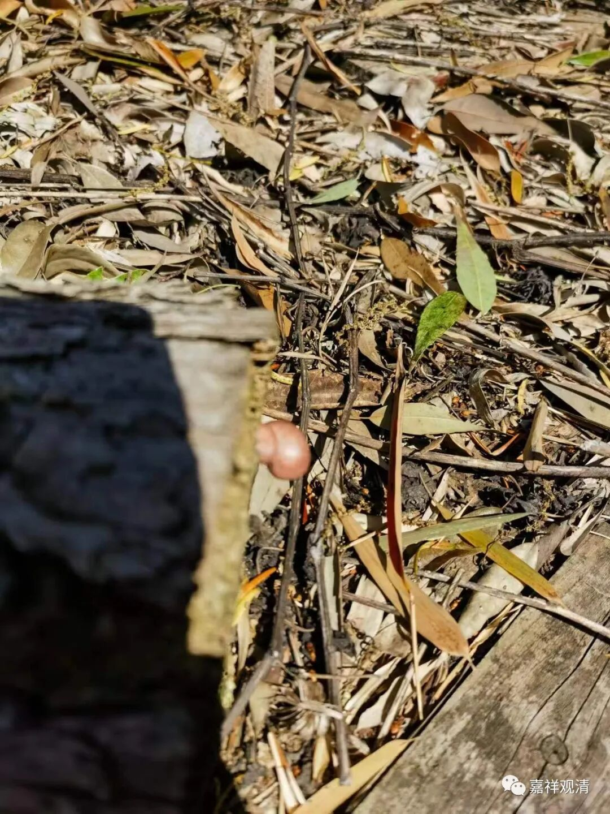

这些也是山里的

前些年，应该是十几年前吧，终南山有几位住山的师父采了一堆蘑菇，煮了一锅，说是鲜美无比……四个人，一个当地人一口没吃，其余三个，当天就倒下了……有一个挣扎着爬到附近茅棚找WL师求助。当天晚上附近几个茅棚的师父们把三个中毒的背下山，透析，好像其中一个港台的师父比较严重，另两个也大病一场……二天周围几个茅棚的和尚回去就把那个当地人给死揍了一顿，因为他说“可以吃”（！！！）……

** 三**

有的庙里自己种蘑菇的。

Hscw寺，有一次搞了几棵什么木头来，就横在禅堂前面，找了山底下种香菇的来喷了一次菌种……后来，那香菇滋滋往外冒

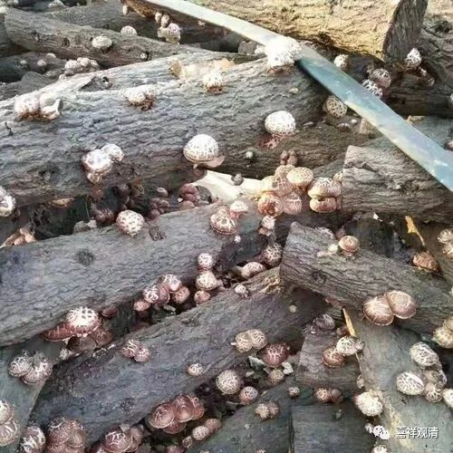

一开始师兄弟们可高兴了，改善伙食啦！但后来冒得太快了，实在吃不完，愁啊！

大家脑洞大开，想了各种办法来加工：

菌菇汤

清炒香菇

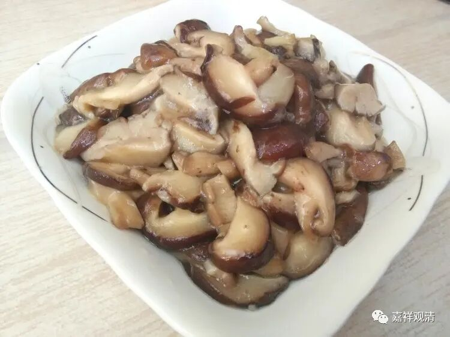

青菜炒香菇

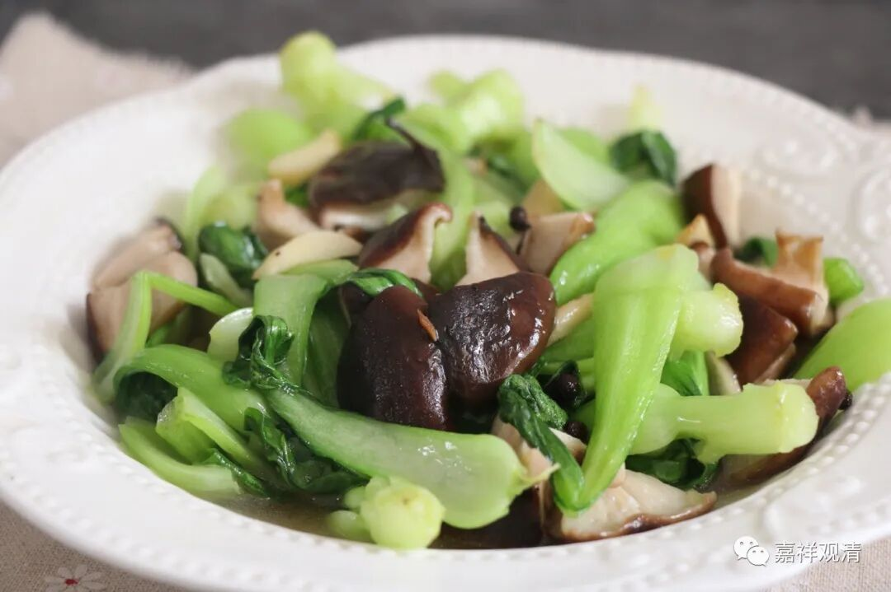

豆干炒香菇

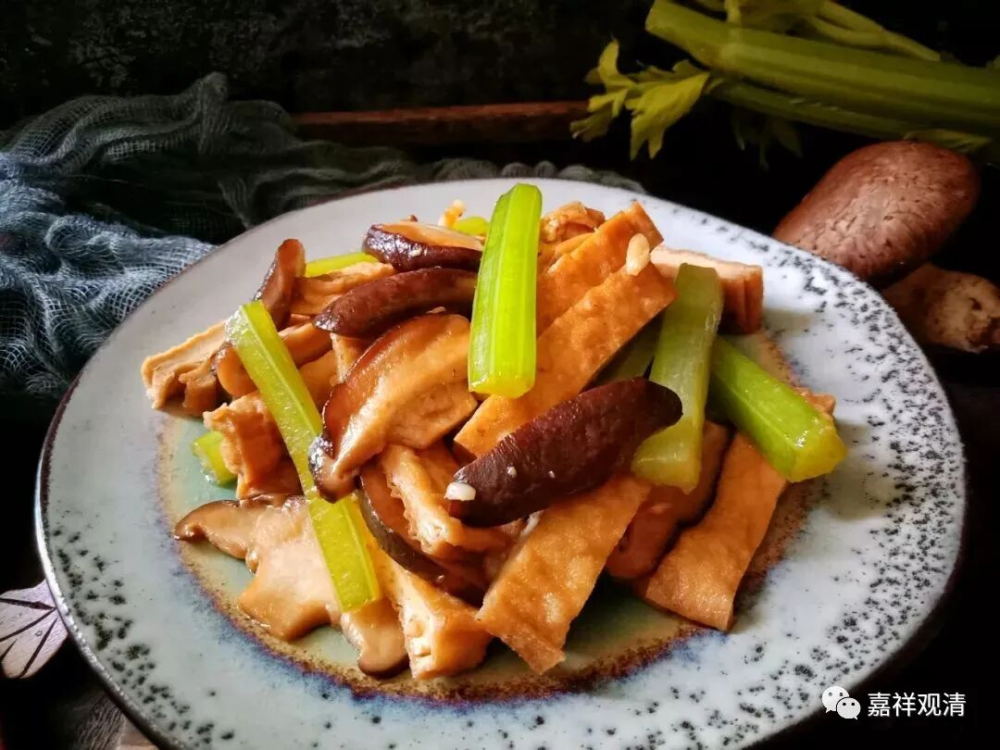

炸香菇

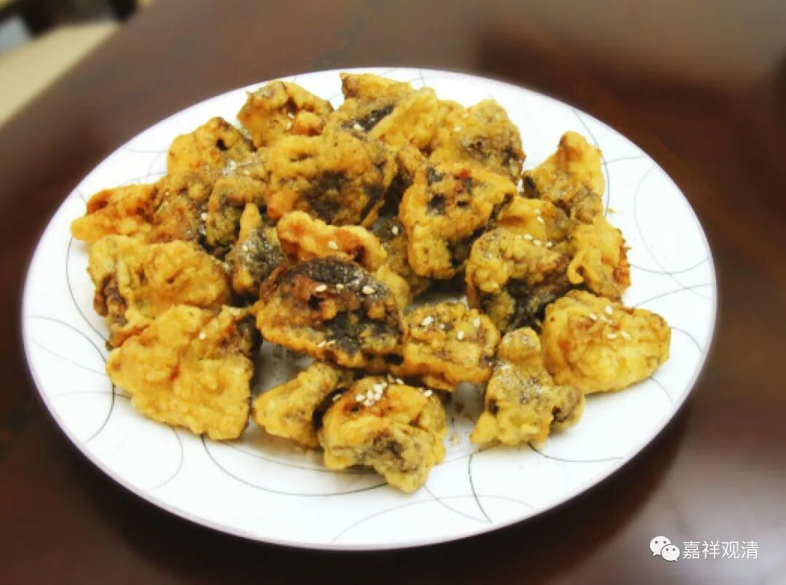

香菇丸子

……最后还发明了香菇油墩子……

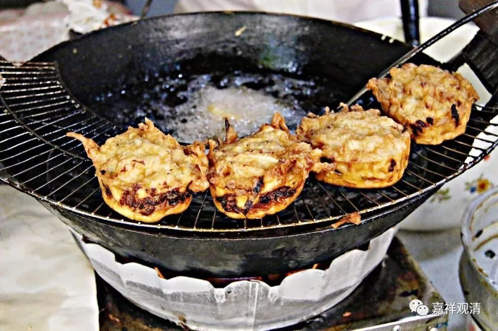

那时候看到有新人来就会异常兴奋——有来人帮忙消灭香菇了！！！

