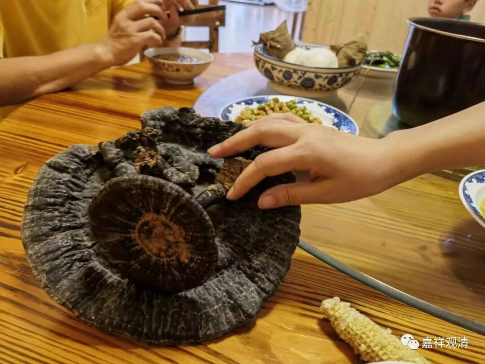
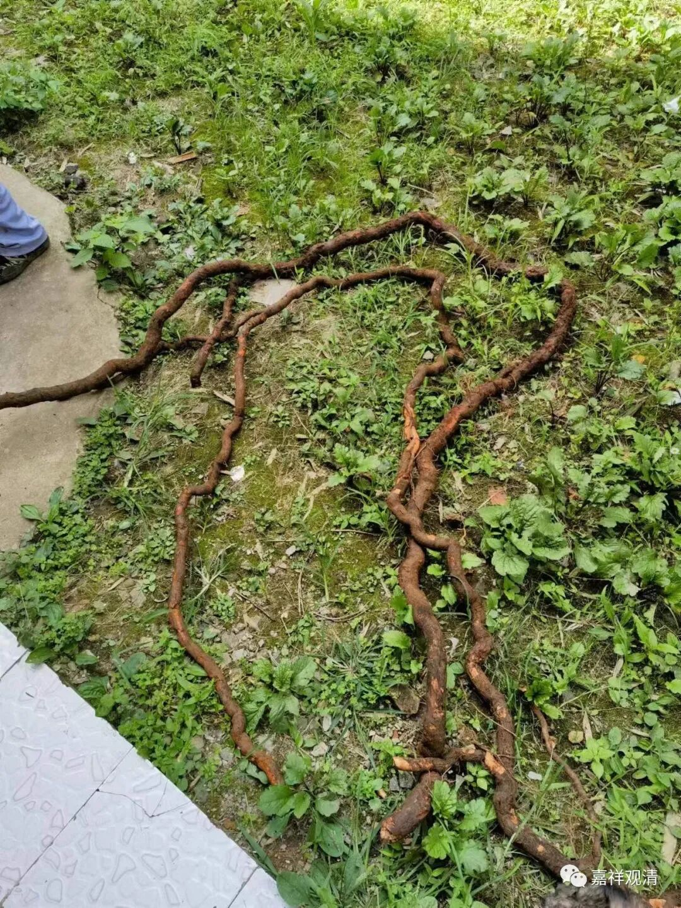
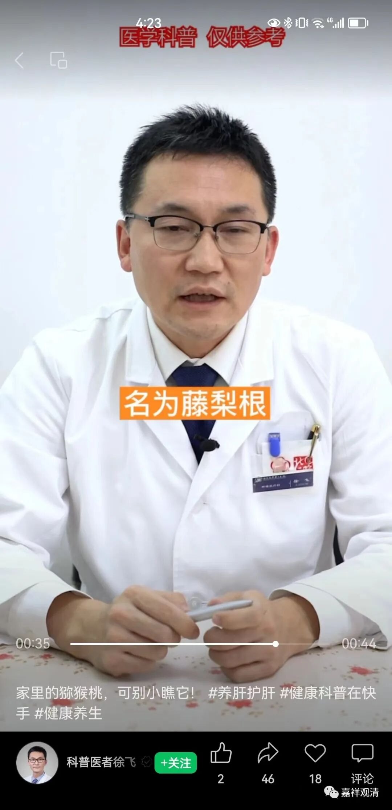
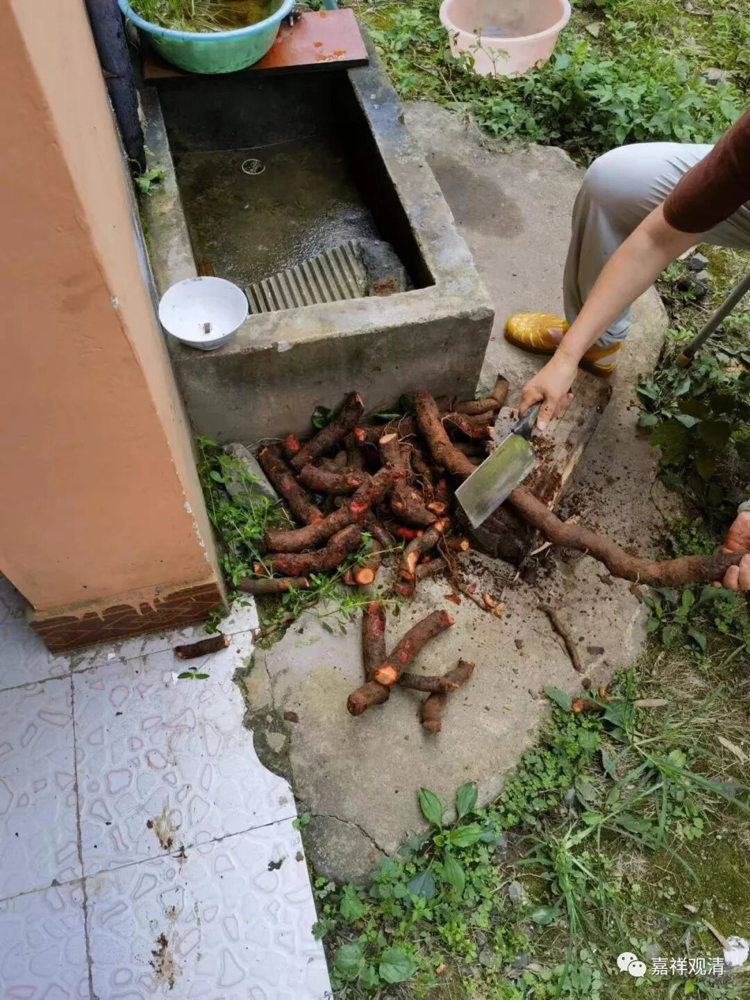
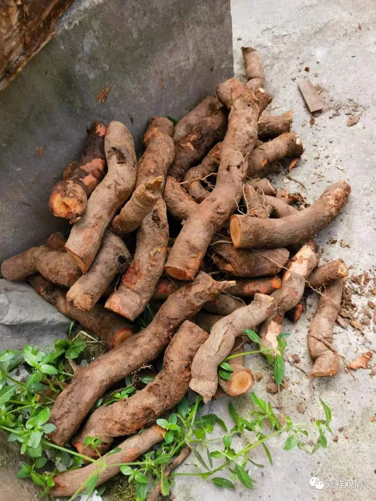
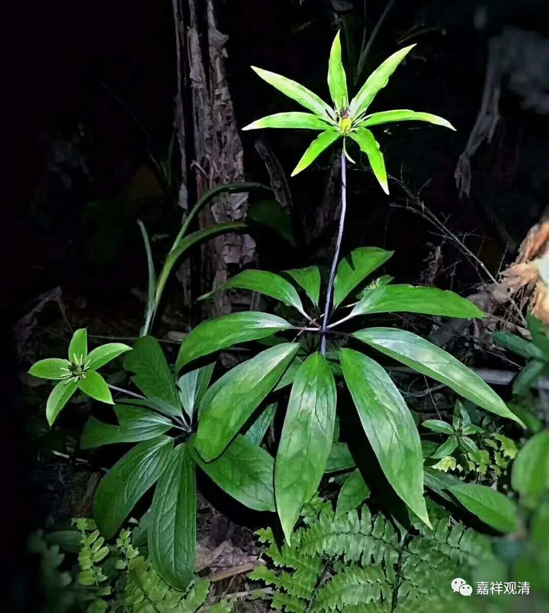

山里“名贵”中草药

我曾经是中医，借机会正好聊聊中医药。

一

早上龙乐拿了两根灵芝给我看——

好大的两棵啊！

这是木生弟弟挖到的。山下面村里其他人家也有，下午还有人要送我，我没要。但说明咱这山里，灵芝常见。

记得有一次，我和师父在海口的时候，有人送来袋泡的灵芝（海南出灵芝），我们俩当晚就打开包装泡着喝了，结果那晚上睡眠大好，好像都是一下睡到七点多……从此我认定，灵芝的安神功能极佳。

灵芝还有单独的“孢子粉”，灵芝孢子粉提高免疫力的效果也极佳，当然最好是破壁的，不过未破壁的效果也差不到哪里去，只需要稍微加点药量就很好了。一般身边的癌症病人，我都会推荐虫草+灵芝孢子粉，效果都不错。

二

下午，眼看着木生扛来几根——

正好山下的村医也在，我问这是啥，他说“这是猕猴桃根，有抗癌作用。”我这学中医的还是第一次听到“猕猴桃根”这味中药，上网一查，果然有它，有利尿消肿、清热解毒、外用可以接骨消肿，还能抗癌……又叫“藤梨根”。

我问村医用法用量，他说当地经常和灵芝一起泡，一次能用半斤（估计指鲜药），看来计量上不怎么讲究，基本可以随便用。一般说还是要晒干……不过我们有新鲜的，当然用新鲜的更好了。

刚才他们洗了，剁了，说还要再去皮、切片、晒干……

我跟木生说了——回头给我也搞一点来，我也要补补！

三

说起抗癌，庙里泉水边上还有“七叶一枝花”——以前学中药的时候，老老师说民间有云“七叶一枝花，深山是我家”，因此记得特别牢……）

又；

俩小朋友来了一个礼拜，大公鸡被追瘦了……

