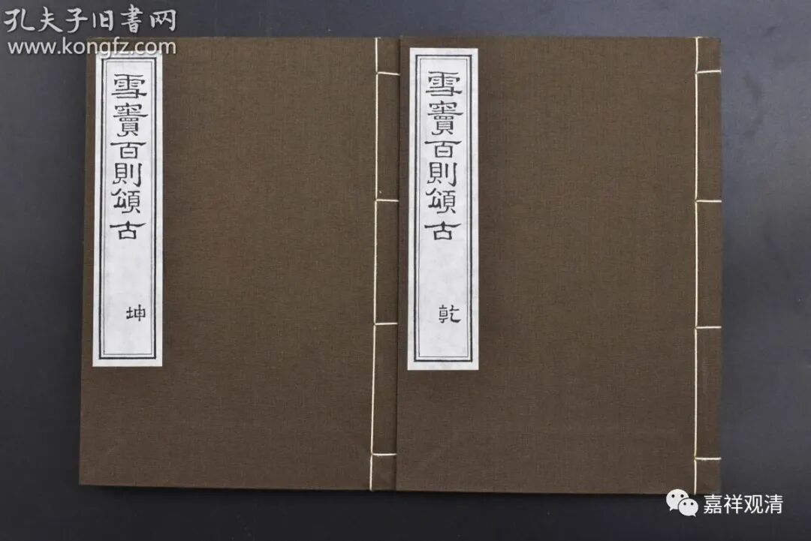
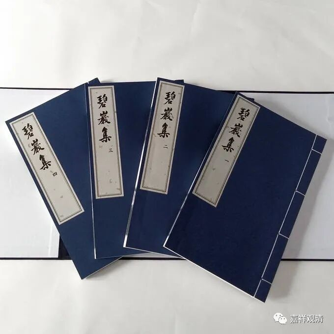

提到元版的《四家录》，边上再说几句。

《四家录》，包括——《雪窦显和尚颂古》、《天童觉和尚颂古》、《投子青禅师颂古》和《丹霞淳禅师颂古》，其中的“四家”，即宋代四位大禅师——

雪窦重显禅师（公元980～1052），云门宗第四代祖师；

投子义青禅师(公元1032-1083)，投子义青师从临济门下浮山法远禅师，出世则奉浮山法远之令，嗣法于曹洞宗大阳警玄禅师，传统上算作曹洞系的祖师；

丹霞子淳禅师（公元1064～1117），曹洞宗传人；

天童宏智正觉禅师（公元1091～1157），曹洞宗僧人，嗣法于丹霞子淳禅师；

国家图书馆和北大图示馆藏有元至正二年（公元1342）《新刊四家录》，台北图书馆也藏有一本《雪窦显和尚颂古》。

元版此《四家录》，后世做《四家颂古》，如明·天奇本瑞禅师（生卒年月不详）在其《<茕绝老人天奇直注雪窦显和尚颂古>·焭绝老人颂古直注序》中说：

**“禅宗颂古有四家焉：天童、雪窦、投子、丹霞是已。而寔嗣响于汾阳。夫‘古’者、古德悟心之机缘也；‘颂’者，鼓发心机使之宣流也……”**

（天奇本瑞禅师说，《颂古》四家并称，而《颂古》题材的开创者则为汾阳善昭禅师，其中，“颂”意为诗颂评唱、法语宣流，“古”则为公案“故”事、悟道机缘。）

明·永觉元贤（公元1578～1657）《永覺和尚廣錄》：

** “世所傳四家頌古，當以雪竇為最，天童次之……投子……”**

可见此四家并称，传承至今。

（或此四家并称，反而是因为他们都非临济宗师——因为临济门徒众多，临济祖师的《颂古》多已单行，而此四家作为“参考资料丛书”，合并发行。）

