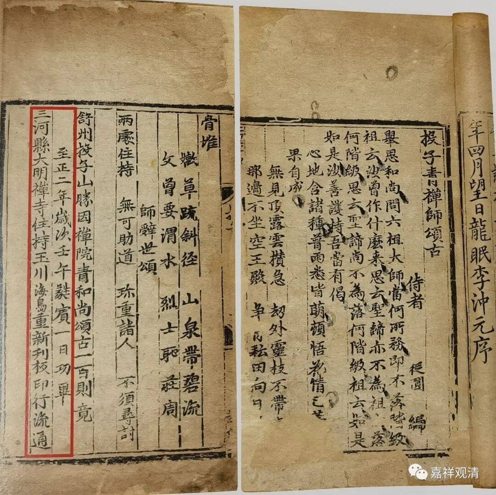
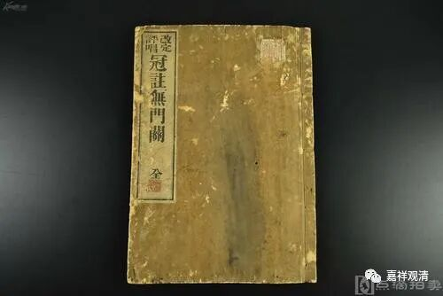

**微课佛教史380·2**

出现“颂古”这种形式之后呢，除了禅师的“语录”以外，后面会专门带一段“颂古”。

我曾经在一个拍卖会上见过现存最早的“颂古”的雕版印刷文献——元版的《四家录》，这套书流传极为稀少，其中的四家颂古，分别是《雪窦显和尚颂古》、《天童觉和尚颂古》、《投子青禅师颂古》和丹霞淳禅师颂古，当时拍卖的那件就是投子义青禅师的“颂古”。四位禅师的一个合集，在国家图书馆有一本，北大图书馆有一本。那次拍卖会上出现的这本《投子青禅师颂古》，最后拍卖的价格并不高，好像才十二万，其实算是一个低价了。

元刻《投子青禅师颂古》

从它作为珍本的角度来看，价格应该不止这个。我是没这钱去买，它的实际价格绝对应该更高一点。因为目前它是一个孤本——四位禅师的元版《颂古》合集，海内只存其三，所以这个本子可以明确是一个孤本，和它相对应的，另外三本《颂古》，有一个到目前还没发现，还有两本分别在国家图书馆和北大图书馆（另，台北图书馆也藏有一本《雪窦显和尚颂古》）。如果你们想挣钱、想收藏的话，以后看到可以把它买下来。

从“颂古”出现的时代来看，投子义青禅师比这个时代差不多要晚两辈，也就是晚两代人的时间。最早使用“颂古”这种体例的应该就是汾阳善昭禅师，从他开始，像这样的“颂古”就越来越多了。

我可以给大家举一些“颂古”的例子。比如说，他讲六祖慧能大师和怀让禅师的一个故事，在故事讲完以后，就来了一个颂子：

** “因师顾问自何来,报道嵩山意不回。

**修证即无不污染,拨云见日便心开。”

再往后一点，像这种最有名的“颂古”就变成单行本了，就是把这种“颂古”印成单行本了。最有名的“颂古”单行本是什么呢？是无门慧开禅师的《禅宗无门关》，这是单行的。

无门慧开禅师的师父是月林师观禅师，这位禅师没有他徒弟名气大，是个很本分的大师，我对他很有兴趣，给他做了个年谱。看看将来会不会谈到他……

前面讲的投子义青禅师的“颂古”是和他的“语录”放在一起的，后面一半就是他的“颂古”。我以前好像写过几篇相关的文章，不过主要是从考证的角度去写的。

好，今天就先到这里，谢谢大家！

