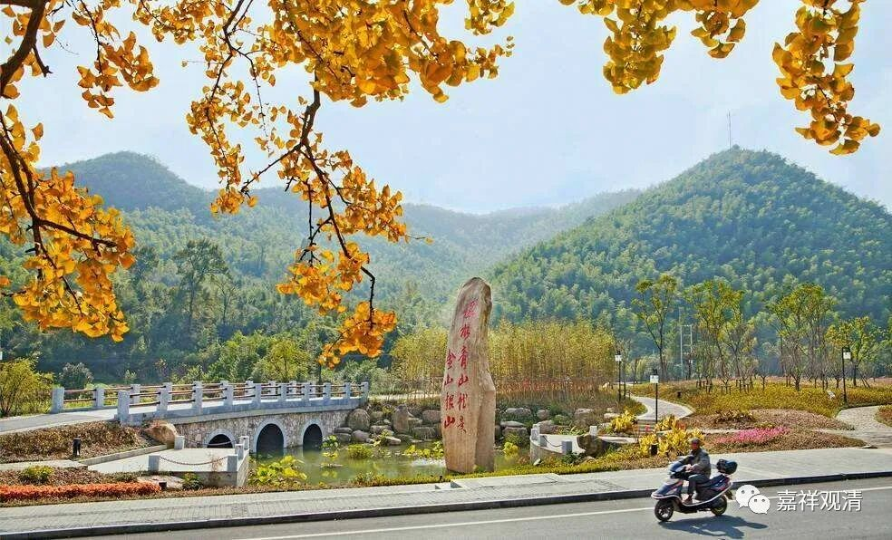

**微课佛教史381·2**

一般，这些禅师差不多等到二十岁左右的时候（大部分汉人对受戒这事儿都刻意地着急，很多年少出家的十七岁多点就去受比丘戒了……）开始受具足戒，受完具足戒以后就可以到处游走了。这个有点像今天在西边的某个地方，他们的情况好像也差不多，就是在受具足戒之前，学习一些经典；受完具足戒以后，基本上就要要考试了，考格西了；考完试以后就回自己的寺院去了，或者回家乡闭关，或者是继续熬下去当方丈。

雪窦重显禅师也是一样，他受完具足戒以后，就出了四川，然后顺着长江下行，是吧？就到了荆州。那他跟谁学习呢？也是参访了很多地方，最后到了这个地方，也叫北塔。

雪窦重显禅师在北塔碰到了智门光祚禅师，光祚禅师很看得起他，很喜欢他。由于雪窦重显禅师可以说是书香门第，或者说是家里有钱的出身，传记里说他“好翰墨”，他是比较能够代师父应酬的，比如和士大夫之间来往等等，所以能够被光祚禅师看得上，觉得可以教，可以托付事业。

有一次雪窦重显禅师就问光祚禅师：** “古人不起一念，云何有过？”**不起念，哪里有过？从这个问题来看，好像雪窦重显禅师在当时的佛教水平不咋地啊！这句话就是存心去考验师父的。不起念，有什么过？不起念，那还用说吗？那就是无想定，哈哈。（其实类似的问题其实我也问过师父。那次我陪师父散步，我问：“无念不是无想定或者非想非非想定嘛，那应该不是佛教推荐的禅定啊。”师父说：“禅宗的无念、无想肯定不是无想定，也不是非想非非想定……”）

光祚禅师呢，就把他叫过来。雪窦重显禅师刚刚往前走了一点，或者这么说，雪窦重显禅师刚刚凑过去，就被他师父拿着拂子打嘴。雪窦重显禅师刚刚要说什么，光祚禅师就又打……传记里说是打了两次之后开悟了。（呵呵，我师父当时没打我，哈哈。也许是看不上我？）

