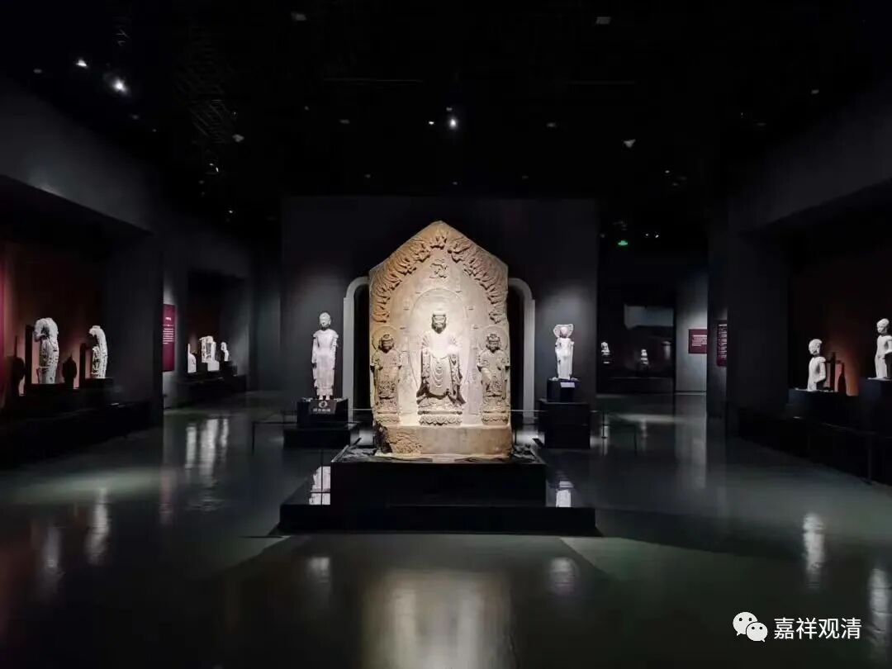
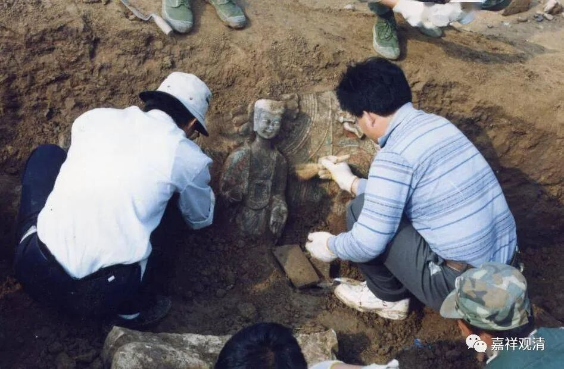
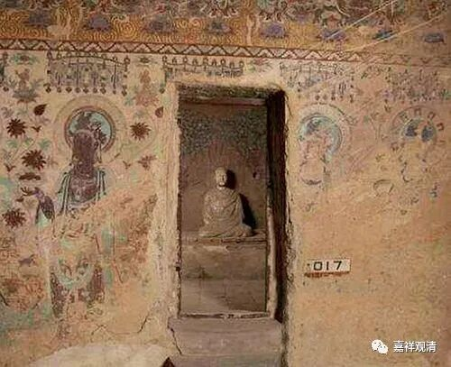
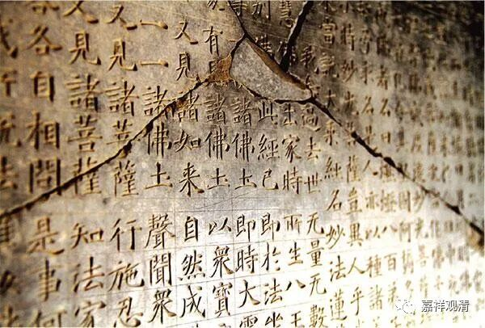

**窖藏佛像与敦煌文献**

上个月去了山东，接连爬了几座山去找了四山摩崖，又去青州博物馆瞻仰了青州佛像，实地考察之下，很有收获……

前几年去烟台，原来打算顺道去青州的，但青州博物馆闭馆改建，就没去成，一直惦记着这事儿，这次新馆刚开放，正好有空。就赶过去了。

青州的窖藏佛像的来历目前有两种猜测；1、灭佛运动造成的；2、（战争下）佛教徒的窖藏传统。带我们参观的原青州博物馆的王馆长说目前学术界倾向于后一种叙事。我也倾向于这第二种解读。

历史上的佛教徒有把破损的法宝（佛像、经书、字纸）集中收藏的“传统”，比如敦煌的藏经洞也是一种形式的“窖藏”，这是因为佛教徒普遍认为，誊写错误的经典和残缺的佛像，虽然不适合供奉或者研读，但也不敢、不方便损坏或者遗弃，于是就有了“窖藏”（集中储存）这种形式……

这是一种被动的“窖藏”——被破坏经像的集中储藏。

其实还有一种主动形式的“窖藏”，比如房山石经，房山石经是僧侣们主动镌刻收藏的，原意是应付不可预测的“灭法危机”——史上的灭佛运动给了僧人一种危机感，于是便有了这种主动为未来“藏宝”的行为。

这种主动藏宝的行为至今仍在延续——我以前认识一个八十年代出家的老和尚，他在寺院重建的时候就做了隐蔽的夹墙，在夹墙里面存了好几部大藏经。他跟我说：“万一再来一次那啥呢。我们为将来的人留点东西。”老和尚的寺院在北方，这么“藏书”相对方便……但是他没考虑到——现代纸墨印刷的大藏经，其实可保存的上限也就百年了……

我曾经有个计划——在某地买一个窑洞……为后人留点东西……要不然千年以后的博物馆里，我们这个时代都没文物了。（我考虑还是以石刻资料为主，能保存，也基本没有文献以外的价值。先把我们翻译的东西都刻上，不行我自己刻，我刻的那些佛像印也可以一起埋了，哇哈哈哈哈……）

