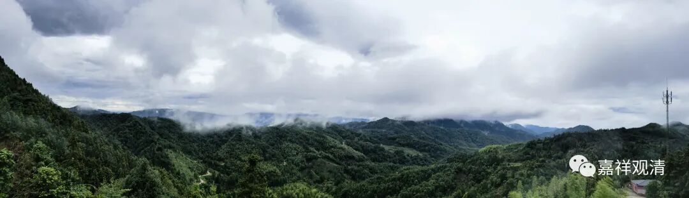

**谈谈精英佛教和在民间的佛教**

从08年来白云寺，这都十五年了，我对“白云寺”的了解，也慢慢地“浸”进去了。

白云寺的历史，清代的四本县志上异口同声——启建于贞观九年。（也有一个记载是武德年间，但我没查到原始资料依据。）以我在这里建寺对此地的观察、了解，根据一些遗留下来的痕迹显示，上一个完整规模的寺院应该建于明代，应是南北向三进两个院子的规模。至少到清代，寺院的宗派性质已经是禅宗临济门下——山里有很多老和尚的墓。

文革以后，老郑（后来的龙善师）修了个地藏殿（我们这里靠近九华山，当地人有地藏信仰），后来王师父（觉超法师）建了大殿和厨房……至此改为实际的东西向格局。

老居士告诉我，早些年，“老郑”和“王师父”并不一直在（就是说经常出去跑），寺院没人的时候，类似“开山会”这样的大型活动也照旧进行，那时候，居士们就会请周边的和尚或者道士来临时“救场”……老乡们说，请过好几次道士……

其实行在民间的宗教，往往这才是“现实”——在民间的佛道教之间界限不清，至少中级知识分子以下是分不太清楚的，同时，江湖上有些和尚也会《破血湖》、看风水，很多道士也能放《焰口》、念《心经》——互通有无。

再比如，咱们寺院“了望台”那个小山包（寺院周围最高点）叫“北斗峰”，往浮梁方向有个白云寺下院的遗址，叫“七星庵”，北斗而七星，都明显是道教的符号。

说这么些，是想说，（我给个新名词——）“在民间的佛教”，大概可以界定为介于“正统佛教’和“民间佛教”之间的一种“社会存在”，它的教义和实际属性是相当模糊而不具备传承性的，其一般传承不超过三代（有一种说法是三十年）。

庙堂的佛教和在地的佛教史有很大距离的。比之印度，则，“在民间的佛教”可以视为“印度教”（印度传统文化）的一支存在，而精英佛教（佛教史里的佛教）和婆罗门教则明确不是一回事。

精英和草根谁说了算？谁掌握话语权谁说了算！

……

（虽然只是瞎聊……但说的东西我自己也负责任。）

