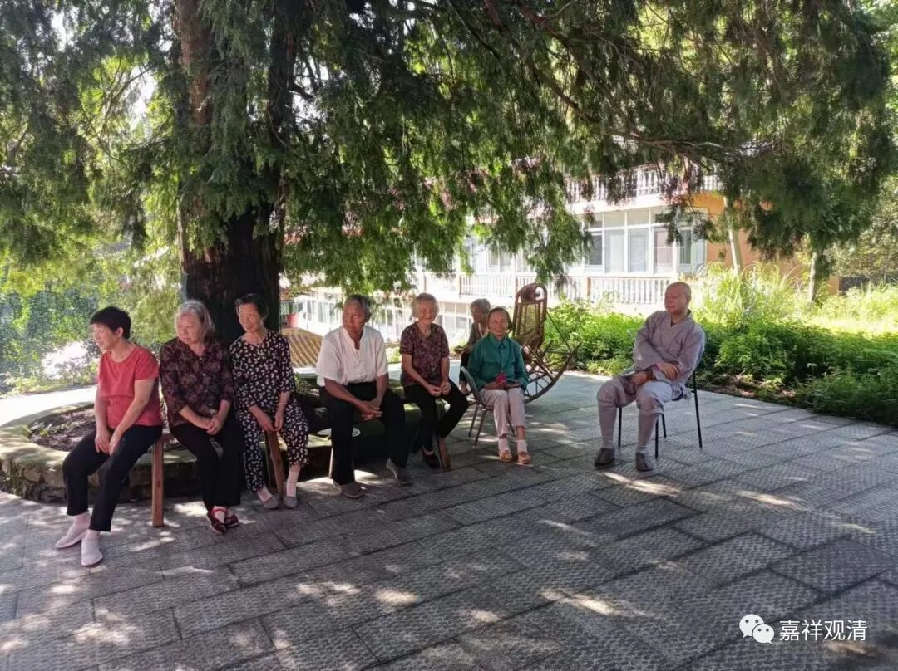

**“老菩萨们”**

今天十五，周围的“老菩萨们”都上山来拜佛、上香、念经。

一早就接到电话：“来不来接啊？”“来接来接……”哈哈……来来回回，老胡接送了五六次。

老菩萨们初一、十五记得特别牢，比我都熟。有的地方老人虽然是文盲，但算这个日子却不错——这都是心诚啊！

不知道哪里传出了消息（可能是为了要给我补身体），她们基本每人提了一箱牛奶或酸奶上来给我，也许是知道我阳了好几回，正虚着。今天送来的这些奶制品，（每天一瓶）我觉得能吃三个月。我让大家先供佛，然后让大家分了。

七斤（人名，出生的时候七斤，就叫了“七斤”，周围五斤、六斤、七斤的还有几个呢，这几个名字都上了我们寺院的铜钟，百年后的人可以拓下来，够写篇小论文了）让我带他们做功课，我说昨天着凉了，有点不舒服，你们自己来……他们就自己“做功课了”。他们念经的调子大致对，但音起得很怪，不过也无所谓，基本上是各自唱自己的。

中午大家留下来吃饭，再让我和大家聊聊。这么多人，说话要让大家都听见，把小声音压下去，真是费气得很。和当地村民说话，有点累，有时候还得借助翻译，有的也只能靠猜。

过几天就是六月十九，他们又要上来了……我估计六月六月十九来的人会多——观音诞，而我们在当地算是“观音道场”。

今天事情比较多，随便聊几句……

