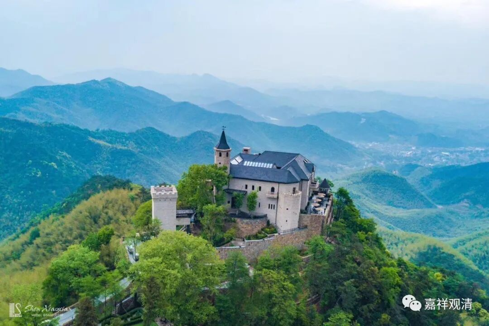

**微课堂佛教史 384·1

刚才有一点事所以迟了，庙里的糟心事。所以造好一座庙，应该还是有点功德的，因为糟心事太多，外面烦的事情不少。解决了这些问题费了些心思，终归会添些功德……

好，我们继续禅宗史。

昨天我们讲到雪窦重显禅师。他是四川人，在随州（武汉附近）得的法，是在云门系的智门光祚禅师那里得到了禅宗的传承。他之前因为家境比较好，学问也比较好，有点嚣张，很可能见到光祚禅师以后就老实了。这一点其实在他后来的经历中是非常明显的。

比如说，他初到灵隐寺，就没把别人的介绍信拿出来，而是很低调地在那里做清众，就是做一般的和尚。不过后来还是被那位知识分子（士大夫）找出来了，找出来以后呢，大家都觉得这位禅师非常低调，正好有寺院的住持位置有空缺，就把他“填”进去了。

昨天我们就已经提到了，禅宗发展到宋代的时候，开始慢慢形成一些新的情况。这是在宋代开始慢慢形成的，特别是禅宗里面的出世——这是世界的世，不是当官的出仕（好像情况真的有点差不多），一位禅师是如何成为后期的名僧或者高僧，或者一位有名的历史人物。那他一开始先要从管理一个寺院入手，这个叫作出世，或者开法，或者开堂（现在我们受戒也叫开堂，开堂师父，是吧？那个时候也叫开堂）。

出世，开法，开堂讲经。就是先在某个小寺院出来开法，一般不会一下子给个大寺院，先会给一个小寺院，然后慢慢地在其他规格稍高一点寺院当中轮流——能叫轮流吗？就是在不同的寺院担任方丈，这样慢慢地从小寺院到中型的寺院，再到高等的寺院，或者是到有“政务”的寺院。比如说一个府里面肯定有一个大的寺院，就是属于官方的大的寺院，再然后到国家级的五山十刹等等。

五山十刹（我们专门写过几篇了，可以查找），大概要到南宋的时候才被固定下来，但是这一整套的形制差不多从北宋就开始形成了。你们看，我们现在刚刚讲到北宋开始的时候，就已经出现了这种情况。

