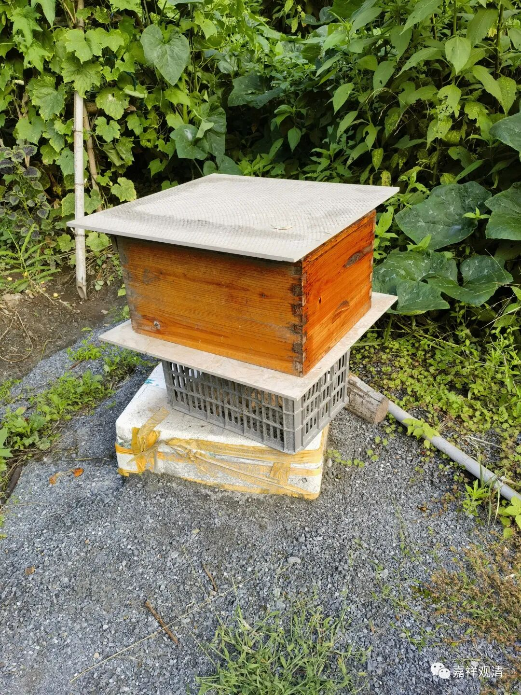
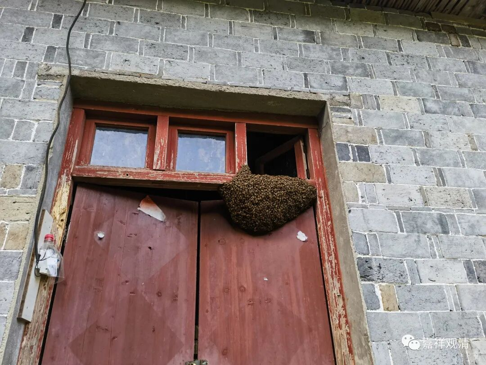
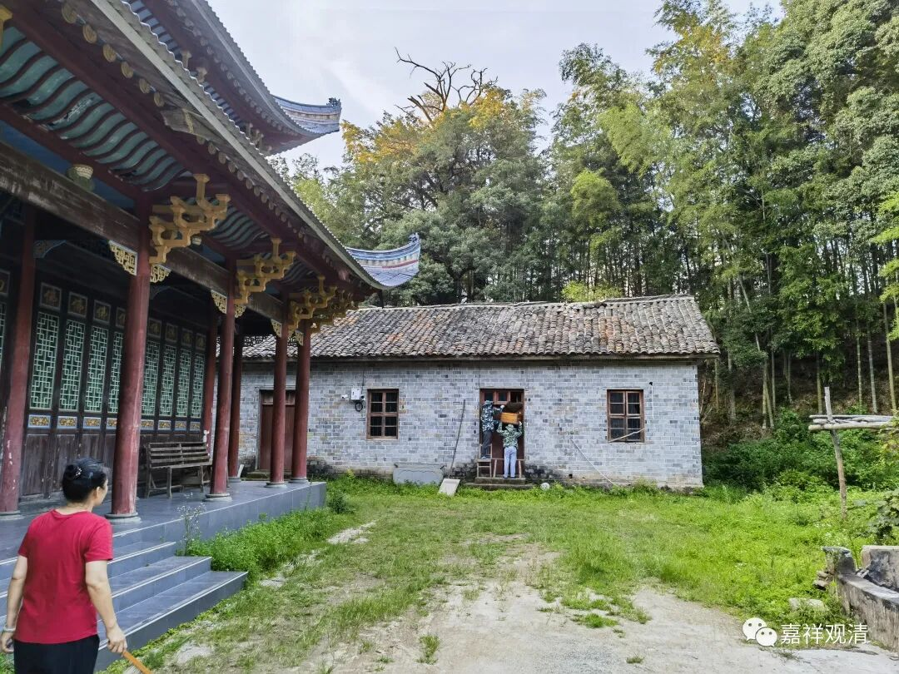
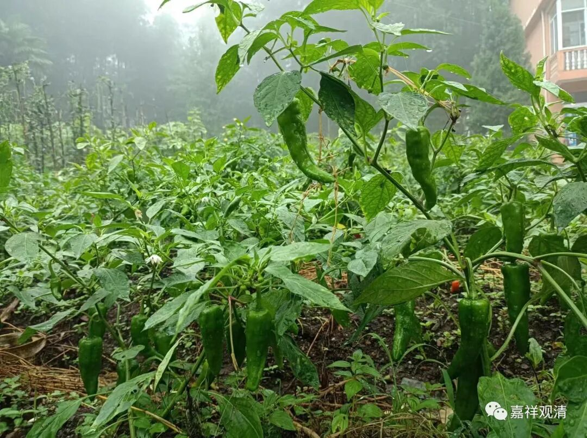

**蜂！蜜！被！盗！**

山里的小庙，游客和信众都不多。大部分来客都很规矩，但人来多了，奇葩的‘绝对数’就很多了……

我们周围有些人有“不占便宜就是吃亏”的习惯，或者说有那种君临天下的气质——都是我的！碰到这类人，有时候真是感觉像“吃了只苍蝇”一样。

** 一**

下午老胡去看蜂窝，发现蜂箱里的蜂！蜜！被！偷！了！

上来告诉我，我也是又好气又好笑。这两天我们人都在，眼皮子底下还有人开箱偷蜂蜜，真是……

蜜蜂跑出去，在老厨房起了一窝——

吃了晚饭，老胡和木生穿上防护服去收拾蜜蜂，我们都躲得远远的，“你们不要过来呀”！（连小黑都奔回来了）

** 二**

就在昨天下午，有个香客跟我们报告——有人偷咱们庙地里的辣椒。居士来报告我，我也是不知道怎么回答。说起来，地里种的辣椒我们也未必吃得完，也不值啥钱，送给她都可以，不过她动了偷的心思并（在菩萨眼皮底下——庙里的庄稼地就在几个殿的前面）付诸实施，实在不知道会是什么因果——上山求佛拜佛这点“福德”还不够她掐一下的。

这种“小偷小摸”（偷功德箱的事儿我们以后专门聊，足够立案的也单独谈）实在是太常见了。上次还有一家人来，结果几个女子在我地里刨洋姜刨了快半个小时，我实在看不下去，走过去说：你们够了！结果一家人围过来把我骂一顿，说庙是他们乡里的就是他的，不是我的……正好有政府的山林巡视员（防火的）在，我指着巡视员说：“你问他，法人是谁？”……最后这帮“香客”还非要把“赃物”带回去……

清明谷雨前后茶叶冒芽的时候也是，经常有“游（香xiao）客（tou）”“沿路看到”“顿生歹意”“果断下手”“满载而归”的。被我看到，有时候能缴获她们的“非法所得”，更多时候反而是我被骂一顿。男人们通常都在不远处抽烟，见势不妙就冲过来护着，他们一入场，声音立刻高八度……说起来这几把鲜叶子也不值钱，就这吃相难看得很……我们作为和尚只能苦笑——你们上山来求“功德”，结果带着满满的“罪过”回家……

这些都只是临时想到的……还有给我下死亡通牒的，有机会再聊……

