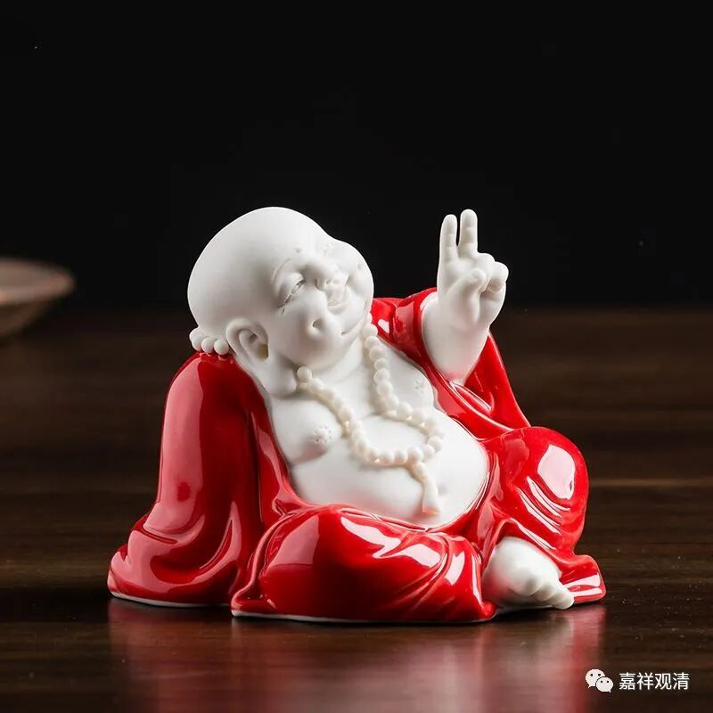
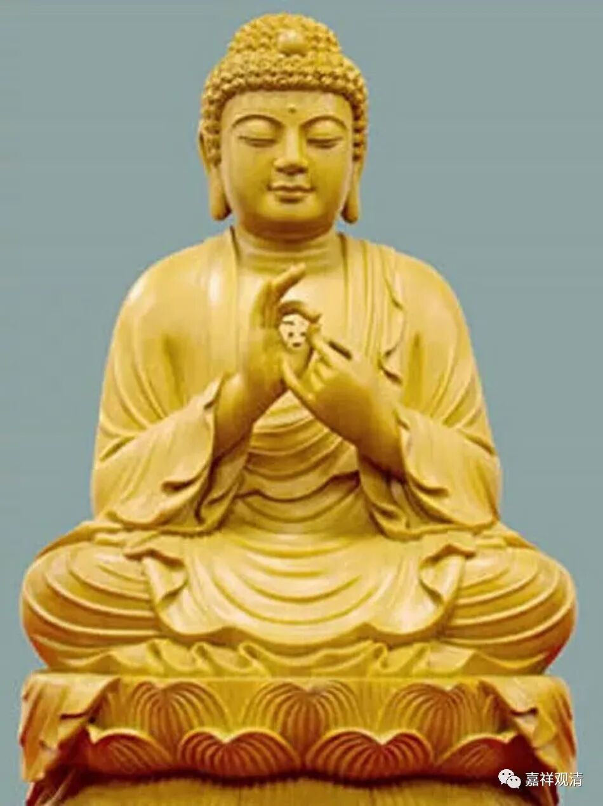
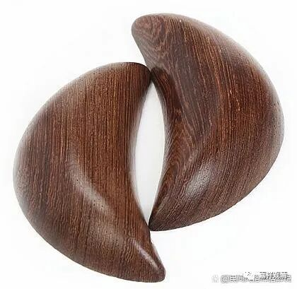
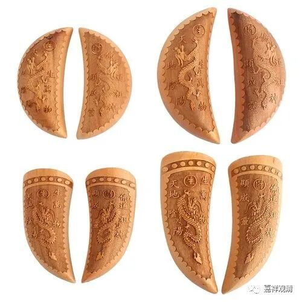
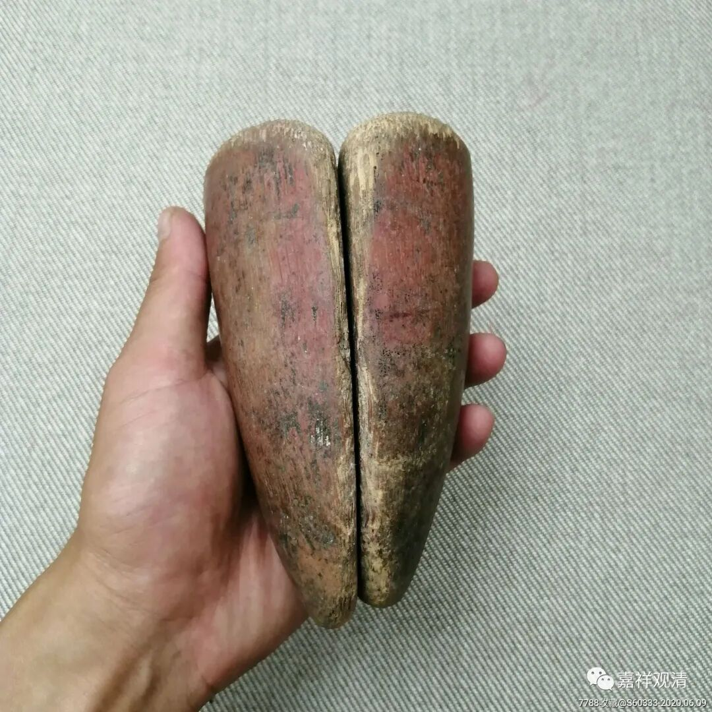
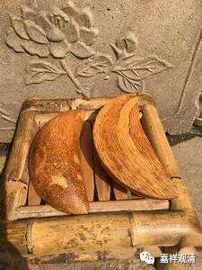

**“我问过菩萨，菩萨同意的”**

前几年网上有个消息，说福建某处有个寺院的会计因贪污被抓，庭审时，嫌疑人说：“我问过菩萨的，菩萨是同意的……”很多人看不懂这句话。也有人摆张佛像给的“OK”的手势，其实不是这个意思……

OK

这个是正反都OK了

民间的寺院（包括道观，各种神庙），会有抽签，抽完签，要丢个“告子”（也叫茭子、交子、茭杯、茭贝），两个“交子”一正一反，这签就算是对了。民间认为这是菩萨认同就是这根“签”了。丢出的“告子”若不是一正一反，则要重新抽签。福建、江西、广东、台湾……都有这个“风俗”。

嫌疑人说的“菩萨同意的”，意思是她拿钱的时候丢过“告子”，告子是一正一反，菩萨同意拿的……&^$%^

……

当时看到这个新闻我马上就明白了，因为我们遇到过。

比那个案子更早的时候，有个香客拿了我们佛台上一些不便宜的东西就走……正好我们过来看到，就把她拦下来

——“哎，你怎么随便拿庙里东西呢！”

“我问过菩萨的，菩萨说可以的！”她还不准备求饶，嘴硬得很。

——“那好呀”，我说，“我也拿着告子去你家，问问菩萨你家的东西我可不可以拿……”

最后她空手而回，我觉得不是因为“菩萨不同意”，而是当时我们人多。

我初来寺院，因为烧了两次卦签和告子，很多当地人上来求签而不得，便怒不可遏，跳着脚地骂我，说我是坏和尚，说我把观音“关起来了”……后来我才明白，我把告子烧掉，他们就没法和“观音”沟通了，相当于我断了他们和“干娘”的联络纽带，所以才说“你把观音关起来了！”

