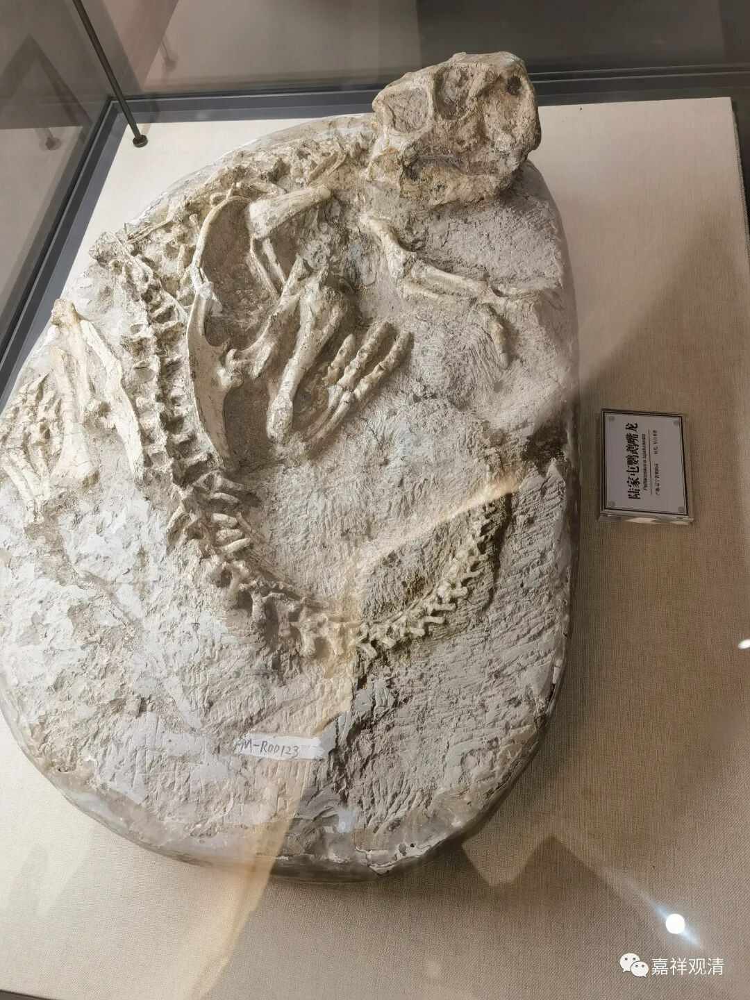
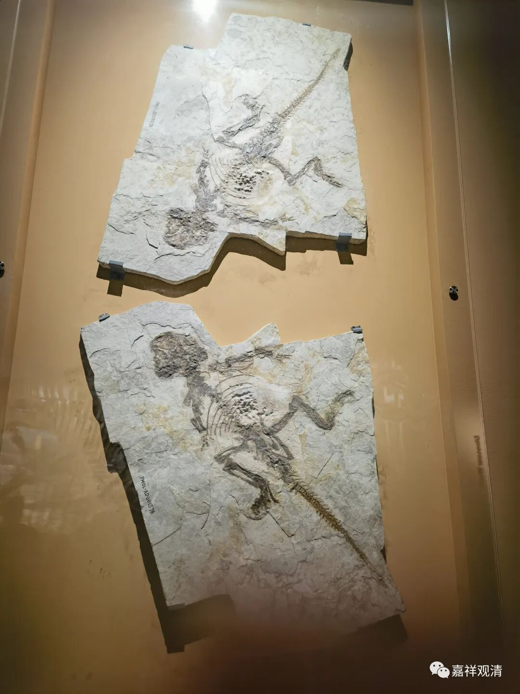
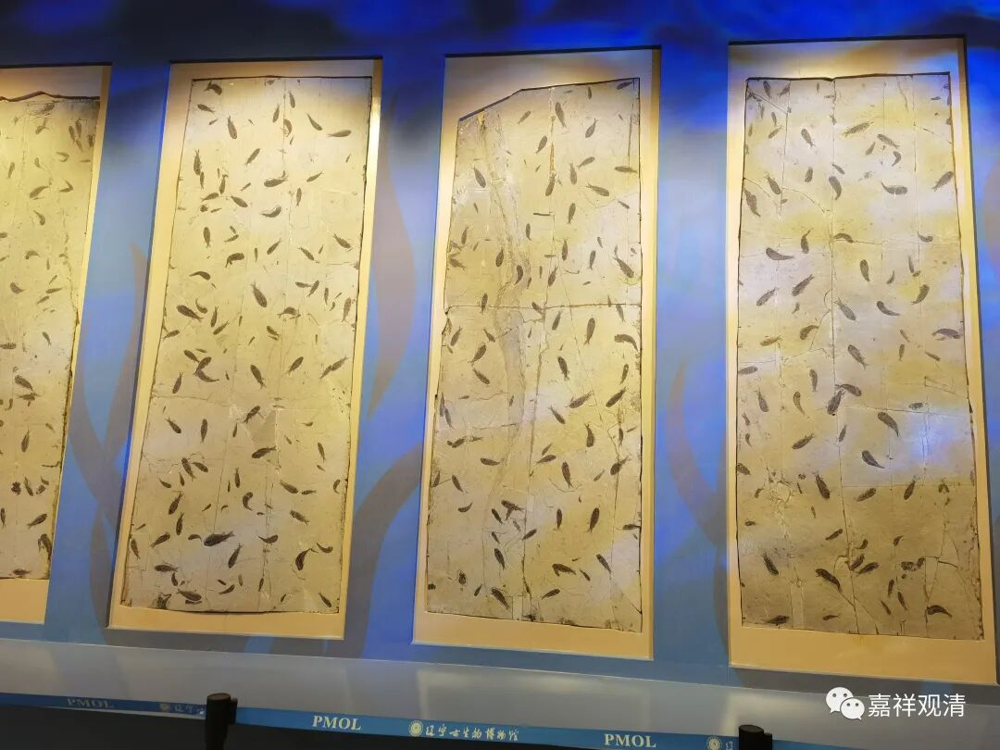
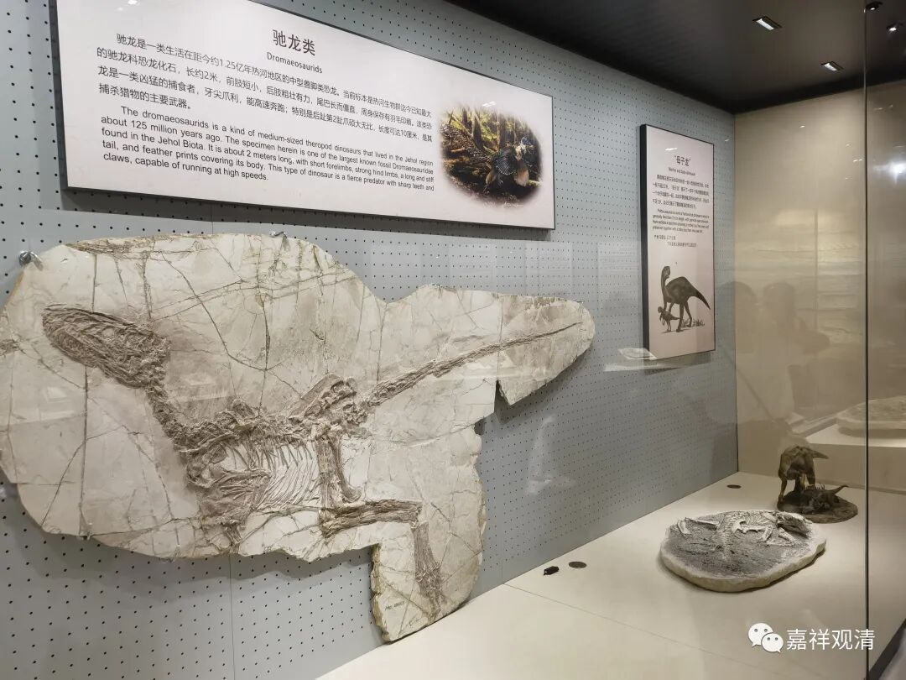
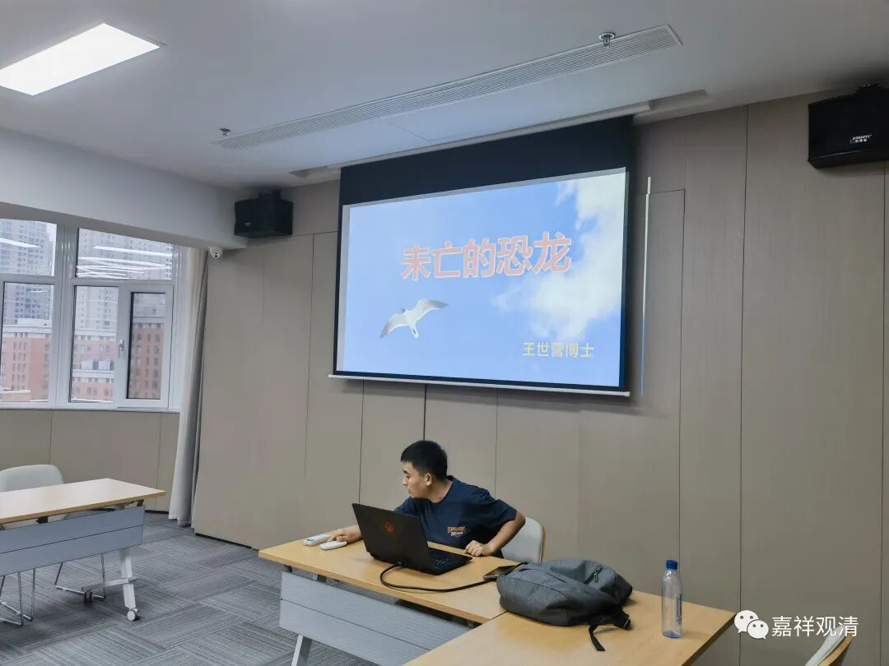
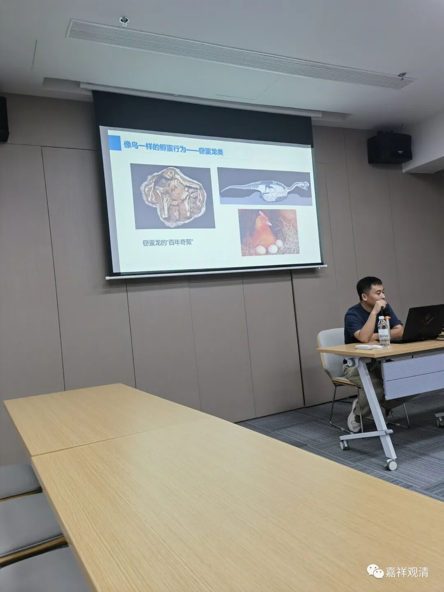
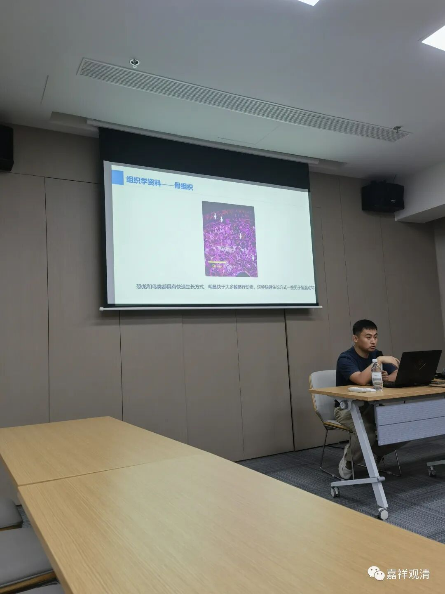
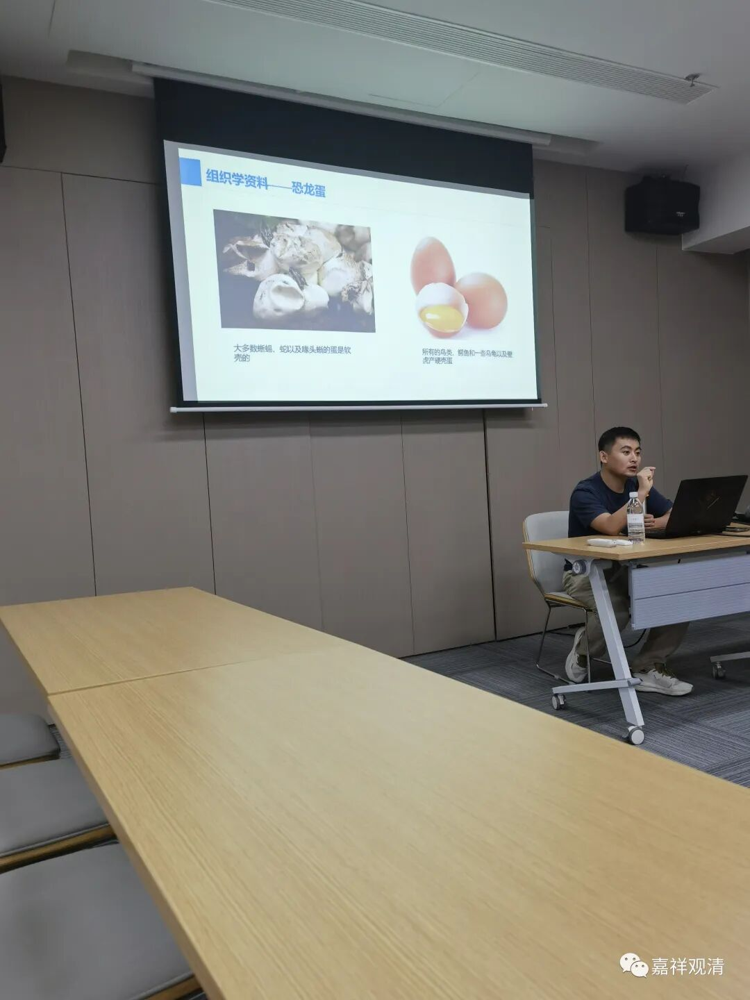
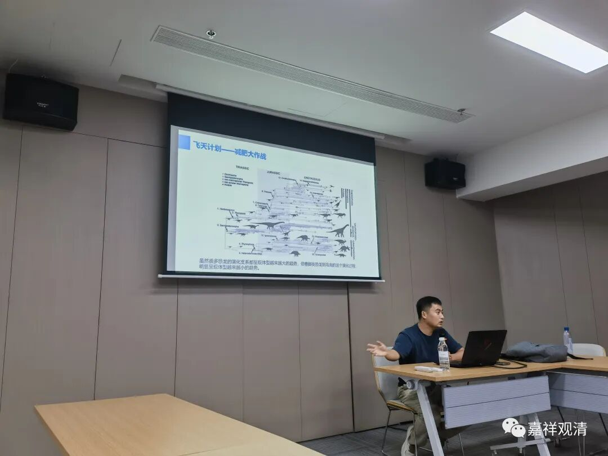

**食物链顶端的更容易灭绝！**

今天参加一个辽西古生物科考夏令营。

第一站是沈阳，下午在辽宁古生物博物馆，王世营博士到我们参观，给我们做地质和古生物的相关介绍。

来给我们讲了一节《未亡的恐龙》，这是他的博士论文的内容了。核心意思是，辽西古生物化石全带来了新的古生物学进展：恐龙可能有毛，甚至有羽毛，热血……其中的一支，经过持续的演化，最终成了今天的鸟类……

王博士说到一句话，一下子戳到了我的伤心处，他说：

“食物链顶端的更容易灭绝！”

我说：我明白了！就是说，精英佛教一旦遭遇外来打击将最先灭亡；而民间宗教由于它的“生物多样性”让它更容易在恶劣的环境中生存下来……

我伤心了……

博士一开始没明白我的点，以为我是说：我们汉传佛教吃素“在食物链低端”容易活下来，一般人吃肉“在食物链顶端”更容易被淘汰（也是一种读法哦）……后来我重复了我的意思，他也听懂了……

说起来，这一推论似乎正是历史事实哦——“精英佛教一旦遭遇外来打击将最先灭亡；而民间宗教由于他的“生物多样性”让它更容易在恶劣的环境中生存下来……”

